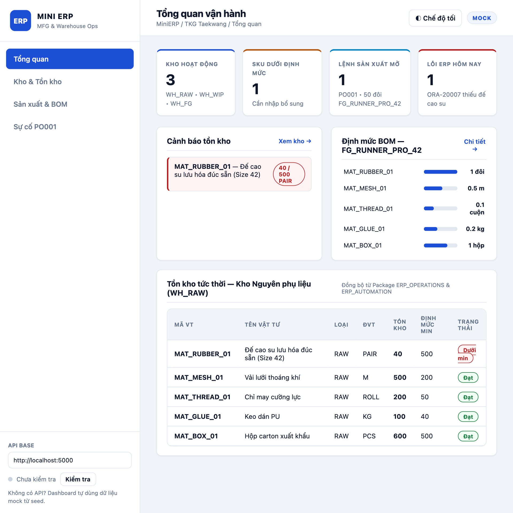
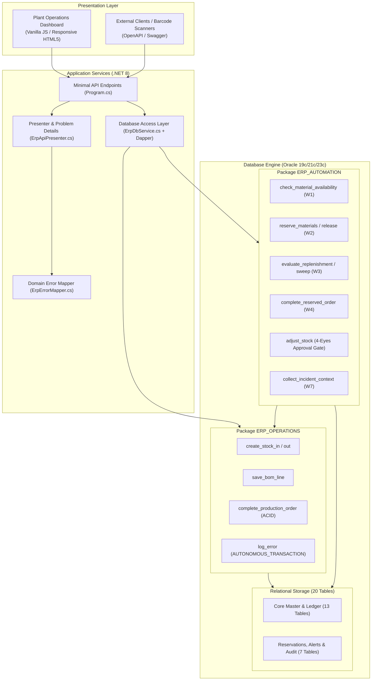
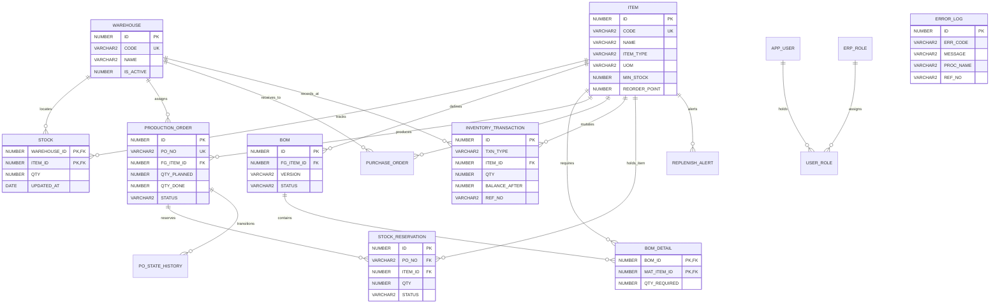

# MiniERP — Manufacturing Execution & Warehouse Automation

> A modular Mini ERP system for industrial manufacturing and warehouse workflows using ASP.NET Core (.NET 8), Oracle Database 19c/21c, and PL/SQL.

[](https://dotnet.microsoft.com/)
[](https://www.oracle.com/database/)
[]()
[](https://github.com/imtarget05/MiniERP-Manufacturing-Warehouse/actions/workflows/ci.yml)
[]()
[]()

---

## 1. Executive Summary & Verified Engineering Metrics

This project is a technical implementation of a shop-floor ERP core for manufacturing plants (footwear/apparel assembly in Industrial Zones / KCN), designed specifically around **transactional integrity, material reservation concurrency, autonomous incident diagnosis, and deterministic testing**.



### Verified Evidence & Production Numbers

All metrics below are verifiable directly in the codebase and reproducible via automated test harnesses:

| Dimension | Metric | Verifiable Evidence |
|---|:---:|---|
| **Database Schema** | **20 Relational Tables** | 13 core tables ([sql/01_schema.sql](sql/01_schema.sql)) + 7 automation tables ([sql/05_automation_schema.sql](sql/05_automation_schema.sql)) |
| **PL/SQL Engine** | **2 Packages / 1,700+ Lines** | `ERP_OPERATIONS` (516 lines, [sql/02_plsql.sql](sql/02_plsql.sql)) & `ERP_AUTOMATION` (1,187 lines, [sql/06_automation_plsql.sql](sql/06_automation_plsql.sql)) |
| **Backend REST API** | **31 Paths / 33 Operations** | ASP.NET Core 8 Minimal API + Dapper micro-ORM ([artifacts/swagger.json](artifacts/swagger.json)) |
| **Automated Tests** | **56 / 56 Passing (100%)** | 10 API integration + 9 Automation integration + 37 Contract/Error unit tests ([tests/](tests/MiniERP.Api.Tests/)) |
| **Test Stability** | **0 Flakes across 3+ Runs** | Fully deterministic; eliminates test state drift without database re-seeding ([TestStockFixture.cs](tests/MiniERP.Api.Tests/TestStockFixture.cs)) |
| **Incident Verification** | **14 / 14 Assertions PASS** | Replays real-world shortage incident (`ORA-20007`), logs autonomously, patches data, verifies completion ([scripts/test-incident.sh](scripts/test-incident.sh)) |
| **Cloud CI/CD** | **GitHub Actions Green** | 2-job matrix (Build, Unit Tests + Full 7-stage containerized acceptance pipeline in 3m7s) |
| **Data Invariant** | **100% Reconciled** | Strict ledger equation enforced: `STOCK.QTY = SUM(INVENTORY_TRANSACTION.QTY)` |

---

## 2. Business Problem & Operational Impact

In multi-assembly industrial plants (e.g. footwear production lines in Đồng Nai / Bình Dương KCNs), uncoordinated production and inventory operations create severe financial and schedule risks:

* **Late Shortage Discovery:** Work orders fail mid-assembly because raw materials were checked visually rather than locked systemically, stranding semi-finished goods and idling work cells.
* **Race Conditions & Double-Allocation:** Multiple concurrent production orders claim the same shared inventory balance simultaneously, leading to false availability and negative inventory balances.
* **Incident Data Loss on Rollback:** Standard database transaction rollbacks erase diagnostic data when business constraints fail, preventing ERP engineers from determining *why* an order aborted.
* **Manual Reorder Bottlenecks:** Plant planners waste hours manually calculating BOM requirements against warehouse balances instead of relying on automated replenishment rules.

---

## 3. Solution Overview

MiniERP automates the material supply chain from order release through atomic assembly completion:

```text
[Plant Operator / Dashboard / Barcode Terminal]
                       │ (HTTP / JSON)
                       ▼
[ASP.NET Core 8 Web API] ── Dapper Micro-ORM ── [Oracle Managed Data Access]
                       │
                       ▼
┌────────────────────────────────────────────────────────────────────────┐
│                      ORACLE DATABASE 19c / 21c / 23c                   │
│                                                                        │
│  [Package ERP_OPERATIONS]                 [Package ERP_AUTOMATION]     │
│  ├── Stock In / Out (Pessimistic Locks)   ├── W1: Material Pre-check   │
│  ├── BOM Explosion (Active Version)       ├── W2: Soft Reservation    │
│  ├── Atomic PO Completion (ACID)          ├── W3: Replenishment Sweep  │
│  └── Autonomous Logging (Error Records)   ├── W4: Transaction Wrapper  │
│                                           ├── W5: Stale PO Detection   │
│  [13 Core Tables]                         ├── W6: Operational Reports  │
│  STOCK, BOM, PRODUCTION_ORDER, ...        └── W7: Incident Collector   │
│                                                                        │
│  [7 Automation Extension Tables]                                       │
│  STOCK_RESERVATION, REPLENISH_ALERT, ERP_AUTOMATION_RUN, ...           │
└────────────────────────────────────────────────────────────────────────┘
                       │
                       ▼
[Atomic Consumption / FG Inward / Immutable Ledger / Diagnostic Context]
```

---

## 4. Architecture & Technical Stack



### Technology Highlights & Rationales

* **Backend:** ASP.NET Core 8 (Minimal APIs, C# 12) for low-overhead routing and fast cold starts.
* **Micro-ORM:** **Dapper 2.1** with `Oracle.ManagedDataAccess.Core` for direct, high-throughput stored procedure execution with strongly-typed parameter mapping.
* **Database:** **Oracle Database 19c/21c/23c** (containerized via `gvenzl/oracle-free:slim`) enforcing server-side business integrity through PL/SQL packages.
* **Concurrency Model:** Row-level pessimistic locking (`SELECT ... FOR UPDATE`) on critical stock and order records.
* **CI/CD Automation:** GitHub Actions pipeline executing containerized Oracle integration tests on every commit.

---

## 5. Core Modules

| Module | Core Responsibility | Status | Evidence in Codebase |
|---|---|:---:|---|
| **Master Data** | Multi-warehouse catalog (`WH_RAW`, `WH_WIP`, `WH_FG`), raw items & finished goods, UOM conversions, roles. | **Implemented** | `ITEM`, `WAREHOUSE`, `APP_USER`, `ERP_ROLE` |
| **Warehouse Inventory** | Stock-in, stock-out, balance checks, pessimistic locks, immutable transaction history. | **Implemented** | `STOCK`, `INVENTORY_TRANSACTION`, `ERP_OPERATIONS` |
| **Manufacturing & BOM** | Multi-level Bill of Materials definition, active BOM explosion, planned order release, atomic completion. | **Implemented** | `BOM`, `BOM_DETAIL`, `PRODUCTION_ORDER` |
| **Shop Floor Automation** | Pre-flight availability checks, soft reservations, low-stock sweeps, stale order detection. | **Implemented** | `ERP_AUTOMATION`, `STOCK_RESERVATION`, `REPLENISH_ALERT` |
| **Four-Eyes Governance** | Approval request creation, manager decision, token consumption on manual stock adjustments. | **Implemented** | `APPROVAL_REQUEST`, `adjust_stock` (`ORA-20010`) |
| **Incident Runbook & RCA** | Autonomous error persistence surviving transaction rollbacks, Change Request tracking (`CR-2026-0901`). | **Implemented** | `ERROR_LOG`, `CHANGE_REQUEST`, `test-incident.sh` |
| **Operations Dashboard** | Dual-mode web interface (Live API + Mock fallback) displaying warehouse KPIs, BOM consumption, and incident runbook. | **Implemented** | `dashboard/index.html`, `app.js`, `styles.css` |
| **AI ERP Diagnostic** | Structured diagnostic context extractor (`W7`) operational; LLM advisory agent integration planned. | **Planned** | `CollectIncidentContextAsync`, `SPEC-KE-HOACH-AI.md` |

---

## 6. Automation Workflows

### W1 & W2: Pre-flight Material Check & Soft Reservation
* **Trigger:** Production Order released via API (`POST /api/automation/production-order/{poNo}/material-check`).
* **Condition:** `Available Stock = Physical Stock (STOCK.QTY) - Active Reservations of Other Orders`.
* **Action:**
  * If stock sufficient: transitions order to `READY` and writes soft holds to `STOCK_RESERVATION`.
  * If stock deficient: transitions order to `WAITING_MATERIAL`, raises `ORA-20007`, and creates active entry in `REPLENISH_ALERT`.
* **Failure Handling:** Fails gracefully without corrupting stock; logs execution to `ERP_AUTOMATION_RUN`.

### W3: Low-Stock Evaluation & Replenishment Sweeps
* **Trigger:** Material consumption transaction OR scheduled sweep (`POST /api/automation/replenishment/sweep`).
* **Condition:** `Available Stock <= ITEM.REORDER_POINT`.
* **Action:** Computes suggested reorder: `Suggested = (AVG_DAILY_USAGE × LEAD_TIME_DAYS) + SAFETY_STOCK - Available`. Upserts unique active alert in `REPLENISH_ALERT`. Automatically closes alert once physical stock recovers.
* **Idempotency:** Re-evaluating the same SKU updates existing records without duplicate alerts.

### W4: Atomic Production Completion with Reservation Consumption
* **Trigger:** Operator clicks "Complete PO" (`POST /api/automation/production-order/{poNo}/complete`).
* **Execution:**
  1. Acquires row locks (`SELECT FOR UPDATE`) on target `PRODUCTION_ORDER` and component `STOCK` rows.
  2. Converts order's `STOCK_RESERVATION` entries from `ACTIVE` to `CONSUMED`.
  3. Executes `ERP_OPERATIONS.complete_production_order` within the **same atomic transaction**:
     * Deducts component materials from `WH_RAW`.
     * Receives manufactured finished goods into `WH_FG`.
     * Writes 5 `MFG_CONSUME` + 1 `MFG_OUTPUT` ledger rows into `INVENTORY_TRANSACTION`.
     * Marks `PRODUCTION_ORDER` as `COMPLETED` with `QTY_DONE = planned_qty`.
* **Failure Handling:** If any component is short, a complete database `ROLLBACK` executes. Zero partial deductions persist. Diagnostic errors persist autonomously into `ERROR_LOG`.

### W8: Four-Eyes Governance for Manual Stock Adjustments
* **Trigger:** Supervisor requests manual inventory delta (`POST /api/automation/stock/adjust`).
* **Enforcement:** Validates `APPROVAL_REQUEST` token. If missing or status `!= 'APPROVED'`, rejects with `HTTP 403 Forbidden` (`ERR_APPROVAL_REQUIRED` / `ORA-20010`).
* **Result:** Prevents unauthorized inventory manipulation while ensuring every override writes an audited `ADJUSTMENT` ledger row.

---

## 7. Key Engineering Decisions & Trade-offs

### 1. Business Logic in PL/SQL Packages vs. Application Layer
* **Decision:** Place BOM explosion, material checks, and stock deductions inside Oracle stored packages (`ERP_OPERATIONS` and `ERP_AUTOMATION`).
* **Reason:** In factory KCN environments, multiple applications, batch jobs, and scanner clients touch inventory concurrently. Database-level logic guarantees data proximity, eliminates network roundtrips, and enforces invariants regardless of the calling client.
* **Trade-off:** Oracle database coupling; schema changes require dedicated PL/SQL scripts rather than ORM migrations.
* **Alternative Considered:** EF Core domain entities. Rejected due to vulnerability to race conditions when external plant systems execute raw SQL.

### 2. Autonomous Logging (`PRAGMA AUTONOMOUS_TRANSACTION`)
* **Decision:** Encapsulate incident logging in `ERP_OPERATIONS.log_error` with `PRAGMA AUTONOMOUS_TRANSACTION`.
* **Reason:** When a production completion fails (e.g. `ORA-20007` shortage), the outer business transaction rolls back completely. Autonomous transactions allow error records to commit independently without preserving dirty business data.
* **Trade-off:** Must manage commit scopes carefully to prevent locking parent tables.
* **Alternative Considered:** Application-level `catch` block logging via secondary connection. Rejected because internal database-triggered aborts would bypass application logging.

### 3. Dapper Micro-ORM Over Full Heavy ORM (EF Core)
* **Decision:** Use Dapper 2.1 for data access.
* **Reason:** Zero abstraction overhead, direct mapping of complex stored procedure outputs (`SYS_REFCURSOR`, output parameters), and complete control over database command execution.
* **Trade-off:** Manual mapping of SQL parameters and DTO definitions.
* **Alternative Considered:** EF Core. Rejected due to heavy change-tracking overhead and poor impedance match with procedural Oracle packages.

### 4. Soft Reservations Decoupled from Physical Stock
* **Decision:** Model holds in `STOCK_RESERVATION` rather than immediately decrementing `STOCK.QTY`.
* **Reason:** Prevents inventory ledger skew. If a planned order is cancelled, released, or delayed, physical warehouse balances remain accurate.
* **Trade-off:** Availability calculation requires reading `Physical Qty - SUM(Active Reservations)`. Indexed by `(ITEM_ID, WAREHOUSE_ID, STATUS)` to maintain single-digit millisecond query response.
* **Alternative Considered:** Adding a `RESERVED_QTY` column to `STOCK`. Rejected due to high row contention during concurrent planning sessions.

### 5. Deterministic Fixtures & Serialized DB Integration Tests
* **Decision:** Implement `TestStockFixture` and disable parallel test execution (`[assembly: CollectionBehavior(DisableTestParallelization = true)]`).
* **Reason:** Integration tests execute against a single live Oracle instance. Previous tests consumed stock and created holds, causing false failures on subsequent runs. The fixture reconciles baseline inventory without expensive container rebuilds.
* **Trade-off:** Serialized test suite takes ~8 seconds instead of parallel ~3 seconds.
* **Alternative Considered:** Dropping and recreating schema per test class. Rejected because full DDL rebuild takes >30 seconds per run.

---

## 8. Reliability, Transactions & Failure Handling

```text
┌─────────────────────────────────────────────────────────────────────────┐
│                      TRANSACTIONAL FAILURE MATRIX                       │
├──────────────────────────┬───────────────────────┬──────────────────────┤
│ Scenario                 │ System Behavior       │ Failure State        │
├──────────────────────────┼───────────────────────┼──────────────────────┤
│ Material Shortage        │ Atomic ROLLBACK       │ Zero stock deducted  │
│ Concurrent PO Claim      │ SELECT FOR UPDATE     │ Blocks until release │
│ Unapproved Adjustment    │ ORA-20010 Raised      │ HTTP 403 Forbidden   │
│ Duplicate Reservation    │ Upsert Logic          │ Idempotent (No dup)  │
│ Stale Order Idle >7 Days │ W5 Sweeper            │ MANUAL_REVIEW alert  │
│ System Abort / Error     │ AUTONOMOUS_TRANSACTION│ Log preserved        │
└──────────────────────────┴───────────────────────┴──────────────────────┘
```

* **ACID Invariant Verification:** Verified by automated tests and incident scripts:
  $$\sum \text{INVENTORY\_TRANSACTION.QTY} = \text{STOCK.QTY}$$
* **Standardized Error Contract:** Every Oracle error maps to a deterministic HTTP status and structured problem detail JSON:
  * `ORA-20001` $\rightarrow$ `400 BadRequest` (`ERR_INVALID_QTY`)
  * `ORA-20002` $\rightarrow$ `404 NotFound` (`ERR_NOT_FOUND`)
  * `ORA-20003` $\rightarrow$ `409 Conflict` (`ERR_INSUFFICIENT_STOCK`)
  * `ORA-20007` $\rightarrow$ `409 Conflict` (`ERR_MATERIAL_SHORTAGE`)
  * `ORA-20010` $\rightarrow$ `403 Forbidden` (`ERR_APPROVAL_REQUIRED`)

---

## 9. Security & Governance

* **Role-Based Access Control (RBAC):** Normalized roles in `ERP_ROLE` (`ERP_ADMIN`, `WAREHOUSE_STAFF`, `PRODUCTION_STAFF`, `ERP_SUPPORT`).
* **Four-Eyes Governance:** Critical inventory overrides require two distinct user accounts: requester and approver via `APPROVAL_REQUEST`.
* **Zero SQL Injection:** 100% of database interactions execute via strongly-typed parameters using Dapper.
* **Strict DTO Validation:** Requests enforce non-negative numbers, uppercase code formats, and required reference numbers before hitting the database.
* **Immutable Audit Trail:** Direct `UPDATE` and `DELETE` operations are forbidden on `INVENTORY_TRANSACTION` and `ERROR_LOG`.

---

## 10. Observability & Audit Trail

* **Health Probe (`GET /api/health`):** Verifies live Oracle connection, validates that both PL/SQL packages are `STATUS = 'VALID'`, and confirms all 20 tables exist.
* **Autonomous Error Log (`GET /api/support/errors`):** Exposes historical error codes, procedures, reference numbers, and timestamps even for failed transactions.
* **Automation Run Audit (`GET /api/automation/runs`):** Tracks workflow name, execution duration, trigger source, and outcome (`SUCCESS`, `FAILED`, `MANUAL_REVIEW`).
* **Incident Diagnostic Collector (`POST /api/automation/incidents`):** Aggregates error logs, BOM requirements, and stock balances into a structured diagnostic snapshot for support engineers.

---

## 11. Database Model (ERD)



---

## 12. Main Workflow: End-to-End Manufacturing Execution

The following sequence reflects the complete execution of production batch `PO001` (50 pairs of `FG_RUNNER_PRO_42`):

```text
[Step 1: Release Order]
   Planner creates order PO001 for 50 pairs of FG_RUNNER_PRO_42. Status: RELEASED.

[Step 2: Pre-flight Material Evaluation]
   System explodes active BOM V1.0:
   - MAT_RUBBER_01: 50 pairs (1.0/pair)
   - MAT_MESH_01:   25 meters (0.5/pair)
   - MAT_THREAD_01: 5 rolls (0.1/pair)
   - MAT_GLUE_01:   10 kg (0.2/pair)
   - MAT_BOX_01:    50 boxes (1.0/pair)

[Step 3: Shortage Detection & Autonomous Log]
   WH_RAW rubber sole stock is 40 (short by 10).
   Order transitions to WAITING_MATERIAL; REPLENISH_ALERT raised;
   ORA-20007 recorded in ERROR_LOG via PRAGMA AUTONOMOUS_TRANSACTION.

[Step 4: Procurement Remediation]
   Purchase Order PO_PUR_901 delivers 100 pairs of MAT_RUBBER_01.
   receive_purchase_order(PO_PUR_901) adds 100 units to WH_RAW. Stock becomes 140.
   REPLENISH_ALERT closes automatically.

[Step 5: Atomic Assembly Completion]
   complete_reserved_order(PO001) locks rows via SELECT FOR UPDATE:
   - Consumes 50 units of each raw material (5 MFG_CONSUME rows).
   - Receives 50 units of FG_RUNNER_PRO_42 into WH_FG (1 MFG_OUTPUT row).
   - Marks reservations as CONSUMED; PO001 status -> COMPLETED (QTY_DONE = 50).
   - Verifies ledger equation: STOCK.QTY = SUM(INVENTORY_TRANSACTION.QTY).
```

---

## 13. AI Advisory Integration & Safety Boundaries

MiniERP includes a dedicated diagnostic context collector (`collect_incident_context` / W7) built for AI-assisted ERP support, strictly adhering to enterprise safety boundaries:

```text
Shop Floor Technician
        │
        ▼
Select Problem Order (PO001)
        │
        ▼
Diagnostic Aggregator: ERP_AUTOMATION.collect_incident_context
        │  ├── Aggregates ERROR_LOG entries
        │  ├── Compares BOM requirements vs available stock
        │  ├── Extracts deficit quantities and pending purchase orders
        │  └── Serializes into sanitized Diagnostic Context JSON
        ▼
AI Diagnostic Assistant (LLM Inference Engine)
        │
        ▼
Advisory Output: "Deficit of 10 pairs MAT_RUBBER_01. Receive PO_PUR_901 to unblock."
```

* **Strictly Advisory Only:** The AI layer produces diagnostic recommendations only. It has **zero database write privileges** and cannot execute SQL, mutate inventory, or confirm production orders.
* **Deterministic Fallback:** If the external AI service is unreachable, the system returns deterministic, rule-based diagnostic text derived directly from the Oracle `ERROR_LOG`.

---

## 14. Testing & Verification Evidence

### Test Suite Execution Summary

```text
Passed!  - Failed: 0, Passed: 56, Skipped: 0, Total: 56, Duration: 8s
Target:    Oracle Database 19c/21c/23c (minierp-oracle container)
```

```text
Test Breakdown:
├── ErpContractTests.cs (37 Tests)
│   ├── BusinessCodeFor_KnownOracleNumbers (12 tests: 20001..20012)
│   ├── BusinessCodeFor_NegativeOracleNumber_StillMaps
│   ├── OracleCodeFor_IsNormalizedToFiveDigits (3 tests)
│   ├── StatusFor_FollowsDocumentedContract (13 tests: 400, 403, 404, 409, 500)
│   └── BuildPayload & ActionFor Presentation Mapping (8 tests)
├── ApiIntegrationTests.cs (10 Tests)
│   ├── Health_ReportsDatabaseUpAndPackageValid
│   ├── StockByWarehouse_ExposesRawMaterialAndMinStockFlag
│   ├── StockOut_InsufficientQuantity_IsRejectedWithBusinessContract
│   └── CompleteOrder_MaterialShortage_ReportsOra20007AndKeepsAutonomousLog
└── AutomationIntegrationTests.cs (9 Tests)
    ├── MaterialCheck_EnoughStock_ReturnsReadyStatus
    ├── MaterialCheck_OverPlannedOrder_ReturnsWaitingMaterialStatus
    ├── ReserveMaterials_SufficientStock_ReservesSuccessfully
    ├── ReleaseReservations_Success_ReturnsSuccess
    └── CompleteReservedOrder_HappyPath_CompletesOrder
```

* **Idempotency Verification:** Verified across **3 consecutive test runs without database re-seeding**.
* **Incident Scenario Harness:** `scripts/test-incident.sh` verified with **14/14 assertions passed**.

---

## 15. Interview Demo Scenarios

These 4 scenarios can be demonstrated directly in under 5 minutes:

### Demo 1 — Material Shortage & Autonomous Error Persistence
```bash
# 1. Attempt completing PO001 while raw soles stock is insufficient (40 vs 50 required)
curl -s -X POST http://localhost:5000/api/manufacturing/production-order/PO001/complete
# Output: HTTP 409 Conflict {"businessCode":"ERR_MATERIAL_SHORTAGE","oracleCode":"ORA-20007"}

# 2. Inspect autonomous error log: record survived transaction rollback
curl -s "http://localhost:5000/api/support/errors?refNo=PO001"
```

### Demo 2 — Purchase Inward & Successful Order Completion
```bash
# 1. Receive 100 soles into WH_RAW
curl -s -X POST http://localhost:5000/api/procurement/purchase-order/PO_PUR_901/receive

# 2. Re-attempt completion: succeeds atomically
curl -s -X POST http://localhost:5000/api/manufacturing/production-order/PO001/complete
# Output: HTTP 200 OK {"success":true,"status":"COMPLETED","message":"PO PO001 completed..."}
```

### Demo 3 — Soft Reservation & Idempotency
```bash
# 1. Reserve materials for new order
curl -s -X POST http://localhost:5000/api/automation/production-order/AUT_RES_01/reserve

# 2. Re-evaluating reservation returns HTTP 200 without creating duplicate holds
curl -s -X POST http://localhost:5000/api/automation/production-order/AUT_RES_01/reserve
```

### Demo 4 — Four-Eyes Governance on Inventory Adjustments
```bash
# 1. Direct adjustment without token is rejected
curl -s -X POST http://localhost:5000/api/automation/stock/adjust \
  -H "Content-Type: application/json" -d '{"warehouseCode":"WH_RAW","itemCode":"MAT_RUBBER_01","quantityDelta":10}'
# Output: HTTP 403 Forbidden {"businessCode":"ERR_APPROVAL_REQUIRED"}
```

---

## 16. How to Run

### Prerequisites
* Docker Engine / Docker Desktop
* .NET 8.0 SDK (optional if running in Docker)
* Bash shell (macOS, Linux, WSL2)

### Single-Command Acceptance Run (Recommended)
```bash
bash scripts/run-all-tests.sh
```
*Executes all 7 stages: container start $\rightarrow$ SQL deployment $\rightarrow$ incident replay $\rightarrow$ build $\rightarrow$ 56 tests $\rightarrow$ API smoke test $\rightarrow$ Swagger export.*

### Step-by-Step Manual Execution
```bash
# 1. Start Oracle Database container
docker compose up -d && bash scripts/start-db.sh

# 2. Deploy 20 tables, 2 PL/SQL packages, and seed data
bash scripts/run-sql.sh

# 3. Replay incident runbook (PO001)
bash scripts/test-incident.sh

# 4. Run automated test suite (56 tests)
dotnet test tests/MiniERP.Api.Tests

# 5. Start API server (http://localhost:5000)
bash scripts/start-api.sh

# 6. Start Operations Dashboard (http://localhost:8080)
cd dashboard && python3 -m http.server 8080
```

---

## 17. Repository Structure

```text
04-MiniERP-Manufacturing-Warehouse/
├── .github/workflows/ci.yml           # Automated CI/CD pipeline (GitHub Actions)
├── docker-compose.yml                 # Oracle Database Free container definition
├── dashboard/                         # Plant operations web dashboard (HTML5/CSS/JS)
│   ├── index.html                     # Responsive factory UI with KPIs and runbook
│   ├── app.js                         # Dual-mode state machine (Live API / Mock fallback)
│   └── styles.css                     # Industrial design theme with dark/light modes
├── docs/                              # Technical specifications and guides
│   ├── 01-phases.md                   # Implementation roadmap and DoD criteria
│   ├── 02-database-schema.md          # Data dictionary for all 20 relational tables
│   ├── 03-api-spec.md                 # REST API endpoint documentation
│   ├── 04-plsql-spec.md               # PL/SQL package specifications & error catalog
│   ├── 05-erp-support-runbook.md      # IT ERP incident diagnosis and resolution runbook
│   ├── 06-interview-and-cv-en.md      # Interview defense Q&A and resume descriptions
│   └── images/dashboard-preview.jpg   # Operations dashboard preview screenshot
├── scripts/                           # Automation and verification bash scripts
│   ├── lib.sh                         # Shared shell helpers and database wrappers
│   ├── start-db.sh                    # Container health-check polling script
│   ├── run-sql.sh                     # Sequential SQL script execution runner
│   ├── test-incident.sh               # Incident scenario verification harness
│   ├── start-api.sh                   # API startup manager (foreground/background)
│   └── run-all-tests.sh               # End-to-end 7-stage CI/CD verification pipeline
├── sql/                               # Oracle DDL, PL/SQL packages, and seeds
│   ├── 01_schema.sql                  # Core schema definition (13 tables, keys, indexes)
│   ├── 02_plsql.sql                   # Package ERP_OPERATIONS (ACID movements, logging)
│   ├── 03_seed.sql                    # Footwear manufacturing plant seed dataset
│   ├── 04_incident_scenarios.sql      # PO001 shortage simulation & verification script
│   ├── 05_automation_schema.sql       # Automation extension schema (7 tables)
│   └── 06_automation_plsql.sql        # Package ERP_AUTOMATION (Workflows W1-W7)
├── src/                               # ASP.NET Core 8 Web API backend
│   ├── Program.cs                     # Minimal API route definitions (31 endpoints)
│   ├── Models/                        # Request/Response DTO records
│   ├── Services/                      # ErpDbService, ErpErrorMapper, ErpApiPresenter
│   └── appsettings.json               # Database connection string configuration
└── tests/                             # Automated test projects
    └── MiniERP.Api.Tests/             # 56 Unit, Contract, and Integration tests
```

---

## 18. Current Project Status

| Area | Implementation Status | Verified Evidence |
|---|:---:|---|
| **Core Database Schema** | **Implemented** | 20 Oracle tables, constraints, foreign keys, and indexes compiled. |
| **PL/SQL Packages** | **Implemented** | `ERP_OPERATIONS` & `ERP_AUTOMATION` compiled with `STATUS = 'VALID'`. |
| **Backend REST API** | **Implemented** | ASP.NET Core 8 Minimal API verified via 49-check smoke test and Swagger. |
| **Plant Dashboard UI** | **Implemented** | Dual-mode responsive dashboard functional with live API connection. |
| **Automated Integration Tests** | **Implemented** | 56/56 passing tests across 3 consecutive runs without database re-seeding. |
| **ERP Incident Runbook** | **Implemented** | 14/14 assertions passing in `scripts/test-incident.sh`. |
| **Four-Eyes Governance** | **Implemented** | Token-gated stock adjustment verified with HTTP 403 on unapproved actions. |
| **GitHub Actions CI/CD** | **Implemented** | 2-job matrix passing on GitHub cloud runners (Build, Unit, Integration). |
| **AI LLM Diagnostics** | **Planned** | Diagnostic context builder implemented (`W7`); LLM inference agent planned. |

---

## 19. Practical Roadmap

1. **Phase 1: Scheduled Background Worker Service**
   * Implement a .NET BackgroundWorker / Quartz.NET job to execute automated replenishment sweeps and stale order checks on a recurring cron schedule.
2. **Phase 2: Observability & Distributed Tracing**
   * Integrate OpenTelemetry metrics and Serilog structured logging exporting to Prometheus and Grafana.
3. **Phase 3: AI ERP Diagnostic Assistant**
   * Connect the sanitized incident context payload (`W7`) to an external LLM agent to provide interactive troubleshooting recommendations to plant support technicians.
4. **Phase 4: Mobile Barcode Scanning Interface**
   * Extend the dashboard into a mobile-friendly progressive web application (PWA) supporting handheld barcode scanners for warehouse stock-in/stock-out operations.

---

## 20. Technical Interview Talking Points

### 1. Concurrency Control in Material Allocation
* **Talking Point:** *"How does your ERP prevent overselling or race conditions when two production orders compete for limited raw materials?"*
* **Defense:** In `ERP_OPERATIONS`, completion executes row-level pessimistic locking (`SELECT ... FOR UPDATE`) on both `PRODUCTION_ORDER` and `STOCK` records. Furthermore, `ERP_AUTOMATION` separates soft holds (`STOCK_RESERVATION`) from physical stock, calculating availability dynamically as `Physical Stock - SUM(Active Holds)`.

### 2. Error Logging Across Transaction Rollbacks
* **Talking Point:** *"If an Oracle transaction rolls back due to a shortage error, how does the system preserve the incident log for IT support?"*
* **Defense:** The `log_error` procedure declares `PRAGMA AUTONOMOUS_TRANSACTION`. It executes within an independent sub-transaction, committing the incident record to `ERROR_LOG` even when the outer business transaction triggers an atomic `ROLLBACK`.

### 3. Overcoming Test State Drift in Integration Suites
* **Talking Point:** *"How did you ensure your database integration tests remained deterministic across repeated runs without re-creating the database?"*
* **Defense:** I identified three root causes: leaked soft reservations, residual finished goods inventory, and parallel test execution mutating shared stock. I resolved this by designing `TestStockFixture` to reconcile baseline inventory before each test scenario and enforcing serialized test execution via `[assembly: CollectionBehavior(DisableTestParallelization = true)]`. The suite passes 56/56 tests across consecutive runs without reseeding.

### 4. Dapper vs. Entity Framework in Stored Procedure Architectures
* **Talking Point:** *"Why choose Dapper instead of Entity Framework Core for an enterprise ERP?"*
* **Defense:** In industrial manufacturing, heavy calculations (BOM explosion, reservation reconciliations) reside close to the data in PL/SQL packages. Dapper provides near-zero object mapping overhead and native support for `CommandType.StoredProcedure` and Oracle parameter binding without the unnecessary weight of EF Core change trackers.
