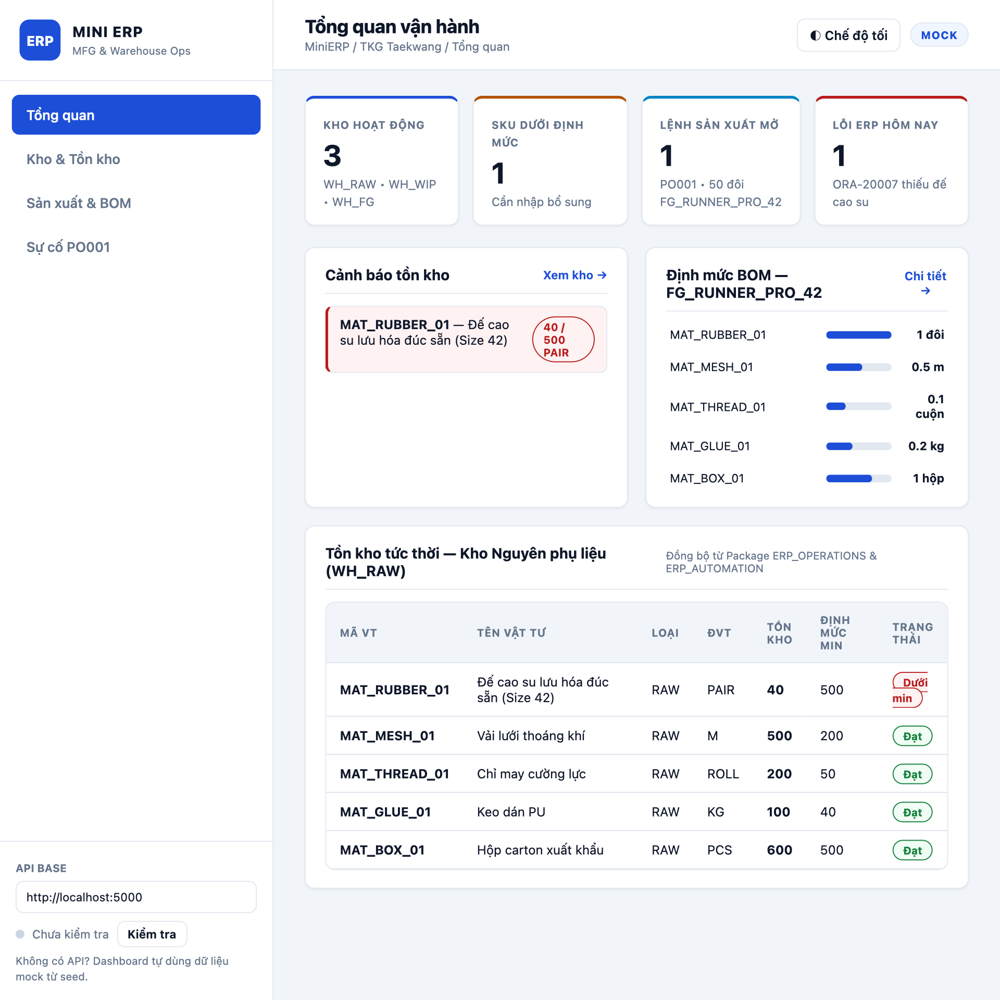

# 🏭 MiniERP — Manufacturing Execution & Warehouse Management

> **Dự án portfolio** mô phỏng hệ thống ERP cho nhà máy gia công,
> gồm **Oracle PL/SQL, ASP.NET Core 8, Dashboard** và kiểm thử CI/CD.

<p align="center">
  <a href="https://github.com/imtarget05/MiniERP-Manufacturing-Warehouse/actions/workflows/ci.yml">
    
  </a>
  
  
  
  
  
  
  
</p>

---

## Dự án này làm được gì?

Một nhà máy gia công thường gặp 4 vấn đề trước khi số hóa:

1. **Không truy được nguồn gốc lô** — khó xác định nguyên liệu và nhà cung cấp khi thành phẩm bị khiếu nại.
2. **Sai lệch tồn kho** — quét mã lặp, mất mạng hoặc thao tác lại tạo giao dịch trùng.
3. **Dừng chuyền sản xuất** — phát lệnh khi BOM hoặc vật tư chưa được kiểm tra.
4. **Thiếu kiểm soát** — điều chỉnh tồn, phê duyệt và tra cứu thay đổi thiếu phân tách quyền.

MiniERP gói các bài toán này thành một luồng khép kín:

- ✅ **Oracle PL/SQL** giữ transaction nguyên tử cho kho, BOM và sản xuất.
- ✅ **FEFO & genealogy hai chiều** truy lô thành phẩm về nguyên liệu và nhà cung cấp.
- ✅ **PBKDF2, JWT, RBAC, audit** bảo vệ thao tác và truy cập.
- ✅ **166 test + 9-stage acceptance** kiểm tra API, Oracle, backup và traceability.
- ✅ **Helpdesk outbox** gửi incident theo kiểu fail-soft, không rollback nghiệp vụ ERP.

---

## Tôi đã xây dựng những gì?

### 🏗️ 1. Oracle ERP, WMS và MES bằng PL/SQL

Tầng CSDL chứa **31 bảng 3NF** và 3 package nghiệp vụ chính:

| Thành phần | Chức năng |
|---|---|
| 📦 **`ERP_OPERATIONS`** | Kho, vật tư, BOM, purchase order và production order |
| 🤖 **`ERP_AUTOMATION`** | Kiểm tra vật tư, reservation, cảnh báo và phê duyệt |
| 🏷️ **`ERP_TRACEABILITY`** | Lot, bin, hạn dùng, FEFO, genealogy và nhãn Zebra |
| 🎫 **Helpdesk Outbox** | Gửi và retry incident tới Enterprise Helpdesk |
| 🛡️ **Error Log** | Ghi lỗi độc lập khi transaction nghiệp vụ rollback |

### 🌐 2. ASP.NET Core 8 API và Operations Dashboard

| Tính năng | Mô tả |
|---|---|
| 🔌 **62 REST operations** | Nhập kho, tồn, BOM, sản xuất, lot, audit và Helpdesk |
| 🖥️ **Operations Dashboard** | Tổng quan nhà máy, kho, BOM, lot, approval và sự cố |
| 🔍 **Truy vết trực quan** | Cây backward/forward genealogy và nhãn ZPL/HTML |
| 🧭 **Theo dõi yêu cầu** | `X-Correlation-ID`, health checks và autonomous error log |
| 🤝 **RBAC theo nghiệp vụ** | Warehouse, Planner, Procurement, Manager, Support, Auditor |

### 📋 3. Quy trình sản xuất khép kín

Quy trình mẫu đi từ lô nguyên liệu đến truy xuất thành phẩm:

1. Nhà cung cấp giao hàng và nhận lô kèm hạn dùng.
2. Put-away vào bin, kiểm tra tồn và cấp lô theo **FEFO**.
3. Dự án BOM, kiểm tra khả dụng và reserve vật tư.
4. Hoàn thành lệnh trong transaction nguyên tử, sinh thành phẩm.
5. In nhãn và truy ngược/forward bằng cây genealogy.

Các tình huống nghiệp vụ có thể tái lập gồm:

| Kịch bản | Kết quả kiểm chứng |
|---|---|
| Nhập lô và quét mã lặp | Idempotency ngăn cộng tồn hai lần |
| Hoàn thành BOM thiếu vật tư | `ORA-20007`, rollback và ghi `ERROR_LOG` |
| Nhiều lô có hạn dùng khác nhau | Cấp phát theo ngày hết hạn sớm nhất |
| Hoàn thành sản xuất có truy vết | Đối soát `STOCK` và `LOT_STOCK` bằng 0 sai lệch |
| Đề xuất điều chỉnh tồn | Hai người phê duyệt trước khi ghi ledger |

### ⚡ 4. Kiểm thử, CI/CD và vận hành

| Công cụ | Phạm vi kiểm thử |
|---|---|
| `dotnet test` | 166 test: unit, contract, RBAC và Oracle integration |
| `scripts/test-api.sh` | 53 kiểm tra HTTP: health, auth, CRUD và phân quyền |
| `scripts/test-traceability.sh` | 61 assertion cho luồng lot → sản xuất → genealogy |
| `scripts/run-all-tests.sh` | Acceptance 9 bước, incident, API, E2E, backup và OpenAPI |
| `scripts/backup-db.sh` | Oracle Data Pump export và quản lý backup |
| `scripts/restore-db.sh` | Phục hồi có kiểm soát trên môi trường demo |

> Nhóm không cần Oracle: **139/139 test**.
> Nhóm cần Oracle thật: **166/166 test**, không skip.

---

## Screenshots



*Dashboard: tổng quan kho, sản xuất, nhận lô, phê duyệt và sự cố.*

---

## Tại sao làm dự án này?

Mục tiêu là trình diễn một dự án ERP có **nghiệp vụ nhà máy thực tế**, không chỉ CRUD:

- Nhận vật tư theo lot và kiểm soát hạn dùng.
- Đồng bộ tồn giữa kho tổng, bin và lot.
- Hoàn thành sản xuất nguyên tử theo BOM.
- Truy xuất nguồn gốc khi cần thu hồi chất lượng.
- Áp dụng phân quyền, hai người duyệt và audit.
- Đóng gói kiểm thử, CI/CD, backup và vận hành.

README này giới thiệu ngắn gọn. Kiến trúc, quy trình, API và runbook chi tiết
nằm trong [`docs/`](docs/).

---

## Chạy thử ngay

### Yêu cầu

- Docker Desktop + Docker Compose.
- Oracle có thể cần vài phút ở lần khởi tạo đầu.
- .NET 8 SDK nếu chạy backend trực tiếp hoặc test local.

### Docker — khuyến nghị

```bash
git clone https://github.com/imtarget05/MiniERP-Manufacturing-Warehouse.git
cd MiniERP-Manufacturing-Warehouse

# Oracle + API + UI, chờ database sẵn sàng
bash scripts/start-db.sh

# Nạp schema, PL/SQL và dữ liệu mẫu
bash scripts/run-sql.sh
```

Mở:

- Dashboard: <http://localhost:8080>
- Swagger: <http://localhost:5000/swagger>
- Health: <http://localhost:5000/api/health>

### Chạy API và dashboard trên host

```bash
# Oracle đã được nạp theo cách trên
docker compose stop api ui

# Terminal 1
bash scripts/start-api.sh

# Terminal 2
python3 -m http.server 8080 --directory dashboard
```

### Chạy test

```bash
# 139 test, không cần Oracle
dotnet test tests/MiniERP.Api.Tests \
  --filter "Category!=Integration"

# 166 test, cần Oracle
dotnet test tests/MiniERP.Api.Tests

# Acceptance đầy đủ 9 bước
bash scripts/run-all-tests.sh
```

> Acceptance thay đổi dữ liệu trong Oracle. Chỉ chạy trên database demo/CI.

---

## Demo nhanh (cho buổi phỏng vấn)

### Tài khoản local

| Tài khoản | Mật khẩu | Nghiệp vụ chính |
|---|---|---|
| `admin` | `Admin@123` | Quản trị và phê duyệt |
| `planner01` | `Planner@123` | BOM và kế hoạch sản xuất |
| `warehouse01` | `Warehouse@123` | Nhập lô, bin, tồn và nhãn |
| `procurement01` | `Procurement@123` | Purchase order và tiếp nhận |
| `support01` | `Support@123` | Lỗi và tích hợp Helpdesk |
| `auditor01` | `Auditor@123` | Truy vết và audit chỉ đọc |

### Demo 1 — Kiểm tra API

```bash
curl -s http://localhost:5000/api/health
```

### Demo 2 — Nhập kho có lot và idempotency

```bash
TOKEN=$(curl -s -X POST http://localhost:5000/api/auth/login \
  -H "Content-Type: application/json" \
  -d '{"username":"warehouse01","password":"Warehouse@123"}' \
  | grep -oE '"accessToken":"[^"]+' | cut -d'"' -f4)

RUN_ID="$(date +%H%M%S)"

curl -s -X POST \
  http://localhost:5000/api/warehouse/receipts/PO_PUR_LOT_01/receive \
  -H "Authorization: Bearer $TOKEN" \
  -H "Content-Type: application/json" \
  -d "{
    \"itemCode\": \"MAT_RUBBER_01\",
    \"qty\": 100,
    \"lotCode\": \"RM-$RUN_ID\",
    \"supplierLotNo\": \"SUP-$RUN_ID\",
    \"receivingLocationCode\": \"RCV-01\",
    \"idempotencyKey\": \"readme-$RUN_ID\"
  }"
```

Gửi lại cùng key và payload sẽ replay; cùng key nhưng khác payload sẽ bị từ chối.

### Demo 3 — Chạy traceability E2E

```bash
bash scripts/test-traceability.sh http://localhost:5000
```

Kịch bản đầy đủ cho buổi phỏng vấn:
[Recruiter Demo](docs/demo/recruiter-demo.md).

---

## Cấu trúc project

```text
04-MiniERP-Manufacturing-Warehouse/
├── 📁 .github/workflows/   # CI/CD
├── 📁 src/                 # ASP.NET Core 8 API
├── 📁 sql/                 # Schema, PL/SQL và seed
├── 📁 dashboard/           # Operations Dashboard
├── 📁 tests/               # 166 test xUnit
├── 📁 scripts/             # Run, test, backup và restore
├── 📁 docs/                # Phân tích, kiến trúc, UAT, vận hành
├── 📁 artifacts/           # Evidence kiểm định
├── 📁 go-live/             # Cutover và rollback
├── docker-compose.yml
└── README.md
```

---

## Tech stack

<p>
  
  
  
  
  
  
  
  
  
  
  
</p>

---

## Tài liệu tham khảo

- [📐 Kiến trúc hệ thống](docs/architecture/system-context.md)
- [🗄️ Thiết kế CSDL Oracle](docs/architecture/database-design.md)
- [🔒 Thiết kế bảo mật & RBAC](docs/security/security-design.md)
- [📋 Kết quả UAT](docs/uat/uat-results.md)
- [⚙️ CI/CD pipeline](docs/devops/ci-cd.md)
- [💾 Sao lưu, phục hồi & DR](docs/operations/backup-restore.md)
- [🚨 Runbook ERP Support](docs/05-erp-support-runbook.md)
- [🎯 Kịch bản demo đầy đủ](docs/demo/recruiter-demo.md)
- [📨 Hợp đồng tích hợp Helpdesk](https://github.com/imtarget05/Enterprise-IT-Helpdesk-Lab/blob/main/docs/11-minierp-integration.md)

> Đây là dự án portfolio mô phỏng nghiệp vụ doanh nghiệp. Tài khoản và số liệu
> trong repository chỉ dùng cho học tập/demo, không phải cam kết SLA thương mại.

---

**MIT License** — *Dự án portfolio của **Mai Nguyễn Bình Tân*** — GitHub: [@imtarget05](https://github.com/imtarget05)
