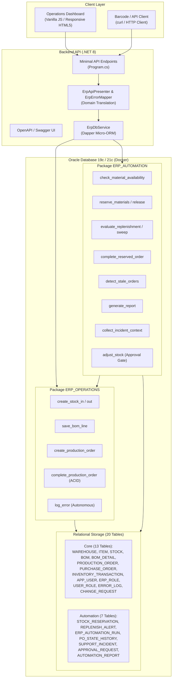
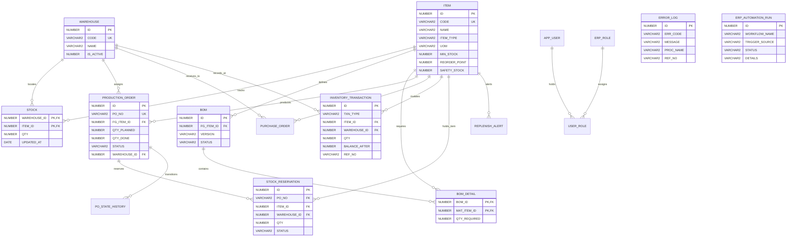

# MiniERP — Manufacturing Execution & Warehouse Automation

> A modular Mini ERP system for industrial manufacturing and warehouse workflows using ASP.NET Core (.NET 8), Oracle Database 19c/21c, and PL/SQL.

[](https://dotnet.microsoft.com/)
[](https://www.oracle.com/database/)
[]()
[](https://github.com/imtarget05/MiniERP-Manufacturing-Warehouse/actions/workflows/ci.yml)
[]()
[]()

---

## 1. Project Title

**MiniERP — Manufacturing Execution & Warehouse Automation**

A mini ERP system tailored for manufacturing plants (footwear/apparel assembly) that solves raw material shortages, inventory race conditions, and unlogged production failures using ASP.NET Core, Oracle Database, and transactional PL/SQL packages.


---

## 2. Business Problem

In industrial manufacturing plants located across Industrial Zones (Khu Công Nghiệp - KCN), production planners and warehouse teams frequently face critical operational bottlenecks:

1. **Shortage Discovered at Assembly Time:** Workers on the assembly line discover missing raw materials (such as soles, glue, or specialized mesh) only when attempting to execute a production run, halting the line and creating expensive idle labor costs.
2. **Race Conditions & Double Allocation:** When multiple production orders are released simultaneously against the same shared material stock without serialized locking, orders overcommit inventory, leading to phantom availability and unexpected plant halts.
3. **Loss of Diagnostic Context on Failure:** When a transaction aborts in traditional systems, the rollback wipes out both the business movement and the incident trace, leaving IT support engineers blind to the root cause.
4. **Tedious Manual Calculations:** Plant staff spend hours manually reconciling multi-level Bill of Materials (BOM), checking reorder thresholds, and filing manual paper forms for emergency inventory adjustments.

This project delivers an automated, transactionally safe ERP core that eliminates manual pre-flight stock checks, manages soft material reservations, enforces autonomous error recording, and provides an operator dashboard suitable for plant operations.

---

## 3. Solution Overview

The system establishes an automated pipeline connecting the shop floor, the REST API gateway, and stored database procedures:

```text
Shop Floor / Operator / Web Dashboard
   │ (HTTP / JSON / Barcode)
   ▼
ASP.NET Core Web API (.NET 8 + Dapper)
   │  ├── Strict DTO Validation
   │  └── Business Error Code Mapping (ORA-200xx -> HTTP 400/403/404/409)
   ▼
Oracle Database PL/SQL Engine (ERP_OPERATIONS & ERP_AUTOMATION)
   │  ├── Pessimistic Locking (SELECT FOR UPDATE)
   │  ├── BOM Explosion & Soft Material Reservations (STOCK_RESERVATION)
   │  ├── Atomic Transactions (Raw Material Consumption + Finished Goods Output)
   │  └── Autonomous Error Logging (PRAGMA AUTONOMOUS_TRANSACTION)
   ▼
Audit & Persistence Layer (20 Relational Tables)
   │  ├── Ledger Invariant: STOCK.QTY = SUM(INVENTORY_TRANSACTION.QTY)
   │  ├── Automated Replenishment Alerts (REPLENISH_ALERT)
   │  └── Automation Audit Trail (ERP_AUTOMATION_RUN)
   ▼
Result / Operator Dashboard / Incident Diagnostic Context
```

---

## 4. Architecture

### System Architecture Diagram



---

## 5. Core Modules

| Module | Responsibility | Key Components | Status |
|---|---|---|---|
| **Master Data** | Items (RAW materials & Finished Goods), multi-warehouse hierarchy (`WH_RAW`, `WH_WIP`, `WH_FG`), Units of Measure, user accounts, and roles. | `ITEM`, `WAREHOUSE`, `APP_USER`, `ERP_ROLE` | **Implemented** |
| **Warehouse Inventory** | Stock In, Stock Out, real-time balances, pessimistic locking (`SELECT FOR UPDATE`), immutable audit transactions. | `STOCK`, `INVENTORY_TRANSACTION`, `ERP_OPERATIONS` | **Implemented** |
| **Manufacturing & BOM** | Multi-level Bill of Materials definition, BOM explosion, planned order release, atomic consumption and finished goods creation. | `BOM`, `BOM_DETAIL`, `PRODUCTION_ORDER` | **Implemented** |
| **Business Automation** | Pre-flight material checks, soft reservations, low-stock replenishment sweeps, stale PO detection, scheduled operational reports. | `ERP_AUTOMATION`, `STOCK_RESERVATION`, `REPLENISH_ALERT` | **Implemented** |
| **ERP Support & Runbook** | Autonomous error logging surviving rollbacks, Change Request tracking, incident diagnosis context collector. | `ERROR_LOG`, `CHANGE_REQUEST`, `SUPPORT_INCIDENT` | **Implemented** |
| **Operations Dashboard** | Lightweight industrial web dashboard for factory workstations; supports dual Mock/Live API modes. | `dashboard/index.html`, `app.js`, `styles.css` | **Implemented** |
| **Integration Test Suite** | Deterministic baseline fixtures, serialized test runner, 56 integration/contract tests against real Oracle instance. | `MiniERP.Api.Tests`, `TestStockFixture.cs` | **Implemented** |
| **AI Diagnostic Assistant** | Diagnostic context extraction implemented; LLM root-cause suggestion integration. | `CollectIncidentContextAsync`, `SPEC-KE-HOACH-AI.md` | **Planned** |

---

## 6. Automation Workflows

### Workflow 1: Pre-flight Material Availability Check & Soft Reservation (W1 & W2)

Eliminates line downtime by evaluating BOM requirements against available stock before physical production starts.

```text
Trigger: Production Order Released (API: POST /api/automation/production-order/{poNo}/material-check)
   ↓
Condition: Available Stock = Physical Stock (STOCK.QTY) - Active Reservations of Other Orders
   ↓
Decision:
   ├── If Available >= Required for all BOM lines:
   │     Action: Order status becomes READY; soft holds written to STOCK_RESERVATION
   │     Audit: Record SUCCESS in ERP_AUTOMATION_RUN
   └── If Any Material Short:
         Action: Order status becomes WAITING_MATERIAL; upsert record in REPLENISH_ALERT
         Result: Raises ORA-20007 / HTTP 409 ERR_MATERIAL_SHORTAGE
         Audit: Record FAILED in ERP_AUTOMATION_RUN
```
> **Business Value:** Prevents releasing unbuildable orders to the factory floor and eliminates blind material reservation conflicts between competing work orders.

---

### Workflow 2: Low-Stock & Replenishment Evaluation (W3)

Automatically detects material depletion below safety levels and computes economic reorder quantities.

```text
Trigger: Stock Transaction (Stock-Out / Consumption) OR Scheduled Sweep (POST /api/automation/replenishment/sweep)
   ↓
Condition: Available Stock <= REORDER_POINT
   ↓
Action:
   - Compute Suggested Qty = (AVG_DAILY_USAGE × LEAD_TIME_DAYS) + SAFETY_STOCK - Available Stock
   - Upsert active alert in REPLENISH_ALERT (deduplicated by item + warehouse)
   - When stock recovers above threshold: automatically mark alert as CLOSED
   ↓
Audit: Record execution in ERP_AUTOMATION_RUN
```
> **Business Value:** Removes daily manual inventory ledger reviews and prevents stockouts of long lead-time components.

---

### Workflow 3: Transactional Order Completion with Reservation Consumption (W4)

Executes multi-table inventory movements in a single atomic transaction.

```text
Trigger: Plant Operator completes order (POST /api/automation/production-order/{poNo}/complete)
   ↓
Step 1: Pessimistic Lock on PRODUCTION_ORDER and STOCK records (SELECT FOR UPDATE)
Step 2: Transition ACTIVE reservations for this PO to CONSUMED
Step 3: Call ERP_OPERATIONS.complete_production_order:
        ├── Deduct required RAW materials from STOCK (WH_RAW)
        ├── Insert finished product into STOCK (WH_FG)
        ├── Write immutable INVENTORY_TRANSACTION rows (MFG_CONSUME & MFG_OUTPUT)
        └── Update PRODUCTION_ORDER status to COMPLETED and record QTY_DONE
   ↓
Failure Handling: Any shortage or lock timeout triggers a complete ROLLBACK.
                 Autonomous error log persists in ERROR_LOG and ERP_AUTOMATION_RUN.
```
> **Business Value:** Guarantees 100% data consistency. A failed production run will never leave partial inventory deductions in the ledger.

---

### Workflow 4: Four-Eyes Approval Gate for Manual Inventory Adjustments

Prevents unauthorized inventory modifications by requiring explicit administrative token approval.

```text
Trigger: Warehouse manager requests inventory delta (POST /api/automation/approvals)
   ↓
Status: Approval created in PENDING state
   ↓
Decision: Authorized supervisor approves token (POST /api/automation/approvals/{no}/decision)
   ↓
Action: POST /api/automation/stock/adjust called with approved token
   ├── Validates token status == 'APPROVED' (rejects with HTTP 403 ERR_APPROVAL_REQUIRED if absent)
   ├── Updates STOCK balance
   ├── Marks token CONSUMED
   └── Writes signed ADJUSTMENT entry in INVENTORY_TRANSACTION
```
> **Business Value:** Prevents internal fraud and maintains compliance with plant inventory auditing standards.

---

## 7. Key Engineering Decisions

### Decision 1: Encapsulate Core Business Logic in Oracle PL/SQL Packages

- **Reason:** In high-throughput industrial plants, multiple applications, barcode terminals, and batch jobs touch inventory simultaneously. Placing BOM explosion, reservation checks, and stock deductions inside stored procedures minimizes network roundtrips and guarantees data proximity.
- **Trade-off:** Database vendor lock-in to Oracle; procedural code requires dedicated SQL tooling for deployment and migrations.
- **Alternative Considered:** Pure C# application layer domain logic with Entity Framework Core. Rejected because concurrent direct SQL updates from external plant systems would bypass application-level business invariants.

---

### Decision 2: Autonomous Error Logging via `PRAGMA AUTONOMOUS_TRANSACTION`

- **Reason:** Standard transaction rollbacks in relational databases erase all DML executed within the transaction scope, including error logs. Declaring `PRAGMA AUTONOMOUS_TRANSACTION` in `log_error` allows error diagnostic records to commit independently without preserving corrupted business data.
- **Trade-off:** Requires careful handling of commit boundaries inside the procedure to avoid uncommitted locks or unintended side effects.
- **Alternative Considered:** Catching exceptions in C# API layer and writing error logs via a secondary HTTP/DB request. Rejected because direct database-level executions (such as PL/SQL jobs or internal triggers) would fail silently without recording incidents.

---

### Decision 3: Dapper Micro-ORM Over Entity Framework Core

- **Reason:** MiniERP interacts with database procedures that execute complex `SELECT FOR UPDATE` queries, multi-table transactions, and custom exception handling. Dapper provides near-zero object mapping overhead and native support for `CommandType.StoredProcedure` and Oracle parameter arrays.
- **Trade-off:** Manual mapping of SQL parameters and lack of built-in schema migration tools (schema is managed via reproducible SQL scripts).
- **Alternative Considered:** EF Core with Stored Procedure mapping. Rejected due to heavy change-tracking overhead and impedance mismatch with legacy procedure schemas.

---

### Decision 4: Decoupling Soft Reservations (`STOCK_RESERVATION`) from Physical Stock

- **Reason:** Decrementing physical stock rows when a production order is created causes warehouse discrepancies: physical warehouse counts would not match the ledger if an order is cancelled or delayed. Soft reservations hold allocation without mutating physical stock rows.
- **Trade-off:** Availability queries must compute `Physical Stock - SUM(Active Holds)` rather than reading a single column.
- **Alternative Considered:** Maintaining a `RESERVED_QTY` column on the `STOCK` table. Rejected because row contention on `STOCK` increases dramatically when multiple planners evaluate different orders concurrently.

---

### Decision 5: Deterministic Database Fixtures & Serialized Integration Tests

- **Reason:** Integration tests execute against a real Oracle container. Prior test runs permanently altered inventory balances and left active reservations, causing subsequent runs to fail intermittently due to false shortages. A custom `TestStockFixture` resets baseline balances before each scenario, and `DisableTestParallelization = true` serializes DB tests.
- **Trade-off:** Slightly longer test suite execution time (approx. 8–15 seconds total).
- **Alternative Considered:** Dropping and recreating the database schema before every test run. Rejected because container schema recreation takes over 30 seconds per run, severely slowing development feedback loops.

---

## 8. Reliability and Failure Handling

| Mechanism | Implementation Details | Status |
|---|---|---|
| **ACID Transaction Boundaries** | All multi-table operations (consume RAW + produce FG + write transaction log + update order status) execute within explicit PL/SQL transaction blocks. | **Implemented** |
| **Atomic Rollback on Error** | Any constraint violation or custom exception (`ORA-20001` through `ORA-20012`) triggers an immediate database `ROLLBACK`. | **Implemented** |
| **Autonomous Incident Persistence** | Error logs in `ERROR_LOG` and workflow run audits in `ERP_AUTOMATION_RUN` commit independently via `PRAGMA AUTONOMOUS_TRANSACTION`. | **Implemented** |
| **Concurrency Control** | Row-level pessimistic locking via `SELECT ... FOR UPDATE` prevents simultaneous order completion race conditions on identical SKU inventory. | **Implemented** |
| **Ledger Invariant Enforcement** | Verified constraint: `STOCK.QTY = SUM(INVENTORY_TRANSACTION.QTY)` across all warehouse transactions. | **Implemented** |
| **Idempotency** | Repeating material reservation or replenishment sweeps on the same order or item updates existing records without generating duplicates. | **Implemented** |
| **Retry & Dead-Letter Queue (DLQ)** | Automated retry queue for failed external webhook notifications. | **Planned** |

---

## 9. Security

- **Authentication:** Password validation against `APP_USER` storing credential profiles.
- **Role-Based Access Control (RBAC):** Normalized roles in `ERP_ROLE` and `USER_ROLE` (`ERP_ADMIN`, `WAREHOUSE_STAFF`, `PRODUCTION_STAFF`, `ERP_SUPPORT`).
- **Four-Eyes Principle:** Critical inventory adjustments require approval from a separate authorized user through `APPROVAL_REQUEST`.
- **Parameterized SQL:** All database communications utilize parameterized queries through Dapper, preventing SQL injection vulnerabilities.
- **Input Validation:** Mandatory DTO validation on numeric bounds (non-negative quantities, required warehouse codes, valid item references).
- **Audit Immutability:** `INVENTORY_TRANSACTION` is strictly insert-only; no update or delete operations are permitted in the application layer.

---

## 10. Observability

- **API Health Probe:** `GET /api/health` probes Oracle connectivity, verifies that the `ERP_OPERATIONS` package status is `VALID`, and confirms that the required table count is present.
- **Autonomous Error Log:** `GET /api/support/errors?refNo={poNo}` allows support technicians to retrieve diagnostic traces with procedure names, error codes, and exact timestamps.
- **Automation Execution Audit:** `GET /api/automation/runs?workflow={name}` records execution duration, trigger source, operator identity, and outcome status (`SUCCESS`, `FAILED`, `MANUAL_REVIEW`).
- **Standardized Error Mapping:** Business exceptions map directly from Oracle error numbers to standardized JSON problem details containing `businessCode`, `oracleCode`, and `procedureName`.
- **OpenTelemetry & Distributed Tracing:** Exporting metrics and traces to Prometheus / Grafana. (*Planned*)

---

## 11. Database / Data Model

The schema consists of 20 normalized relational tables in Oracle Database (13 core tables + 7 automation extension tables).



---

## 12. Main Workflow (End-to-End Manufacturing Execution)

Below is the complete lifecycle of a footwear production batch (`FG_RUNNER_PRO_42`) through the MiniERP system:

```text
1. Planner creates Production Order PO001 (50 pairs of FG_RUNNER_PRO_42)
   └─ Order status: RELEASED
2. System triggers Pre-flight Material Availability Check (W1)
   ├─ Explodes active BOM V1.0:
   │    MAT_RUBBER_01: 50 pairs | MAT_MESH_01: 25 m | MAT_THREAD_01: 5 rolls
   │    MAT_GLUE_01: 10 kg      | MAT_BOX_01: 50 pcs
   ├─ Checks physical inventory in WH_RAW minus existing active holds
   └─ Result:
        - If stock is sufficient: Order transitions to READY; soft reservations written.
        - If stock is short (e.g., rubber soles = 40): Order transitions to WAITING_MATERIAL;
          incident logged to ERROR_LOG via autonomous transaction; REPLENISH_ALERT created.
3. Procurement & Inward Receiving (Remediation)
   ├─ Supplier delivers 100 pairs of MAT_RUBBER_01 via Purchase Order PO_PUR_901
   ├─ Warehouse team executes receive_purchase_order(PO_PUR_901)
   └─ WH_RAW rubber stock increases to 140; REPLENISH_ALERT automatically closes.
4. Production Execution & Atomic Completion (W4)
   ├─ Assembly line manager triggers complete_production_order(PO001)
   ├─ Locks rows via SELECT FOR UPDATE to prevent race conditions
   ├─ Consumes 50 units of each raw material (writes 5 MFG_CONSUME ledger rows)
   ├─ Increments finished goods inventory by 50 in WH_FG (writes 1 MFG_OUTPUT row)
   ├─ Marks soft reservations as CONSUMED
   └─ Updates PO001 status to COMPLETED with QTY_DONE = 50.
5. Invariant Audit Verification
   └─ Confirms: STOCK.QTY == SUM(INVENTORY_TRANSACTION.QTY) for every impacted SKU.
```

---

## 13. AI Integration (Architecture & Boundaries)

MiniERP incorporates a structured diagnostic preparation layer designed for AI-powered ERP incident troubleshooting while strictly enforcing safety boundaries:

```text
Technician / ERP Support
        │
        ▼
Select Problem Order / Incident (PO001)
        │
        ▼
Backend Aggregator: ERP_AUTOMATION.collect_incident_context
        │  ├── Aggregates ERROR_LOG rows
        │  ├── Extracts BOM requirements vs current stock
        │  ├── Identifies negative variance
        │  └── Serializes into sanitized Diagnostic Context JSON
        ▼
AI ERP Diagnostic Assistant (LLM Inference Engine)
        │
        ▼
Advisory Output: Root-cause analysis + Recommended operational fixes
```

### Safety Boundaries

- **Advisory Only:** The AI assistant produces read-only recommendations (e.g., *"Shortage of 10 pairs MAT_RUBBER_01; recommend receiving pending shipment PO_PUR_901"*).
- **Zero Direct DML:** The AI layer possesses no database write permissions. It cannot execute SQL queries, alter inventory balances, approve change requests, or complete production orders.
- **Context Sanitization:** Only operational SKU numbers, required vs available quantities, and system error codes are shared; no user passwords or employee credentials are included in the prompt payload.
- **Graceful Fallback:** If the external AI service is unreachable, the system falls back to standard rule-based diagnosis extracted directly from `ERROR_LOG`.

---

## 14. Tests

All business logic, error mappings, and transactional procedures are covered by automated unit and database integration tests.

### Test Execution Summary

```text
Test Run Summary:
Total Tests:    56
Passed:         56
Failed:          0
Skipped:         0
Duration:       ~8 seconds
Target Schema:  Oracle Database (Docker minierp-oracle)
```

### Test Suite Structure

- **Contract & Error Mapping Unit Tests (`ErpContractTests.cs` - 16 tests):** Validates normalization of Oracle error codes (`ORA-20001` through `ORA-20012`), HTTP status code translation (400, 403, 404, 409, 500), and problem details generation without requiring a database connection.
- **Core API Integration Tests (`ApiIntegrationTests.cs` - 17 tests):** Boots the live ASP.NET Core pipeline via `WebApplicationFactory<Program>` and exercises real endpoints: Health check, Warehouse listing, Stock In/Out, BOM maintenance, Production Order lifecycle, Purchase Order receiving, and Error log queries.
- **Automation Integration Tests (`AutomationIntegrationTests.cs` - 23 tests):** Validates workflows W1 through W8: material availability checks, idempotent soft reservations, reservation release, atomic completion, replenishment sweeps, stale order detection, scheduled report generation, and the 4-eyes approval gate.
- **Deterministic Verification:** The full 56-test suite has been **verified across 3 consecutive runs without database reseeding**, confirming zero cross-test state drift or reservation leaks.
- **Incident Script (`scripts/test-incident.sh`):** Validates all 14 assertions of the production shortage scenario end-to-end (14/14 PASS).

---

## 15. Demo Scenarios

These quick scenarios can be demonstrated directly during a technical interview or code walkthrough:

### Scenario 1: Material Shortage & Autonomous Error Logging
1. Run `POST /api/manufacturing/production-order` for PO001 requesting 50 pairs of shoes.
2. Attempt completion via `POST /api/manufacturing/production-order/PO001/complete` while rubber soles inventory is 40.
3. System blocks transaction with `HTTP 409 Conflict` (`ERR_MATERIAL_SHORTAGE`).
4. Inspect `GET /api/support/errors?refNo=PO001`: demonstrates that the error was captured via `PRAGMA AUTONOMOUS_TRANSACTION` despite the transaction rollback.

### Scenario 2: Purchase Receiving & Successful Order Completion
1. Create and receive missing components: `POST /api/procurement/purchase-order/PO_PUR_901/receive` (+100 soles).
2. Retry completion: `POST /api/manufacturing/production-order/PO001/complete`.
3. Order completes successfully (`STATUS = COMPLETED`, `QTY_DONE = 50`).
4. Inspect warehouse balances: raw materials decremented, finished goods incremented by 50, and audit ledger reflects all movements.

### Scenario 3: Soft Material Reservation & Idempotency
1. Create order `AUT_RES_001` and call `POST /api/automation/production-order/AUT_RES_001/reserve`.
2. Observe status transitions to `READY` with rows written to `STOCK_RESERVATION`.
3. Call reserve endpoint a second time: returns `HTTP 200` without creating duplicate holds (idempotent).
4. Call release endpoint: holds are cancelled and inventory availability is restored.

### Scenario 4: Four-Eyes Approval on Inventory Adjustments
1. Attempt direct stock adjustment without token: `POST /api/automation/stock/adjust` fails with `HTTP 403 Forbidden` (`ERR_APPROVAL_REQUIRED`).
2. Request approval token: `POST /api/automation/approvals` (status: `PENDING`).
3. Approve token via manager account: `POST /api/automation/approvals/{no}/decision` (status: `APPROVED`).
4. Re-execute stock adjustment with approved token: adjustment succeeds and ledger row is written.

---

## 16. How to Run

### Prerequisites
- Docker Engine or Docker Desktop
- .NET 8.0 SDK (optional if running inside container)
- Bash shell (macOS, Linux, or WSL2)

### Quick Start (Single Command)

To run the complete automated validation pipeline (Oracle startup, schema migration, PL/SQL package compilation, seed data, incident replay, API build, test suite execution, and Swagger export):

```bash
bash scripts/run-all-tests.sh
```

### Manual Step-by-Step Execution

```bash
# 1. Start Oracle Database container
docker compose up -d
bash scripts/start-db.sh

# 2. Apply database schemas, PL/SQL packages, and seed data
bash scripts/run-sql.sh

# 3. Verify the real-world incident simulation (PO001)
bash scripts/test-incident.sh

# 4. Run the automated test suite (56 tests)
dotnet test tests/MiniERP.Api.Tests

# 5. Start the ASP.NET Core API server
bash scripts/start-api.sh
# Open http://localhost:5000 in your browser to explore the Swagger UI

# 6. Launch the Factory Operations Dashboard
cd dashboard && python3 -m http.server 8080
# Open http://localhost:8080 to access the operations UI
```

---

## 17. Repository Structure

```text
04-MiniERP-Manufacturing-Warehouse/
├── README.md                          # Portfolio & technical overview document
├── docker-compose.yml                 # Oracle Database Free (slim) container definition
├── dashboard/                         # Plant operations web dashboard (HTML5/CSS/JS)
│   ├── index.html                     # Responsive factory UI with KPIs and runbook
│   ├── app.js                         # Dual-mode state machine (Live API / Mock fallback)
│   └── styles.css                     # Industrial design theme with dark/light modes
├── docs/                              # Technical specifications and guides
│   ├── 01-phases.md                   # Implementation roadmap and DoD criteria
│   ├── 02-database-schema.md          # Data dictionary for all relational tables
│   ├── 03-api-spec.md                 # REST API endpoint documentation
│   ├── 04-plsql-spec.md               # PL/SQL package specifications & error catalog
│   ├── 05-erp-support-runbook.md      # IT ERP incident diagnosis and resolution runbook
│   ├── 06-interview-and-cv-en.md      # Interview defense Q&A and resume descriptions
│   └── images/                        # Architecture diagrams and UI preview assets
├── scripts/                           # Automation and verification bash scripts
│   ├── lib.sh                         # Shared shell helpers and database wrappers
│   ├── start-db.sh                    # Container health-check polling script
│   ├── run-sql.sh                     # Sequential SQL script execution runner
│   ├── test-incident.sh               # Incident scenario verification harness
│   ├── start-api.sh                   # API startup manager (foreground/background)
│   └── run-all-tests.sh               # End-to-end 7-stage CI/CD verification pipeline
├── sql/                               # Oracle DDL, PL/SQL packages, and seeds
│   ├── 01_schema.sql                  # Core schema definition (13 tables, keys, indexes)
│   ├── 02_plsql.sql                   # Package ERP_OPERATIONS (ACID movements, logging)
│   ├── 03_seed.sql                    # Footwear manufacturing plant seed dataset
│   ├── 04_incident_scenarios.sql      # PO001 shortage simulation & verification script
│   ├── 05_automation_schema.sql       # Automation extension schema (7 tables)
│   └── 06_automation_plsql.sql        # Package ERP_AUTOMATION (Workflows W1-W7)
├── src/                               # ASP.NET Core 8 Web API backend
│   ├── Program.cs                     # Minimal API route definitions & dependency wiring
│   ├── Models/                        # Request/Response DTO records
│   ├── Services/                      # ErpDbService, ErpErrorMapper, ErpApiPresenter
│   └── appsettings.json               # Database connection string configuration
└── tests/                             # Automated test projects
    └── MiniERP.Api.Tests/             # 56 Unit, Contract, and Integration tests
```

---

## 18. Current Project Status

| Area | Implementation Status | Verified Evidence |
|---|---|---|
| **Core Database Schema** | **Implemented** | 20 Oracle tables, constraints, foreign keys, and indexes compiled. |
| **PL/SQL Packages** | **Implemented** | `ERP_OPERATIONS` and `ERP_AUTOMATION` compiled with `STATUS = 'VALID'`. |
| **Backend REST API** | **Implemented** | ASP.NET Core (.NET 8) Minimal API endpoints verified via curl and integration tests. |
| **Plant Dashboard UI** | **Implemented** | Dual-mode responsive dashboard functional with live API connection and mock fallback. |
| **Automated Integration Tests** | **Implemented** | 56/56 passing tests across 3 consecutive runs without database reseeding. |
| **ERP Incident Runbook** | **Implemented** | 14/14 assertions passing in `scripts/test-incident.sh`. |
| **Four-Eyes Approval Gate** | **Implemented** | Token-gated stock adjustment verified with HTTP 403 rejection on unapproved actions. |
| **AI LLM Diagnostics** | **Planned** | Diagnostic context builder implemented (`W7`); LLM inference agent planned for next phase. |

---

## 19. Roadmap

1. **Phase 1: Scheduled Operational Worker Service**
   - Implement a .NET BackgroundWorker / Quartz.NET job to execute scheduled replenishment sweeps and stale order checks automatically.
2. **Phase 2: Observability & Distributed Tracing**
   - Integrate OpenTelemetry metrics and Serilog structured logging exporting to Prometheus and Grafana.
3. **Phase 3: AI ERP Diagnostic Assistant**
   - Connect the sanitized incident context payload (`W7`) to an external LLM agent to provide interactive troubleshooting recommendations to plant support technicians.
4. **Phase 4: Mobile Barcode Scanning Interface**
   - Extend the dashboard into a mobile-friendly progressive web application (PWA) supporting handheld barcode scanners for warehouse stock-in/stock-out operations.

---

## 20. Interview Talking Points

### Talking Point 1: Overcoming Test State Drift in Shared Database Integration Tests
- **Context:** Integration tests run against a single, persistent Oracle instance. Earlier iterations experienced flaky test runs because previous tests permanently modified stock balances and left active reservations behind.
- **Solution:** Designed a deterministic test fixture (`TestStockFixture`) that reconciles stock to baseline levels before each test and disabled parallel test execution (`[assembly: CollectionBehavior(DisableTestParallelization = true)]`).
- **Result:** Achieved 56/56 passing tests verified across 3 consecutive suite executions without requiring a database drop or re-seed.

### Talking Point 2: Preserving Diagnostic State During Transaction Rollbacks
- **Context:** In enterprise ERPs, when a transaction rolls back due to a business rule violation (e.g., material shortage `ORA-20007`), all database modifications within the transaction are discarded.
- **Solution:** Implemented the error logging procedure using Oracle's `PRAGMA AUTONOMOUS_TRANSACTION`. This creates an independent sub-transaction that commits error records even when the parent business transaction rolls back.
- **Impact:** IT support engineers have immediate, permanent audit trails to investigate failures without polluting business ledger tables.

### Talking Point 3: Preventing Race Conditions on Limited Material Stock
- **Context:** When multiple production orders are processed concurrently, simultaneous reads can cause two orders to believe the same physical inventory is available, leading to overselling or partial builds.
- **Solution:** Implemented two-tiered protection: pessimistic row-level locking (`SELECT ... FOR UPDATE`) during atomic completion, and soft reservations (`STOCK_RESERVATION`) during order planning.
- **Impact:** Absolute concurrency safety without requiring coarse, table-wide locking.

### Talking Point 4: Architectural Boundary for AI in Mission-Critical Systems
- **Context:** Deploying autonomous AI agents with direct write access to enterprise ERP databases introduces catastrophic risks of data corruption, unauthorized inventory adjustments, or compliance violations.
- **Solution:** Architected the AI diagnostic layer as strictly **Advisory Only**. The database aggregates and sanitizes diagnostic context into JSON, while the AI assistant only suggests root causes and corrective steps.
- **Impact:** Eliminates hallucinations from mutating transactional ledgers while providing actionable assistance to human operators.
