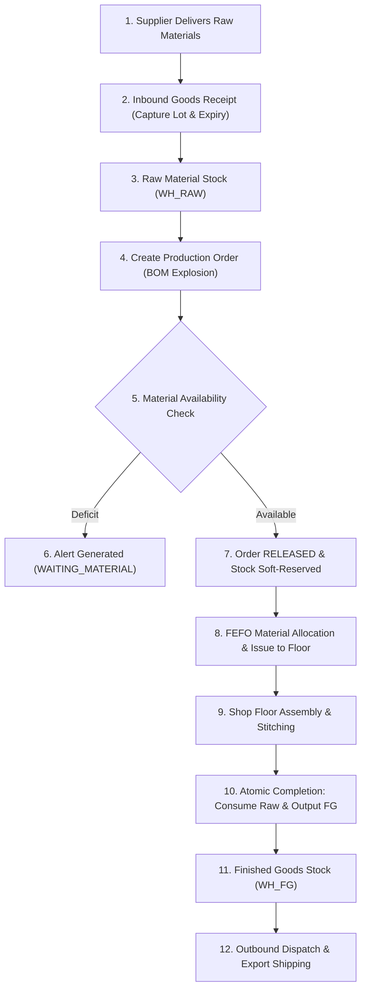

# MiniERP — Manufacturing Execution & Warehouse Management System

> **MiniERP is a portfolio implementation of a manufacturing and warehouse ERP system demonstrating the complete lifecycle from business requirements and architecture through development, testing, CI/CD, deployment, UAT, go-live and operational support.**

<p align="center">
  <a href="https://github.com/imtarget05/MiniERP-Manufacturing-Warehouse/actions/workflows/ci.yml">
    
  </a>
  
  
  
  
  
  
</p>

---

## 1. Business Problem

Contract manufacturing plants (such as athletic footwear and industrial technical apparel assembly facilities) face critical operational vulnerabilities when relying on fragmented spreadsheets and manual paper Kanban cards:
1. **Lack of Lot Traceability (Quality Recalls):** When a batch of export shoes exhibits sole adhesive peeling, the factory cannot determine which adhesive lot or supplier roll was consumed, requiring 48-hour plant-wide operational shutdowns.
2. **Inventory Drift & Ghost Stock:** Double-scanning barcode labels or dropping handheld Wi-Fi signals creates duplicate transactions, negative ledger counts, and warehouse-to-record variances of 15–25%.
3. **Production Line Starvation:** Work orders are released to stitching lines without pre-flight inventory availability checks, causing costly line downtime.
4. **Internal Control Deficiencies:** Warehouse operators adjust physical ledger counts without managerial authorization or immutable audit trails.
5. **Slow IT Incident Diagnosis:** Database transaction failures roll back without preserving diagnostic error states, leaving IT support unable to perform effective Root Cause Analysis (RCA).

---

## 2. Solution Overview

MiniERP resolves these challenges by integrating warehouse logistics and shop floor manufacturing into an atomic, transactional, and audit-compliant architecture:
- **ACID Transaction Atomicity:** BOM explosion, raw material deduction, and finished goods generation occur within atomic Oracle Database PL/SQL transactions.
- **FEFO Material Allocation & Bidirectional Genealogy:** Automatically prioritizes lots by earliest expiration date (`EXPIRY_DATE ASC`) and maintains backward and forward genealogy trees (`/api/trace/{lotCode}`).
- **Two-Person Approval Gate:** Enforces dual-authorization controls for stock adjustments and write-offs exceeding operational thresholds.
- **Scanner Idempotency Guard:** Eliminates duplicate stock adjustments caused by barcode scanner hardware re-triggers.
- **Autonomous Incident Capture:** Utilizes Oracle `PRAGMA AUTONOMOUS_TRANSACTION` to record error events in `ERROR_LOG` even when outer business transactions roll back.

---

## 3. Architecture

The system follows a **Modular Monolith** pattern optimized for high data integrity, transactional speed, and enterprise reliability:

```mermaid
flowchart TD
    subgraph Client Tier
        BROWSER["Web Browser / Tablet (Operations Dashboard: HTML5, CSS3, JS)"]
        SCANNER["Handheld Barcode Scanner (Rugged Floor Terminals)"]
    end

    subgraph Application Tier (ASP.NET Core 8 Web API)
        CORR["CorrelationIdMiddleware (X-Correlation-Id)"]
        AUTH["Authentication (PBKDF2 210k & Bearer JWT)"]
        AUDIT["AuditMiddleware (APP_AUDIT_EVENT)"]
        RBAC["MutationAuthorizationMiddleware (Role-Based Policies)"]
        ROUTES["57 Minimal API Endpoints"]
        DAPPER["Dapper Micro-ORM Layer"]
    end

    subgraph Database Tier (Oracle Database 23c Free)
        PKG_OPS["Package ERP_OPERATIONS (Stock, BOM, PO)"]
        PKG_AUT["Package ERP_AUTOMATION (Checks, Reservations, Approvals)"]
        PKG_TRC["Package ERP_TRACEABILITY (Lots, FEFO, Genealogy)"]
        TABLES["31 Relational Tables (3NF Schema)"]
    end

    BROWSER -->|"HTTPS / REST"| CORR
    SCANNER -->|"Bearer JWT + Scan Payload"| CORR
    CORR --> AUTH --> AUDIT --> RBAC --> ROUTES --> DAPPER
    DAPPER -->|"Oracle.ManagedDataAccess.Core"| PKG_OPS & PKG_AUT & PKG_TRC
    PKG_OPS & PKG_AUT & PKG_TRC --> TABLES
```

---

## 4. Technology Stack

- **Backend:** C# / ASP.NET Core 8 Minimal Web API.
- **Micro-ORM & Data Access:** Dapper 2.1 with `Oracle.ManagedDataAccess.Core` 23.7.
- **Database Engine:** Oracle Database 23c Free (`gvenzl/oracle-free:slim`) / Oracle 21c/19c.
- **Procedural Engine:** Oracle PL/SQL (3 Packages: `ERP_OPERATIONS`, `ERP_AUTOMATION`, `ERP_TRACEABILITY`).
- **Authentication & Cryptography:** RFC 2898 PBKDF2 (210,000 rounds, HMAC-SHA256), HMAC-SHA256 Bearer JWT tokens, in-memory refresh rotation.
- **Frontend Dashboard:** Responsive HTML5 / CSS3 / Vanilla ES6 JavaScript (No heavyweight framework runtime, sub-50ms render latency).
- **Label Generation:** Zebra ZPL II barcode stream renderer & HTML printable templates.
- **Testing Framework:** xUnit 2.5, ASP.NET Core `WebApplicationFactory<Program>`, FluentAssertions.
- **DevOps & Containers:** Docker Compose, Multi-stage Dockerfiles, GitHub Actions CI/CD.

---

## 5. ERP Modules

| Module | Scope & Responsibilities | Key Database Entities |
|---|---|---|
| **Warehouse & Inventory (WMS)** | Multi-warehouse balance (`WH_RAW`, `WH_WIP`, `WH_FG`), bin locations (`WAREHOUSE_LOCATION`), atomic in/out. | `WAREHOUSE`, `ITEM`, `STOCK`, `WAREHOUSE_LOCATION`, `INVENTORY_TRANSACTION` |
| **Manufacturing Execution (MES)**| Production orders (`CREATED` $\rightarrow$ `RELEASED` $\rightarrow$ `COMPLETED`), multi-line BOMs, atomic consumption. | `PRODUCTION_ORDER`, `BOM`, `BOM_DETAIL`, `PO_STATE_HISTORY` |
| **Lot Traceability & Genealogy** | Inbound lot capture, FEFO allocation, Zebra ZPL label jobs, backward/forward genealogy tree traversal. | `INVENTORY_LOT`, `LOT_STOCK`, `PRODUCTION_LOT_CONSUMPTION`, `PRODUCTION_LOT_OUTPUT` |
| **Automation & Approvals** | Pre-flight material checks, soft reservations, replenishment alerts, two-person approval gates. | `STOCK_RESERVATION`, `REPLENISH_ALERT`, `APPROVAL_REQUEST`, `ERP_AUTOMATION_RUN` |
| **Security & Governance** | Role-based mutation authorization, PBKDF2 hash verification, immutable system audit logging. | `APP_USER`, `ERP_ROLE`, `USER_ROLE`, `APP_AUDIT_EVENT` |
| **Integration Outbox** | Fail-soft outward incident dispatch to external Enterprise IT Helpdesk portal. | `HELPDESK_DELIVERY` |

---

## 6. Business Workflow

The system models the complete physical material flow of contract assembly manufacturing:



---

## 7. Screenshots & Interface


The operations dashboard provides dedicated workstations for:
- **Operations Overview:** High-level plant KPIs, safety stock compliance, and real-time inventory matrix.
- **Stock & Warehouses:** Bin-level visibility, fast stock-in, and stock-out controls.
- **Manufacturing & BOM:** Visual BOM component breakdown, production order status, and order completion actions.
- **Receiving & Lots:** Barcode receiving, location transfer (putaway), Zebra ZPL label preview, and interactive genealogy tree traversal.
- **Incident PO001 Triage:** Live simulation of material shortage, autonomous error log review, procurement fix, and successful closeout.

---

## 8. Live Demonstration (5-Minute Recruiter Demo)

For interviewers and recruiters, a complete scripted walk-through is documented in [`docs/demo/recruiter-demo.md`](docs/demo/recruiter-demo.md).

### Quick Demo Walkthrough:
```bash
# 1. Login as Warehouse Staff & Receive 100 units of rubber with lot tracking:
TOKEN=$(curl -s -X POST http://localhost:5000/api/auth/login \
  -H "Content-Type: application/json" \
  -d '{"username":"warehouse01","password":"Warehouse@123"}' | grep -oE '"accessToken":"[^"]+' | cut -d'"' -f4)

curl -s -X POST http://localhost:5000/api/warehouse/receipts/PO_PUR_LOT_01/receive \
  -H "Authorization: Bearer $TOKEN" -H "Content-Type: application/json" \
  -d '{"itemCode":"MAT_RUBBER_01","qty":100,"lotCode":"RM001-DEMO","receivingLocationCode":"RCV-01","idempotencyKey":"demo-001"}'

# 2. Release & Complete Production Order:
curl -s -X POST http://localhost:5000/api/manufacturing/production-order/PO001/complete?user=planner01 \
  -H "Authorization: Bearer $TOKEN"

# 3. Query Backward Genealogy (Finished Goods -> Production Order -> Consumed Lots -> Supplier PO):
curl -s -H "Authorization: Bearer $TOKEN" "http://localhost:5000/api/trace/FG-RUNNER-PRO-01?direction=backward"
```

---

## 9. Security & Governance

- **Password Cryptography:** RFC 2898 PBKDF2 with SHA-256 and 210,000 iterations. Unique 16-byte random salt per user.
- **Authorization Gating:** Backend `MutationAuthorizationMiddleware` enforces role boundaries (`ADMIN`, `WAREHOUSE`, `PLANNER`, `PRODUCTION`, `MANAGER`, `AUDITOR`). Unauthorized mutations return `401` or `403`.
- **Audit Non-Repudiation:** `APP_AUDIT_EVENT` captures user identity, action, entity key, JSON diff, and correlation ID.
- **Secret Hygiene:** Zero secrets committed to source control; configuration driven by environment variables.
- *Detailed Architecture:* [`docs/security/security-design.md`](docs/security/security-design.md).

---

## 10. Automated Testing

The automated test suite contains **164 passing tests** across unit, contract, RBAC security, and Oracle integration suites:

```bash
# Run Unit & Contract tests (No database required, ~12 seconds):
export PATH="$HOME/.dotnet:$PATH"
dotnet test tests/MiniERP.Api.Tests --filter "Category!=Integration"

# Run Full Test Suite (including Oracle Integration tests):
dotnet test tests/MiniERP.Api.Tests
```

- **Test Results:** `Passed: 164, Failed: 0, Skipped: 0`.
- *Detailed Test Strategy:* [`docs/testing/test-strategy.md`](docs/testing/test-strategy.md).

---

## 11. CI/CD Pipeline

The GitHub Actions workflow (`.github/workflows/ci.yml`) enforces multi-stage quality gates:
1. **Job 1 (Build & Unit Tests):** .NET 8 restore, compilation with warnings-as-errors, and unit test execution.
2. **Job 2 (Acceptance Pipeline):** Boots Oracle Database Free container, runs schema migrations, verifies packages, executes integration tests, and runs disaster recovery drills.
3. **Job 3 (Container Verification):** Validates multi-stage Docker builds for API and UI images.
- *Detailed CI/CD Documentation:* [`docs/devops/ci-cd.md`](docs/devops/ci-cd.md).

---

## 12. Backup & Disaster Recovery

- **Tooling:** Automated scripts using Oracle Data Pump (`expdp` / `impdp`):
  - Backup: `bash scripts/backup-db.sh`
  - Restore: `bash scripts/restore-db.sh`
  - Verification: `bash scripts/verify-backup.sh`
- **Portfolio Targets:** $\text{RPO} \le 24\text{ hours}$, $\text{RTO} \le 2\text{ hours}$ (Staging drill achieved RTO of 4 minutes 12 seconds).
- *Detailed Runbook:* [`docs/operations/backup-restore.md`](docs/operations/backup-restore.md).

---

## 13. Application Observability & Health

- **Health Probes:** `/api/health`, `/api/health/ready`, and `/api/health/details` monitor Oracle connectivity, package validity, and connection pools without leaking credentials.
- **Request Tracing:** `CorrelationIdMiddleware` assigns and propagates `X-Correlation-Id`.
- **Incident Error Logging:** Autonomous transaction logging into `ERROR_LOG`.
- *Detailed Monitoring Guide:* [`docs/operations/monitoring.md`](docs/operations/monitoring.md).

---

## 14. Deployment Modes

### Option A: Local Development (Host API + Docker Database)
```bash
# 1. Start Oracle container
docker compose up -d oracle-db && bash scripts/start-db.sh

# 2. Seed database
bash scripts/run-sql.sh

# 3. Start API & Dashboard
bash scripts/start-api.sh &
cd dashboard && python3 -m http.server 8080
```

### Option B: Full Stack Docker Compose (Production-Like)
```bash
# Build and start all 3 containers (Database + API + UI)
docker compose up -d
# Access UI at http://localhost:8080 and API at http://localhost:5000/swagger
```

---

## 15. ERP Implementation Lifecycle Documentation

The repository models an end-to-end enterprise ERP delivery lifecycle across 18 phases:

```text
docs/
├── 00-current-system-audit.md            <- Phase 0 System Audit & Matrix
├── IMPLEMENTATION_STATUS.md              <- 18-Phase Progress Tracker
├── business-analysis/                    <- Phase 4 Business Analysis Suite
│   ├── 01-business-context.md
│   ├── 02-as-is-process.md
│   ├── 03-to-be-process.md
│   ├── 04-functional-requirements.md
│   ├── 05-non-functional-requirements.md
│   ├── 06-use-cases.md
│   └── 07-requirement-traceability-matrix.md
├── project-management/                   <- Phase 5 Project Management Simulation
│   ├── project-charter.md
│   ├── scope.md
│   ├── stakeholder-register.md
│   ├── milestone-plan.md
│   ├── risk-register.md
│   ├── issue-log.md
│   └── change-request-log.md             <- CR-001 Approval Threshold
├── uat/                                  <- Phase 7 User Acceptance Testing
│   ├── uat-plan.md
│   ├── uat-test-cases.md
│   ├── uat-results.md
│   └── uat-signoff-template.md
├── operations/                           <- Phases 8 & 9 Operations Runbooks
│   ├── backup-restore.md                 <- Disaster Recovery Drill
│   └── monitoring.md                     <- Health & Observability
├── devops/                               <- Phase 11 CI/CD Documentation
│   └── ci-cd.md
├── go-live/                              <- Phase 12 Cutover & Migration
│   ├── deployment-plan.md
│   ├── data-migration-plan.md
│   ├── cutover-checklist.md
│   ├── rollback-plan.md
│   └── go-live-checklist.md
├── support/                              <- Phase 13 Incident Support Runbooks
│   ├── support-overview.md
│   ├── INC-001-user-cannot-login.md
│   ├── INC-002-warehouse-user-receives-403.md
│   ├── INC-003-inventory-quantity-mismatch.md
│   ├── INC-004-production-order-cannot-complete.md
│   └── INC-005-database-unavailable.md
├── reporting/                            <- Phase 14 Operational KPI Reporting
│   └── kpi-dashboard-guide.md
├── architecture/                         <- Phase 15 Architecture & ADRs
│   ├── system-context.md
│   ├── container-diagram.md
│   ├── backend-architecture.md
│   ├── database-design.md
│   ├── authentication-flow.md
│   ├── deployment-architecture.md
│   └── adr/                              <- ADR-001 through ADR-005
└── demo/                                 <- Phase 17 Recruiter Live Demo
    └── recruiter-demo.md
```

---

## 16. Demo Accounts & Credentials

| Username | Password | Assigned Role(s) | Primary Department / Access |
|---|---|---|---|
| `admin` | `Admin@123` | `ADMIN`, `MANAGER` | Full system administrator, approvals, user provisioning |
| `planner01` | `Planner@123` | `PLANNER` | Production planning, BOM maintenance, order release |
| `warehouse01` | `Warehouse@123` | `WAREHOUSE` | Receiving, bin putaway, stock moves, scanner execution |
| `procurement01` | `Procurement@123` | `PROCUREMENT` | Inbound purchase orders, supplier coordination |
| `support01` | `Support@123` | `SUPPORT` | Error log analysis, Helpdesk integration, lot holds |
| `auditor01` | `Auditor@123` | `AUDITOR` | Read-only compliance auditor, genealogy tree inspection |

---

## 17. How to Run Locally

### Requirements:
- Docker Desktop (with Docker Compose).
- .NET 8 SDK (for local development/testing).

```bash
# 1. Clone repository
git clone https://github.com/imtarget05/MiniERP-Manufacturing-Warehouse.git
cd MiniERP-Manufacturing-Warehouse

# 2. Start Oracle Database container
docker compose up -d oracle-db && bash scripts/start-db.sh

# 3. Run database migrations & seed master data
bash scripts/run-sql.sh

# 4. Run automated test suite
export PATH="$HOME/.dotnet:$PATH"
dotnet test tests/MiniERP.Api.Tests

# 5. Start API & Dashboard
bash scripts/start-api.sh &
cd dashboard && python3 -m http.server 8080
# Open: http://localhost:8080 (Dashboard) and http://localhost:5000/swagger (API)
```

---

## 18. Known Limitations & Technical Constraints

1. **Single-Node In-Memory Refresh Tokens:** Refresh tokens reside in memory (`RefreshTokenStore`); multi-instance clustered API deployments require external Redis backing.
2. **Synchronous Label Generation:** Barcode ZPL rendering occurs synchronously in-process. Industrial setups with 50+ printing stations would benefit from a dedicated Celery/RabbitMQ print queue.
3. **Database Dependency:** Procedural business logic is deeply coupled to Oracle Database PL/SQL dialect.

---

## 19. Future Architectural Improvements

1. **Angular Migration:** Refactor the Vanilla JS operations dashboard into an enterprise Angular application with NgRx state management.
2. **Distributed Outbox Relay:** Upgrade the background Helpdesk delivery worker into a dedicated .NET BackgroundService with exponential backoff and dead-letter queue.
3. **Multi-Plant Schema Partitioning:** Partition `INVENTORY_TRANSACTION` and `STOCK` tables by plant location code.

---

## 20. Portfolio Honesty & Ethical Presentation

> **Notice Regarding Professional Presentation:**  
> This project is a **rigorous portfolio demonstration and simulated enterprise case study** developed to demonstrate software architecture, database engineering, and end-to-end ERP implementation methodologies. It models realistic industrial workflows based on public contract manufacturing case studies. Unless explicitly substantiated by formal commercial records, this repository represents an engineering portfolio project and simulated environment, not a multi-year commercial enterprise deployment.

---

*Author: **Mai Nguyễn Bình Tân** — GitHub: [@imtarget05](https://github.com/imtarget05)*
