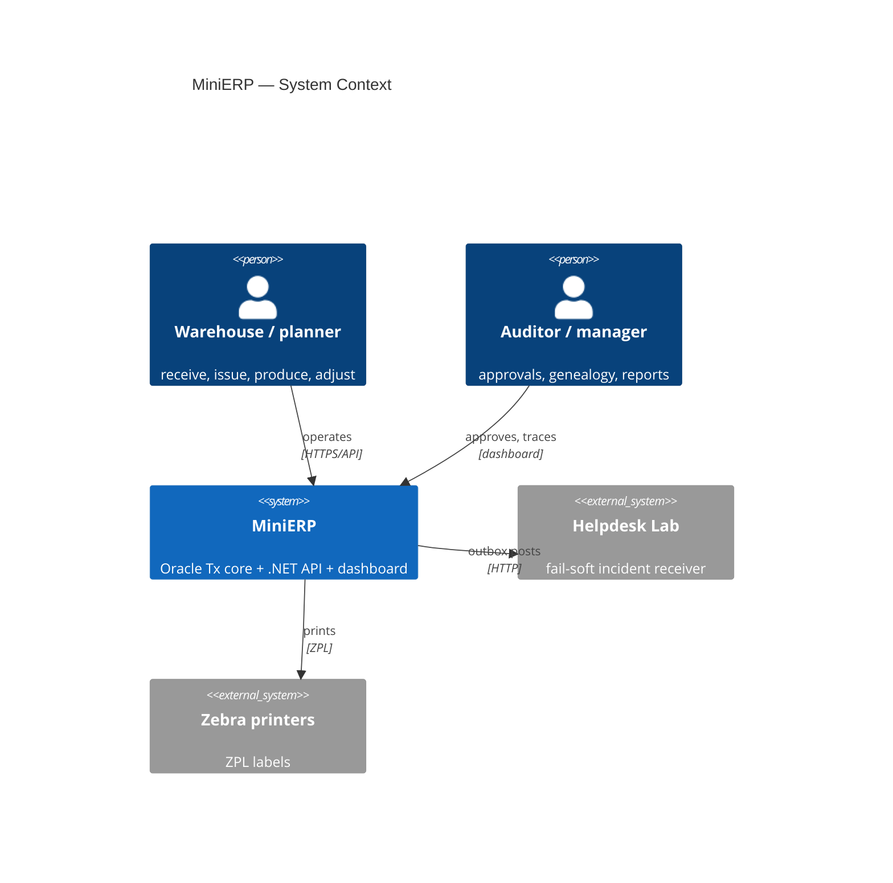
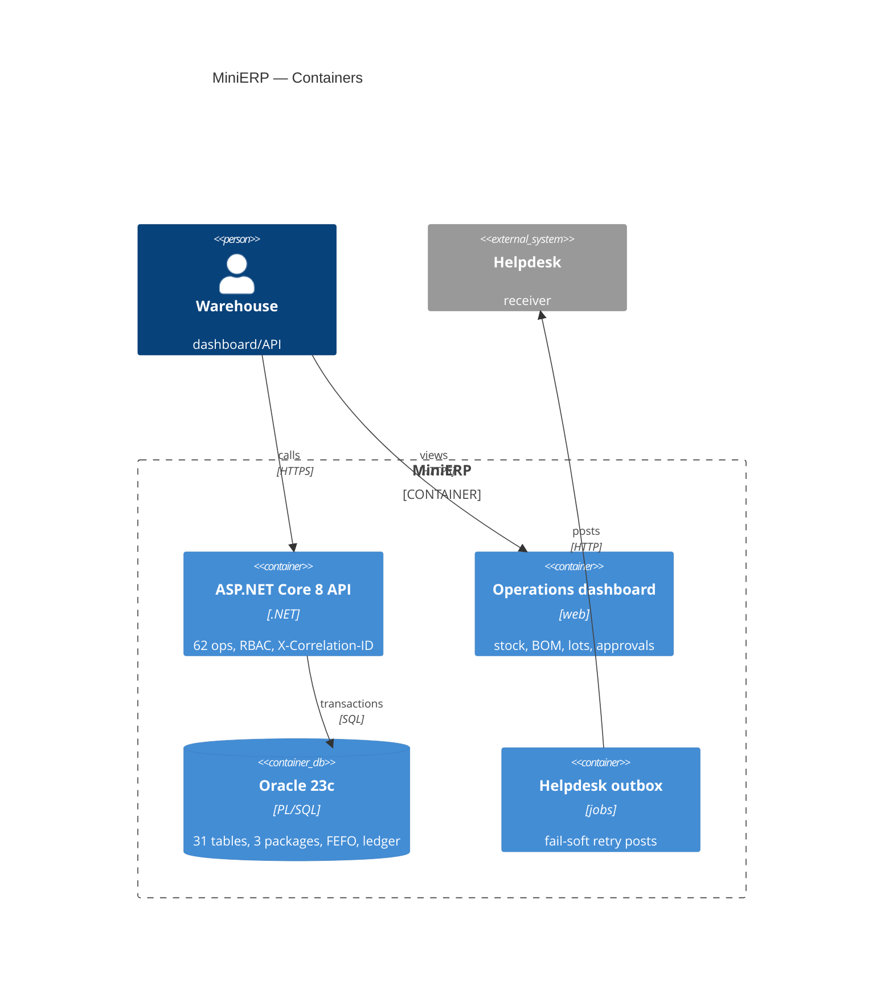

# MiniERP — C4 Architecture

> Source of truth: `docs/architecture/` (`system-context.md`,
> `container-diagram.md`, `backend-architecture.md`, `database-design.md`) and
> ADR-001 (modular monolith, database-centric logic).

## C4-Context

## C4-Container

