# MiniERP Entity-Relationship Diagram

Source of truth: `sql/01_schema.sql` (13 core tables), `sql/05_automation_schema.sql`
(7 automation tables + `ITEM`/`PRODUCTION_ORDER` extensions), `sql/07_traceability_schema.sql`
(10 traceability tables + `ITEM`/`APP_USER` extensions), `sql/10_helpdesk_schema.sql`
(1 outbox table). 31 tables total — no invented tables.

Conventions: `PK` = primary key (incl. composite), `FK` = foreign-key constraint actually
declared in the DDL. Lengths are omitted (`VARCHAR2(30)` → `VARCHAR2`) so the diagram
parses; nullability/checks live in the SQL files. Relations marked `NON-ENFORCED`
have **no FK constraint by design** (see notes) — they are logical links only.

```mermaid
erDiagram
    WAREHOUSE ||--o{ STOCK : holds
    ITEM ||--o{ STOCK : stocked_as
    ITEM ||--o{ BOM : defines
    BOM ||--o{ BOM_DETAIL : contains
    ITEM ||--o{ BOM_DETAIL : consumed_as
    ITEM ||--o{ PRODUCTION_ORDER : produces
    WAREHOUSE ||--o{ PRODUCTION_ORDER : runs_in
    ITEM ||--o{ PURCHASE_ORDER : ordered_as
    WAREHOUSE ||--o{ PURCHASE_ORDER : received_in
    ITEM ||--o{ INVENTORY_TRANSACTION : moves
    WAREHOUSE ||--o{ INVENTORY_TRANSACTION : moves_in
    APP_USER ||--o{ USER_ROLE : has
    ERP_ROLE ||--o{ USER_ROLE : granted_by
    PRODUCTION_ORDER ||--o{ STOCK_RESERVATION : reserves_for
    ITEM ||--o{ STOCK_RESERVATION : reserved_as
    WAREHOUSE ||--o{ STOCK_RESERVATION : reserved_in
    ITEM ||--o{ REPLENISH_ALERT : alerts_on
    WAREHOUSE ||--o{ REPLENISH_ALERT : alerts_in
    WAREHOUSE ||--o{ WAREHOUSE_LOCATION : contains
    ITEM ||--o{ INVENTORY_LOT : lotted_as
    INVENTORY_LOT ||--o{ LOT_STOCK : stored_as
    WAREHOUSE ||--o{ LOT_STOCK : stored_in
    WAREHOUSE_LOCATION ||--o{ LOT_STOCK : stored_at
    ITEM ||--o{ TRACEABILITY_EVENT : traces
    INVENTORY_LOT ||--o{ TRACEABILITY_EVENT : events_for
    WAREHOUSE ||--o{ TRACEABILITY_EVENT : events_in
    WAREHOUSE_LOCATION ||--o{ TRACEABILITY_EVENT : moved_from_or_to
    PRODUCTION_ORDER ||--o{ PRODUCTION_LOT_CONSUMPTION : consumes_for
    ITEM ||--o{ PRODUCTION_LOT_CONSUMPTION : consumed_as
    INVENTORY_LOT ||--o{ PRODUCTION_LOT_CONSUMPTION : input_lot
    TRACEABILITY_EVENT ||--o{ PRODUCTION_LOT_CONSUMPTION : journaled_by
    PRODUCTION_ORDER ||--o{ PRODUCTION_LOT_OUTPUT : outputs_for
    ITEM ||--o{ PRODUCTION_LOT_OUTPUT : produced_as
    INVENTORY_LOT ||--o{ PRODUCTION_LOT_OUTPUT : output_lot
    TRACEABILITY_EVENT ||--o{ PRODUCTION_LOT_OUTPUT : journaled_by

    WAREHOUSE {
        NUMBER ID PK
        VARCHAR2 CODE
        VARCHAR2 NAME
        VARCHAR2 LOCATION
        NUMBER IS_ACTIVE
        DATE CREATED_AT
    }
    ITEM {
        NUMBER ID PK
        VARCHAR2 CODE
        VARCHAR2 NAME
        VARCHAR2 ITEM_TYPE
        VARCHAR2 UOM
        NUMBER MIN_STOCK
        NUMBER REORDER_POINT
        NUMBER SAFETY_STOCK
        NUMBER AVG_DAILY_USAGE
        NUMBER LEAD_TIME_DAYS
        VARCHAR2 TRACE_MODE
        NUMBER SHELF_LIFE_DAYS
        VARCHAR2 LABEL_TEMPLATE
        DATE CREATED_AT
    }
    STOCK {
        NUMBER WAREHOUSE_ID PK_FK
        NUMBER ITEM_ID PK_FK
        NUMBER QTY
        DATE UPDATED_AT
    }
    BOM {
        NUMBER ID PK
        NUMBER FG_ITEM_ID FK
        VARCHAR2 VERSION
        VARCHAR2 DESCRIPTION
        VARCHAR2 STATUS
        DATE CREATED_AT
    }
    BOM_DETAIL {
        NUMBER BOM_ID PK_FK
        NUMBER MAT_ITEM_ID PK_FK
        NUMBER QTY_REQUIRED
    }
    PRODUCTION_ORDER {
        NUMBER ID PK
        VARCHAR2 PO_NO
        NUMBER FG_ITEM_ID FK
        NUMBER QTY_PLANNED
        NUMBER QTY_DONE
        VARCHAR2 STATUS
        NUMBER WAREHOUSE_ID FK
        DATE CREATED_AT
        DATE COMPLETED_AT
    }
    PURCHASE_ORDER {
        NUMBER ID PK
        VARCHAR2 PO_NO
        NUMBER ITEM_ID FK
        NUMBER QTY
        NUMBER WAREHOUSE_ID FK
        VARCHAR2 STATUS
        DATE CREATED_AT
        DATE RECEIVED_AT
    }
    INVENTORY_TRANSACTION {
        NUMBER ID PK
        VARCHAR2 TXN_TYPE
        NUMBER ITEM_ID FK
        NUMBER WAREHOUSE_ID FK
        NUMBER QTY
        NUMBER BALANCE_AFTER
        VARCHAR2 REF_NO
        VARCHAR2 CREATED_BY
        DATE CREATED_AT
    }
    APP_USER {
        NUMBER ID PK
        VARCHAR2 USERNAME
        VARCHAR2 FULLNAME
        VARCHAR2 DEPT
        VARCHAR2 PASSWORD
        NUMBER IS_ACTIVE
        VARCHAR2 PASSWORD_HASH
        VARCHAR2 PASSWORD_SALT
        NUMBER PASSWORD_ITERATIONS
        DATE LAST_LOGIN_AT
        DATE CREATED_AT
    }
    ERP_ROLE {
        NUMBER ID PK
        VARCHAR2 NAME
    }
    USER_ROLE {
        NUMBER USER_ID PK_FK
        NUMBER ROLE_ID PK_FK
    }
    ERROR_LOG {
        NUMBER ID PK
        VARCHAR2 ERR_CODE
        VARCHAR2 MESSAGE
        VARCHAR2 PROC_NAME
        VARCHAR2 REF_NO
        VARCHAR2 CREATED_BY
        DATE CREATED_AT
    }
    CHANGE_REQUEST {
        NUMBER ID PK
        VARCHAR2 CR_NO
        VARCHAR2 TITLE
        VARCHAR2 REQ_TYPE
        VARCHAR2 REF_NO
        VARCHAR2 ROOT_CAUSE
        VARCHAR2 FIX_ACTION
        VARCHAR2 STATUS
        VARCHAR2 REQUESTER
        DATE CREATED_AT
        DATE CLOSED_AT
    }
    STOCK_RESERVATION {
        NUMBER ID PK
        VARCHAR2 PO_NO FK
        NUMBER ITEM_ID FK
        NUMBER WAREHOUSE_ID FK
        NUMBER QTY
        VARCHAR2 STATUS
        DATE CREATED_AT
        DATE UPDATED_AT
    }
    REPLENISH_ALERT {
        NUMBER ID PK
        NUMBER ITEM_ID FK
        NUMBER WAREHOUSE_ID FK
        NUMBER QTY_AVAILABLE
        NUMBER QTY_SUGGESTED
        VARCHAR2 TRIGGER_TYPE
        VARCHAR2 REF_NO
        VARCHAR2 STATUS
        VARCHAR2 TRIGGERED_BY
        DATE CREATED_AT
        DATE CLOSED_AT
    }
    ERP_AUTOMATION_RUN {
        NUMBER ID PK
        VARCHAR2 WORKFLOW_NAME
        VARCHAR2 TRIGGER_TYPE
        VARCHAR2 TRIGGER_ID
        VARCHAR2 STATUS
        DATE STARTED_AT
        DATE FINISHED_AT
        NUMBER RETRY_COUNT
        VARCHAR2 ERROR_CODE
        VARCHAR2 ERROR_MESSAGE
        VARCHAR2 RESULT_SUMMARY
        VARCHAR2 RUN_BY
    }
    PO_STATE_HISTORY {
        NUMBER ID PK
        VARCHAR2 PO_NO
        VARCHAR2 FROM_STATE
        VARCHAR2 TO_STATE
        VARCHAR2 REASON
        VARCHAR2 CHANGED_BY
        DATE CHANGED_AT
    }
    SUPPORT_INCIDENT {
        NUMBER ID PK
        VARCHAR2 ERROR_CODE
        VARCHAR2 REF_NO
        VARCHAR2 TITLE
        VARCHAR2 CONTEXT_JSON
        VARCHAR2 DIAGNOSIS
        VARCHAR2 STATUS
        VARCHAR2 CREATED_BY
        DATE CREATED_AT
        DATE CLOSED_AT
    }
    APPROVAL_REQUEST {
        NUMBER ID PK
        VARCHAR2 APPROVAL_NO
        VARCHAR2 ACTION
        VARCHAR2 REF_NO
        VARCHAR2 PAYLOAD
        VARCHAR2 APPROVED_SCOPE
        VARCHAR2 STATUS
        VARCHAR2 REQUESTER
        VARCHAR2 APPROVER
        DATE DECIDED_AT
        DATE CREATED_AT
    }
    AUTOMATION_REPORT {
        NUMBER ID PK
        VARCHAR2 REPORT_TYPE
        DATE PERIOD_FROM
        DATE PERIOD_TO
        NUMBER LINE_COUNT
        VARCHAR2 PAYLOAD_JSON
        VARCHAR2 GENERATED_BY
        DATE GENERATED_AT
    }
    WAREHOUSE_LOCATION {
        NUMBER ID PK
        NUMBER WAREHOUSE_ID FK
        VARCHAR2 LOCATION_CODE
        VARCHAR2 LOCATION_NAME
        VARCHAR2 LOCATION_TYPE
        NUMBER IS_ACTIVE
        DATE CREATED_AT
    }
    INVENTORY_LOT {
        NUMBER LOT_ID PK
        VARCHAR2 LOT_CODE
        NUMBER ITEM_ID FK
        VARCHAR2 SUPPLIER_LOT_NO
        VARCHAR2 SOURCE_TYPE
        VARCHAR2 SOURCE_REF_NO
        DATE MFG_DATE
        DATE EXPIRY_DATE
        VARCHAR2 STATUS
        VARCHAR2 CREATED_BY
        DATE CREATED_AT
    }
    LOT_STOCK {
        NUMBER LOT_ID FK
        NUMBER WAREHOUSE_ID FK
        NUMBER LOCATION_ID FK
        NUMBER QTY_ON_HAND
        NUMBER QTY_RESERVED
        DATE UPDATED_AT
    }
    TRACEABILITY_EVENT {
        NUMBER EVENT_ID PK
        VARCHAR2 EVENT_TYPE
        NUMBER ITEM_ID FK
        NUMBER LOT_ID FK
        NUMBER WAREHOUSE_ID FK
        NUMBER FROM_LOCATION_ID FK
        NUMBER TO_LOCATION_ID FK
        NUMBER QTY
        VARCHAR2 REF_TYPE
        VARCHAR2 REF_NO
        VARCHAR2 ACTOR
        VARCHAR2 CORRELATION_ID
        VARCHAR2 IDEMPOTENCY_KEY
        DATE CREATED_AT
    }
    PRODUCTION_LOT_CONSUMPTION {
        NUMBER ID PK
        NUMBER PRODUCTION_ORDER_ID FK
        NUMBER ITEM_ID FK
        NUMBER INPUT_LOT_ID FK
        NUMBER QTY_CONSUMED
        NUMBER EVENT_ID FK
        DATE CREATED_AT
    }
    PRODUCTION_LOT_OUTPUT {
        NUMBER ID PK
        NUMBER PRODUCTION_ORDER_ID FK
        NUMBER FG_ITEM_ID FK
        NUMBER OUTPUT_LOT_ID FK
        NUMBER QTY_PRODUCED
        NUMBER EVENT_ID FK
        DATE CREATED_AT
    }
    BARCODE_IDENTIFIER {
        NUMBER BARCODE_ID PK
        VARCHAR2 CODE_VALUE
        VARCHAR2 CODE_TYPE
        VARCHAR2 ENTITY_TYPE
        VARCHAR2 ENTITY_KEY
        NUMBER IS_ACTIVE
        DATE CREATED_AT
    }
    LABEL_PRINT_JOB {
        NUMBER PRINT_JOB_ID PK
        VARCHAR2 LABEL_TYPE
        VARCHAR2 ENTITY_TYPE
        VARCHAR2 ENTITY_KEY
        VARCHAR2 TEMPLATE_CODE
        NUMBER COPIES
        VARCHAR2 FORMAT
        VARCHAR2 STATUS
        VARCHAR2 PRINTED_BY
        DATE CREATED_AT
        DATE PRINTED_AT
        VARCHAR2 ERROR_MESSAGE
    }
    REQUEST_IDEMPOTENCY {
        VARCHAR2 IDEMPOTENCY_KEY PK
        VARCHAR2 OPERATION
        VARCHAR2 REQUEST_HASH
        NUMBER RESPONSE_CODE
        CLOB RESPONSE_BODY
        DATE CREATED_AT
    }
    APP_AUDIT_EVENT {
        NUMBER AUDIT_ID PK
        VARCHAR2 EVENT_TYPE
        VARCHAR2 ENTITY_TYPE
        VARCHAR2 ENTITY_KEY
        VARCHAR2 ACTOR
        VARCHAR2 DETAILS_JSON
        VARCHAR2 CORRELATION_ID
        DATE CREATED_AT
    }
    HELPDESK_DELIVERY {
        NUMBER DELIVERY_ID PK
        VARCHAR2 EXTERNAL_REF
        VARCHAR2 OPERATION
        VARCHAR2 REQUEST_HASH
        VARCHAR2 STATUS
        NUMBER ATTEMPT_COUNT
        VARCHAR2 LAST_ERROR
        VARCHAR2 CORRELATION_ID
        VARCHAR2 CREATED_BY
        DATE CREATED_AT
        DATE UPDATED_AT
        DATE SENT_AT
    }
```

## Uncertain / non-enforced relations (explicitly marked, do not assume joins)

- `STOCK_RESERVATION.PO_NO → PRODUCTION_ORDER.PO_NO`: enforced FK, but against the
  **unique key** `PO_NO`, not the numeric `ID` PK (`ON DELETE CASCADE`) — drawn above,
  join on `PO_NO`, not `ID`.
- `PO_STATE_HISTORY.PO_NO → PRODUCTION_ORDER.PO_NO`: **NON-ENFORCED by design**
  (history must survive PO deletion; written by trigger `TRG_PO_STATE_HISTORY`) — not drawn.
- `PRODUCTION_LOT_CONSUMPTION.EVENT_ID` / `PRODUCTION_LOT_OUTPUT.EVENT_ID` →
  `TRACEABILITY_EVENT.EVENT_ID`: enforced FKs but **nullable** — drawn as optional.
- `TRACEABILITY_EVENT.FROM_LOCATION_ID` / `TO_LOCATION_ID` → `WAREHOUSE_LOCATION.ID`:
  enforced FKs but **nullable** (e.g. `RECEIVE` has no source bin) — drawn as optional.
- Polymorphic references with **no FK at all** (join key is the pair
  `ENTITY_TYPE + ENTITY_KEY`, values like `LOT | ITEM | LOCATION | PRODUCTION_ORDER`) —
  not drawn: `BARCODE_IDENTIFIER`, `LABEL_PRINT_JOB`, `APP_AUDIT_EVENT`
  (`ENTITY_TYPE`/`ENTITY_KEY`/`DETAILS_JSON`).
- Free-text correlation columns with **no FK** (`REF_NO`, `EXTERNAL_REF`,
  `REQUEST_HASH`, `CORRELATION_ID` on `INVENTORY_TRANSACTION`, `ERROR_LOG`,
  `CHANGE_REQUEST`, `SUPPORT_INCIDENT`, `APPROVAL_REQUEST`, `HELPDESK_DELIVERY`,
  `REQUEST_IDEMPOTENCY`) — not drawn; they are audit correlation, not joins.
- Standalone by design (no inbound FK anywhere): `ERROR_LOG`, `CHANGE_REQUEST`,
  `ERP_AUTOMATION_RUN`, `AUTOMATION_REPORT`, `REQUEST_IDEMPOTENCY`, `HELPDESK_DELIVERY`.
