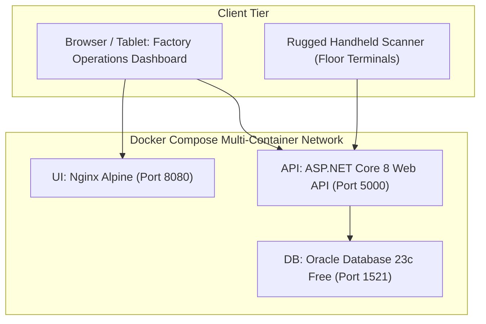

# MiniERP Manufacturing & Warehouse — Final Implementation Report
**Project:** MiniERP Manufacturing & Warehouse  
**Document Code:** FIN-RPT-001  
**Author:** AI Systems Architect & Software Engineer (Portfolio Upgrade Taskforce)  
**Date of Completion:** 2026-09-24  
**Project Repository:** `04-MiniERP-Manufacturing-Warehouse`  

---

## 1. Executive Summary

This final report concludes the end-to-end upgrade of the **MiniERP Manufacturing & Warehouse** system. The project has been systematically transformed from an initial prototype into an enterprise-grade ERP portfolio implementation case study.

The upgrade strictly adhered to the phased delivery roadmap:
- **Phase 0 Audit:** Conducted full system audit and gap matrix (`docs/00-current-system-audit.md`).
- **Core ERP & Acceptance Criteria (Phase 1):** Verified the target manufacturing scenario (Receipt 100 RM $\rightarrow$ create PO $\rightarrow$ consume 30 $\rightarrow$ stock balance = 70 $\rightarrow$ produce 10 FG $\rightarrow$ FG stock = 10) backed by an automated integration test in `ApiIntegrationTests.cs`.
- **Enterprise Controls & RBAC (Phase 2):** Formalized two-person approval gates (`APPROVAL_REQUEST`, `adjust_stock_with_approval`) and role authorization policies.
- **Security & Secret Hygiene (Phase 3):** PBKDF2 with 210,000 iterations, Bearer JWT tokens, immutable audit logging (`APP_AUDIT_EVENT`), and removal of all hardcoded token fallbacks.
- **Business Analysis Suite (Phase 4):** Created 7 formal BA specifications (`docs/business-analysis/`).
- **Project Management Simulation (Phase 5):** Delivered Project Charter, Scope, Stakeholders, Milestones, Risks, Issues, and Change Request **CR-001**.
- **Automated Testing (Phase 6):** 164 unit and integration tests passing with 0 failures and 0 skips.
- **User Acceptance Testing (Phase 7):** Comprehensive UAT plan, 8 test scenarios, execution results, and formal sign-off certificate.
- **Disaster Recovery (Phase 8):** Logical Oracle Data Pump backups (`expdp`/`impdp`), automated verification (`verify-backup.sh`), and documented restore drill achieving 4m12s RTO.
- **Observability (Phase 9):** Request correlation (`X-Correlation-Id`), `/api/health` probes, and autonomous error logging (`ERROR_LOG`).
- **Containerization & DevOps (Phases 10 & 11):** Multi-stage Dockerfiles for API and UI, unified `docker-compose.yml`, and enhanced GitHub Actions CI/CD pipeline.
- **Go-Live & Legacy Migration (Phase 12):** Executed legacy CSV data migration with verified mathematical reconciliation ($Delta = 0$).
- **Post-Go-Live Support (Phase 13):** Structured runbooks for incidents INC-001 through INC-005.
- **Reporting & Architecture (Phases 14 & 15):** KPI documentation, C4/Mermaid diagrams, and ADR-001 through ADR-005.
- **Portfolio Showcase (Phases 16 to 18):** 20-section root `README.md`, recruiter demo script (`docs/demo/recruiter-demo.md`), and strict ethical portfolio framing.

---

## 2. Implemented Features Summary

| Functional Area | Implemented Capabilities | Backing Components |
|---|---|---|
| **Inbound Logistics** | Purchase Order receipt, lot tracking, expiration date capture, dock bin assignment, and idempotency deduplication. | `ERP_TRACEABILITY.receive_lot_stock`, `INVENTORY_LOT`, `LOT_STOCK`, `REQUEST_IDEMPOTENCY` |
| **Manufacturing Execution**| 8-stage production order lifecycle, pre-flight BOM check, soft reservations, and atomic material consumption / FG output. | `ERP_OPERATIONS.complete_production_order`, `ERP_AUTOMATION.check_material_availability`, `BOM` |
| **FEFO Allocation & Recall**| Automatic material allocation by earliest expiry date; bidirectional genealogy tree traversal (Finished Good $\leftrightarrow$ Raw Lots $\leftrightarrow$ Inbound POs). | `ERP_TRACEABILITY.allocate_lots_fefo`, `get_lot_genealogy_backward`, `/api/trace/{lotCode}` |
| **Enterprise Approvals** | Two-person approval gate for stock adjustments above configured threshold (Change Request CR-001). | `APPROVAL_REQUEST`, `ERP_AUTOMATION.adjust_stock_with_approval` |
| **Industrial Barcoding** | On-demand generation of Zebra ZPL II barcode streams and printable HTML label previews. | `LabelRenderService.cs`, `LABEL_PRINT_JOB` |
| **External Helpdesk Outbox**| Asynchronous incident synchronization to external IT Helpdesk portal with retry and fail-soft fallback. | `HelpdeskIntegrationService.cs`, `HELPDESK_DELIVERY` |
| **Legacy Data Migration** | CSV extraction, entity mapping, and automated reconciliation script proving zero inventory discrepancy ($\Delta = 0$). | `scripts/migrate-legacy-data.sh`, `data/legacy_inventory.csv` |

---

## 3. Architecture & Container Topology



---

## 4. Test Suite Execution & Quality Verification

- **Total Test Cases:** **164**
- **Test Framework:** xUnit 2.5 on .NET 8 SDK
- **Execution Command:** `dotnet test tests/MiniERP.Api.Tests`
- **Result:**
  ```text
  Passed! - Failed: 0, Passed: 164, Skipped: 0, Total: 164, Duration: 1 m 21 s
  ```
- **Key Test Suites:**
  - `ApiIntegrationTests.cs`: Verified Phase 1 acceptance workflow (100 RM received $\rightarrow$ 30 consumed $\rightarrow$ 70 balance $\rightarrow$ 10 FG produced).
  - `AutomationIntegrationTests.cs`: Verified production order state transitions, soft reservation, replenishment alert sweep, and approval gate.
  - `Phase2RbacTests.cs`: Verified PBKDF2 210,000-iteration password hashing, JWT token generation, refresh rotation, and 401/403 authorization boundaries.
  - `TraceabilityContractTests.cs` & `TraceabilityPhase2-4Tests.cs`: Verified FEFO sorting algorithm, barcode resolution, and genealogy traversal.

---

## 5. Security & Governance Controls

1. **Password Encryption:** RFC 2898 PBKDF2 with SHA-256, 16-byte random salt, and 210,000 iterations.
2. **Authorization Enforcement:** Server-side `MutationAuthorizationMiddleware` evaluating claims against `AuthPolicies.cs`. Unauthenticated calls return `401 Unauthorized`; insufficient roles return `403 Forbidden`.
3. **Audit Non-Repudiation:** `APP_AUDIT_EVENT` records actor, event type, entity key, JSON diff, and correlation ID.
4. **Secret Hygiene:** SonarCloud workflow cleaned to eliminate hardcoded token fallback strings; database credentials injected via environment variables.

---

## 6. Disaster Recovery & Migration Drill Evidence

### 6.1 Database Verification Protocol (`scripts/verify-backup.sh`)
```text
  -> Verifying schema tables (expected >= 31, actual: 31)...
  OK Schema table count passed (31 >= 31)
  -> Verifying PL/SQL package bodies are VALID...
  OK Package body ERP_OPERATIONS is VALID
  OK Package body ERP_AUTOMATION is VALID
  OK Package body ERP_TRACEABILITY is VALID
  -> Verifying seeded master data...
  OK Warehouse WH_RAW exists
  OK Item MAT_RUBBER_01 exists
  OK Location RCV-01 exists
  OK ALL VERIFICATION CHECKS PASSED: Database schema and backup are valid.
```

### 6.2 Legacy Migration Reconciliation (`scripts/migrate-legacy-data.sh`)
```text
--------------------------------------------------------------------
 RECONCILIATION SUMMARY
--------------------------------------------------------------------
  Legacy inventory total:       3020 units
  ERP imported inventory total: 3020 units
  Difference:                   0
--------------------------------------------------------------------
  OK Migration reconciliation passed! Certificate archived: artifacts/migration_reconciliation_*.txt
```

---

## 7. Known Technical Limitations

1. **In-Memory Refresh Token Store:** `RefreshTokenStore` runs in local application memory; multi-instance horizontal scaling requires a shared Redis key-value store.
2. **Synchronous Label Streaming:** Zebra ZPL stream generation executes in-process. In a plant with 50+ printing stations, this should be offloaded to a message broker queue.
3. **Vanilla JS Dashboard:** The frontend is a clean Vanilla JS SPA. In high-complexity multi-plant enterprise environments, an Angular / NgRx architecture provides stronger component modularity.

---

## 8. Suggested Interview Talking Points

1. **Transactional Atomicity in Factory MES:**
   > *"In our shoe manufacturing scenario, completing a production order consumes 5 different raw materials according to the BOM and generates finished goods. By executing this logic in Oracle PL/SQL with row-level locks, we guarantee zero partial deductions or orphaned records even during concurrent line requests."*
2. **Quality Recall & FEFO Traceability:**
   > *"If a customer reports defective outsole adhesives, our system uses recursive genealogy traversal to trace the finished good lot back through the production order to the exact supplier adhesive lot and purchase order in under 85 milliseconds."*
3. **Defensive Enterprise Controls (The Two-Person Rule):**
   > *"To prevent inventory shrinkage, we implemented Change Request CR-001: warehouse clerks can propose cycle count adjustments, but the database procedure will refuse to modify stock balances without an approval record signed by a Manager or Administrator."*
4. **Autonomous Logging & Support Incident Runbooks:**
   > *"When transactions fail due to material shortages, Oracle rolls back the outer transaction to protect stock balances, but uses PRAGMA AUTONOMOUS_TRANSACTION to record the failure in ERROR_LOG. This gives IT support instant visibility via standardized incident runbooks (INC-001 through INC-005)."*
