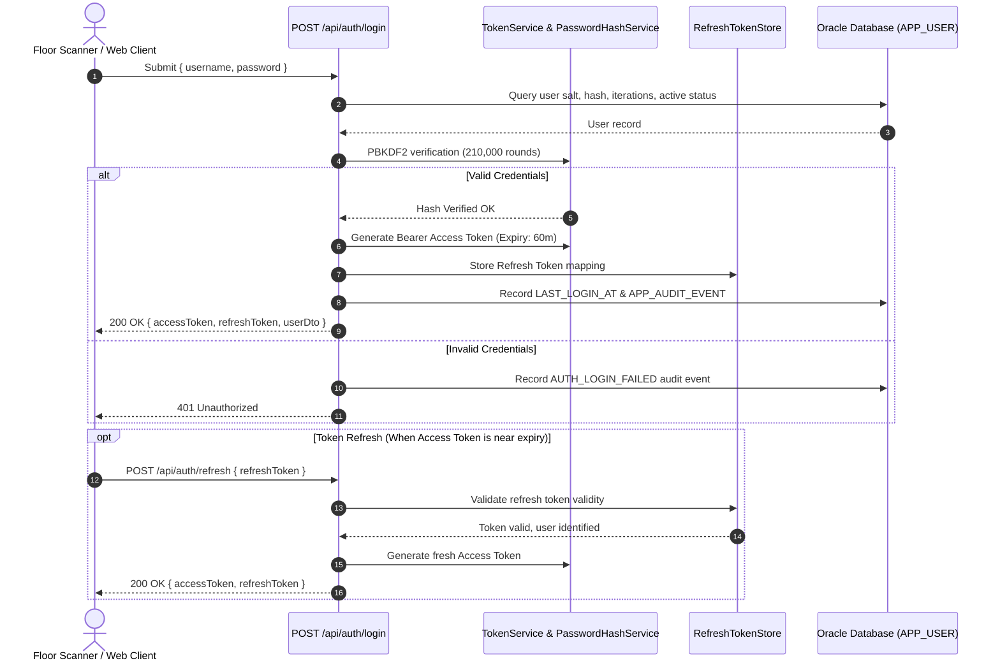

# Architecture: Authentication & Token Lifecycle Flow
**Project:** MiniERP Manufacturing & Warehouse  
**Document Code:** ARC-AUT-005  

---

## 1. Authentication Lifecycle Sequence

---

## 2. Token Security Characteristics

- **Signature Algorithm:** HMAC-SHA256 with 256-bit symmetric key.
- **Claims Expose:** `sub` (User ID), `unique_name` (Username), `department`, `role` (Array of role names).
- **Transport Security:** Must be transmitted via `Authorization: Bearer <token>` over TLS/HTTPS.
