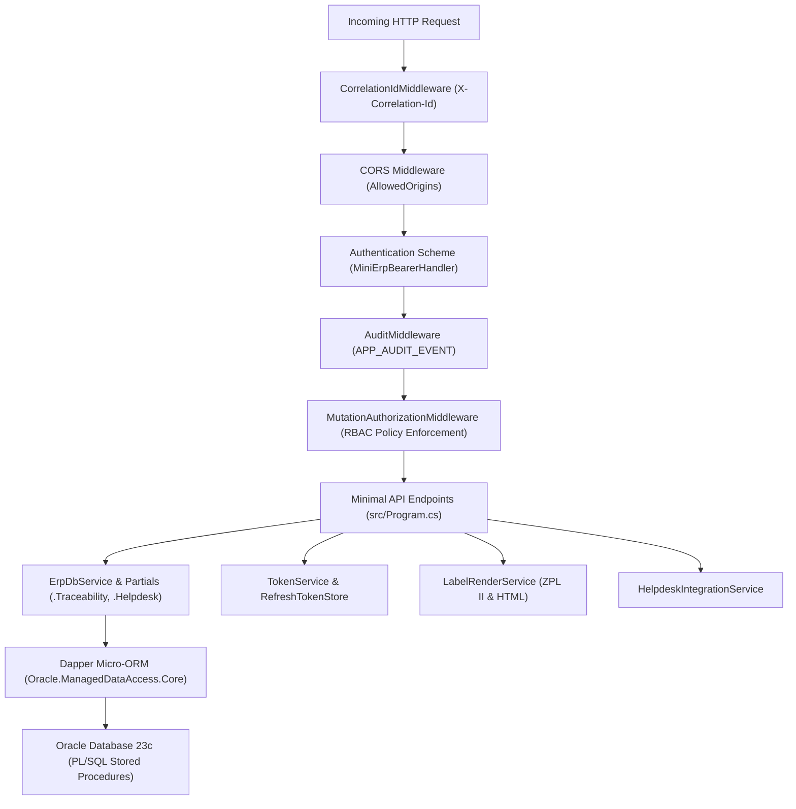

# Architecture: Backend Architecture Specification
**Project:** MiniERP Manufacturing & Warehouse  
**Document Code:** ARC-BCK-003  

---

## 1. Backend Design Patterns & Component Organization

MiniERP employs a **Modular Monolith** pattern optimized for high transactional throughput and data integrity:

---

## 2. Key Architecture Layers

### 2.1 Middleware Pipeline
- **`CorrelationIdMiddleware`:** Guarantees every log and database event carries a persistent `X-Correlation-Id`.
- **`AuditMiddleware`:** Automatically captures the actor, target endpoint, HTTP method, and response code into `APP_AUDIT_EVENT`.
- **`MutationAuthorizationMiddleware`:** Blocks unauthenticated or unauthorized role mutation attempts before endpoints execute.

### 2.2 Micro-ORM & Database Abstraction
- Instead of heavyweight Entity Framework Core migrations which struggle with enterprise Oracle features (autonomous transactions, package state, pessimistic locking), the system uses **Dapper**.
- Dapper maps typed C# DTO records directly to parameters of compiled Oracle PL/SQL stored procedures.

### 2.3 Error Translation (`ErpErrorMapper.cs`)
- Oracle database error codes (`ORA-20001` through `ORA-20025`) are intercepted and translated into standardized HTTP status codes and RFC 7807 problem details:
  - `ORA-20002` (Entity Not Found) $\rightarrow$ `404 Not Found` (`ERR_NOT_FOUND`).
  - `ORA-20003` (Insufficient Stock) $\rightarrow$ `409 Conflict` (`ERR_INSUFFICIENT_STOCK`).
  - `ORA-20007` (Material Shortage) $\rightarrow$ `409 Conflict` (`ERR_MATERIAL_SHORTAGE`).
  - `ORA-20013` (Idempotency Key Conflict) $\rightarrow$ `409 Conflict` (`ERR_IDEMPOTENCY_MISMATCH`).
