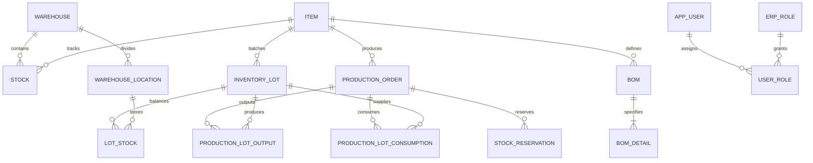

# Architecture: Database Design & PL/SQL Architecture
**Project:** MiniERP Manufacturing & Warehouse  
**Document Code:** ARC-DAT-004  

---

## 1. Relational Database Schema Overview

The database uses **Oracle Database 23c/21c** with Third Normal Form (3NF) relational design across **31 tables** grouped into 4 functional schemas:

---

## 2. PL/SQL Packages Architecture

Business logic requiring atomic consistency and high performance is encapsulated directly inside compiled Oracle Packages:

### 2.1 Package `ERP_OPERATIONS` (`sql/02_plsql.sql`)
- `create_stock_in`: Atomic stock increment + `INVENTORY_TRANSACTION` (`STOCK_IN`).
- `create_stock_out`: Validates balance ($Q_{\text{avail}} \ge Q_{\text{req}}$), pessimistic lock (`FOR UPDATE`), decrements stock, records `STOCK_OUT`.
- `complete_production_order`: Atomic multi-line BOM consumption + Finished Good generation + `ERROR_LOG` autonomous capture.

### 2.2 Package `ERP_AUTOMATION` (`sql/06_automation_plsql.sql`)
- `check_material_availability`: Explodes BOM and evaluates available vs soft-reserved stock.
- `reserve_materials_for_po`: Creates soft holds in `STOCK_RESERVATION` upon order release.
- `adjust_stock_with_approval`: Two-person approval verification gate before updating ledger balances.

### 2.3 Package `ERP_TRACEABILITY` (`sql/08_traceability_plsql.sql`)
- `receive_lot_stock`: Inbound goods receipt capturing lot code, expiry date, bin location, and idempotency key.
- `allocate_lots_fefo`: Dynamic FEFO allocation sorting lots by `EXPIRY_DATE ASC`.
- `get_lot_genealogy_backward` & `get_lot_genealogy_forward`: Recursive traversal returning JSON genealogy trees.
