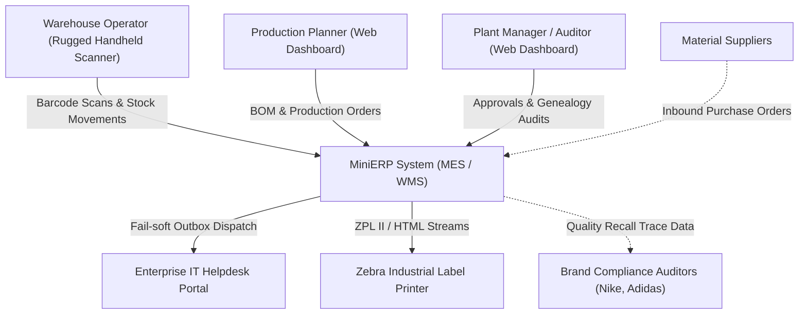

# Architecture: System Context Specification (C4 Level 1)
**Project:** MiniERP Manufacturing & Warehouse  
**Document Code:** ARC-CTX-001  

---

## 1. System Context Overview

MiniERP operates at the heart of the manufacturing enterprise, coordinating warehouse operations, production floor execution, quality compliance, and external IT Helpdesk ticketing.

---

## 2. External System Interfaces

| External Entity | Protocol / Interface | Data Exchanged | Fault Tolerance / Isolation |
|---|---|---|---|
| **Zebra Barcode Printers** | TCP / Raw ZPL II stream | ZPL II label formats, QR codes, Code 128 barcodes | Printable HTML fallback for desktop office printers |
| **Enterprise IT Helpdesk** | HTTP REST Client (`HelpdeskIntegrationService`) | Production incidents, equipment error codes | Asynchronous outbox (`HELPDESK_DELIVERY`) with retry and fail-soft |
| **Rugged Handheld Scanners** | HTTP REST (Wi-Fi 802.11ax) | Scanned barcodes, lot identifiers, bin codes | `REQUEST_IDEMPOTENCY` with SHA-256 deduplication |
| **Brand Client Portals** | HTTPS / JSON Export | Finished goods lot genealogy records | Standardized JSON backward & forward tree schemas |
