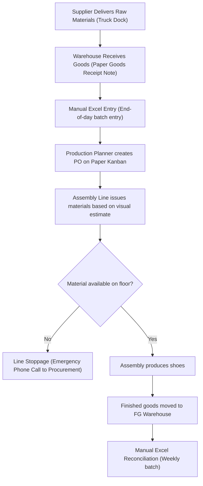

# As-Is Business Process & Pain Points
**Project:** MiniERP Manufacturing & Warehouse  
**Document Code:** BA-ASIS-002  
**Target Enterprise:** Tân Vĩnh Footwear & Apparel Manufacturing Co., Ltd.  

---

## 1. As-Is Process Flow Overview

The existing manual and semi-automated workflows prior to ERP implementation suffered from severe fragmentation across departments:

---

## 2. As-Is Process Stage Analysis

### 2.1 Inbound Receiving (Supplier $\rightarrow$ Warehouse)
- **Current Procedure:** Raw materials arrive at the truck unloading dock. Warehouse staff visually inspect cartons and sign physical delivery notes (DN). At the end of the day, an administrative clerk types quantities into an Excel spreadsheet (`Inventory_2026.xlsx`).
- **Pain Points:**
  - Data lag of 8 to 24 hours between physical arrival and system availability.
  - Supplier lot numbers, roll numbers, and expiry dates are omitted from spreadsheet columns to save typing time.
  - No location tracking; materials are stored wherever pallet space is empty, causing prolonged retrieval times.

### 2.2 Material Allocation & Production Release
- **Current Procedure:** Planners calculate bill of materials requirements on desktop calculators and write handwritten work orders. Orders are physically delivered to shop floor supervisors.
- **Pain Points:**
  - No pre-check of current stock before releasing orders.
  - Multiple production orders frequently compete for the same batch of rubber soles or mesh fabric without reservation controls.
  - When shortages occur, work orders remain stalled on the shop floor with no formal status tracking.

### 2.3 Shop Floor Consumption & Assembly
- **Current Procedure:** Workers collect material bins from `WH_RAW`. There is no verification of batch expiry dates (first-expiry-first-out is completely absent). Old adhesive barrels sit in corners until dried out.
- **Pain Points:**
  - Expired chemicals and adhesives are accidentally used in shoe sole cementing, causing batch bond failure during flex tests.
  - No recording of which specific material lot was used in which shoe lot.

### 2.4 Finished Goods Receiving & Dispatch
- **Current Procedure:** Completed shoes are boxed and wheeled to `WH_FG`. Quantities are recorded on tally sheets. Discrepancies between planned order quantity and actual finished goods are adjusted manually without investigation.
- **Pain Points:**
  - Scrap and line defect rates are obscured by manual quantity write-offs.
  - No customer traceability: if a container of shoes fails quality inspection at the port of destination, the factory cannot identify other batches produced from the same raw material lot.

---

## 3. Summary of Core Deficiencies

| Operational Area | As-Is Failure Mode | Business Impact |
|---|---|---|
| **Inventory Record Accuracy** | Spreadsheet counts differ from physical stock by 15–25% | Frequent stockouts, excess safety stock costs |
| **Material Traceability** | Zero lot genealogy; paper records lost within 30 days | Inability to comply with brand compliance audits |
| **Production Planning** | Orders released blind without inventory reservation | 12% unplanned line downtime due to material starvation |
| **Internal Controls** | Unrestricted stock write-offs without manager approval | Inventory shrinkage and unaccounted material loss |
| **Incident Management** | Informal telephone/Zalo communication between warehouse & IT | Root causes never tracked or analyzed systematically |
