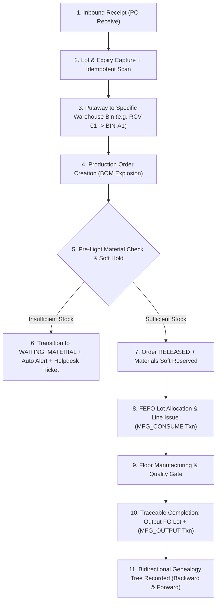

# To-Be Business Process & Future State Architecture
**Project:** MiniERP Manufacturing & Warehouse  
**Document Code:** BA-TOBE-003  
**Target Enterprise:** Tân Vĩnh Footwear & Apparel Manufacturing Co., Ltd.  

---

## 1. To-Be Process Flow Overview

MiniERP establishes a closed-loop, event-driven manufacturing and warehouse execution flow. Every physical material handling activity is immediately reflected in the central transactional database:

---

## 2. To-Be Process Detail by Lifecycle Stage

### 2.1 Standard Raw Material Receiving
1. **Purchase Order Reference:** Inbound shipments must reference an active Purchase Order (`PO_PUR_xxx`).
2. **Lot Metadata Capture:** Warehouse staff scan barcode or enter Supplier Lot Number, Manufacture Date, Expiry Date, and Receiving Location (`RCV-01`).
3. **Idempotent Barcode Protection:** Submissions carry an `idempotencyKey` preventing duplicate stock entry from multi-trigger scanner hardware.
4. **Transaction Logging:** System creates `INVENTORY_LOT`, increments `LOT_STOCK` and `STOCK`, and generates an immutable `INVENTORY_TRANSACTION` row (`STOCK_IN`).

### 2.2 Pre-Flight Validation & Soft Reservation
1. **BOM Evaluation:** Upon production order creation, the system triggers `ERP_AUTOMATION.check_material_availability`.
2. **Soft Reservation:** Available stock is computed as $\text{Available} = \text{Physical Stock} - \sum \text{Active Reservations of Other Orders}$.
3. **Status Gating:** If materials are sufficient, the order transitions to `READY` / `RELEASED` with reservations recorded in `STOCK_RESERVATION`. If deficient, status changes to `WAITING_MATERIAL`, generating an automated replenishment alert in `REPLENISH_ALERT`.

### 2.3 FEFO Allocation & Shop Floor Consumption
1. **First-Expiry-First-Out Rule:** The system prioritizes material lots with the earliest expiration date (`EXPIRY_DATE ASC`), ensuring zero chemical and adhesive expiration waste.
2. **Atomic Consumption:** When the order completes, `ERP_OPERATIONS.complete_production_order` deducts the exact BOM requirement across all component items, writes `MFG_CONSUME` records, and produces finished goods within a single ACID transaction.

### 2.4 Finished Goods & Full Genealogy
1. **Finished Good Lot Generation:** Production order output generates a unique Finished Good Lot identifier (`FG-POxxx-001`).
2. **Genealogy Persistence:** Consumed raw material lots are linked to generated FG lots in `PRODUCTION_LOT_CONSUMPTION` and `PRODUCTION_LOT_OUTPUT`.
3. **Instant Quality Recall:** At any time, quality assurance can query `/api/trace/{lotCode}?direction=backward` or `forward` to produce the full genealogical tree in milliseconds.

### 2.5 Controlled Inventory Adjustment & Approvals
1. **Two-Person Rule:** Floor workers cannot directly adjust stock balances. Any inventory discrepancy triggers an `APPROVAL_REQUEST` in `DRAFT` / `SUBMITTED` state.
2. **Managerial Authorization:** A user holding the `MANAGER` or `ADMIN` role reviews the discrepancy and records an `APPROVED` or `REJECTED` decision with justification notes.
3. **Execution:** Only upon approval is `adjust_stock_with_approval` executed, updating ledger balance and creating an audit trail entry in `APP_AUDIT_EVENT`.
