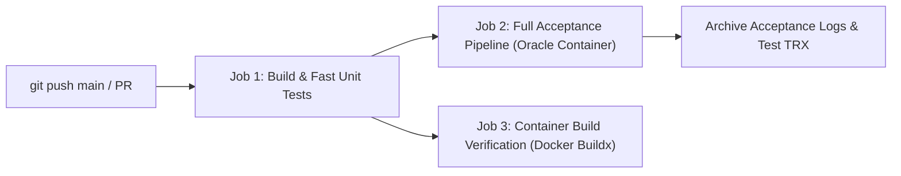

# Continuous Integration & Continuous Delivery (CI/CD) Pipeline
**Project:** MiniERP Manufacturing & Warehouse  
**Document Code:** DEV-CICD-001  
**Platform:** GitHub Actions  
**Configuration Files:** `.github/workflows/ci.yml`, `.github/workflows/sonarcloud.yml`  

---

## 1. Pipeline Architecture & Workflow Stages

The MiniERP continuous delivery pipeline enforces automated quality gates from code commit to container packaging:

---

## 2. Pipeline Jobs & Quality Gates

### Job 1: Build & Fast Unit Tests
- **Runner:** `ubuntu-latest`
- **Runtime:** .NET 8 SDK
- **Key Tasks:**
  1. Restore NuGet dependencies (`dotnet restore`).
  2. Compile API with strict compiler flags (`-p:TreatWarningsAsErrors=true -p:NuGetAudit=false`).
  3. Execute all unit and contract tests that do not require an active database (`--filter "Category!=Integration"`).
- **Execution Time:** ~12–15 seconds.
- **Gate:** If any unit assertion or contract fails, downstream jobs are canceled immediately.

### Job 2: Full Acceptance Pipeline (Docker + Oracle + Integration)
- **Prerequisite:** Successful completion of Job 1.
- **Environment:** Ubuntu runner launching Docker services.
- **Key Tasks (`bash scripts/run-all-tests.sh`):**
  1. Boot Oracle Database 23c Free container (`minierp-oracle`).
  2. Execute sequential SQL migrations (31 tables, 3 PL/SQL packages, master seed data).
  3. Verify PL/SQL compilation validity (`STATUS = 'VALID'`).
  4. Execute full integration test suite against live Oracle instance (all 164+ test cases).
  5. Run simulated material shortage incident scenario (`PO001`).
  6. Execute binary database backup export (`expdp`) and drop/restore drill (`impdp`).
  7. Run `scripts/verify-backup.sh` integrity assertions.
- **Artifacts:** Test execution results (`.trx`), SQL execution logs, and Data Pump reports archived with 7-day retention.

### Job 3: Container Build Verification
- **Prerequisite:** Successful completion of Job 1.
- **Key Tasks:**
  1. Verify multi-stage build of ASP.NET Core 8 Web API (`src/Dockerfile`).
  2. Verify Nginx container build for Factory Operations Dashboard (`dashboard/Dockerfile`).
- **Outcome:** Guarantees that production Docker images can build cleanly without dependency drift.

---

## 3. Secret Governance & Third-Party Code Analysis

- **Zero Hardcoded Credentials:**
  - Database passwords and secrets are supplied via runner environment variables or GitHub Repository Secrets.
- **SonarCloud Integration:**
  - Gated on `${{ secrets.SONAR_TOKEN != '' }}`. If repository secrets are not configured, the workflow skips execution cleanly rather than failing or falling back to insecure dummy tokens.
