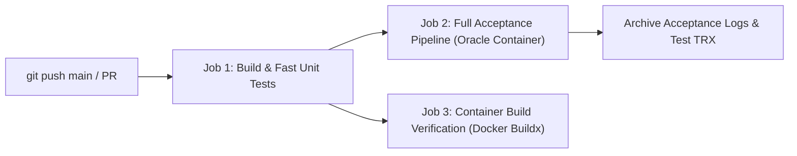

# Continuous Integration & Continuous Delivery (CI/CD) Pipeline
**Project:** MiniERP Manufacturing & Warehouse  
**Document Code:** DEV-CICD-001  
**Platform:** GitHub Actions  
**Configuration Files:** `.github/workflows/ci.yml`, `.github/workflows/sonarcloud.yml`  

---

## 1. Pipeline Architecture & Workflow Stages

The MiniERP continuous delivery pipeline enforces automated quality gates from code commit to container packaging:

---

## 2. Pipeline Jobs & Quality Gates

### Job 1: Build & Fast Unit Tests
- **Runner:** `ubuntu-latest`
- **Runtime:** .NET 8 SDK
- **Key Tasks:**
  1. Restore NuGet dependencies (`dotnet restore`).
  2. Compile API with strict compiler flags (`-p:TreatWarningsAsErrors=true -p:NuGetAudit=false`).
  3. Execute all unit and contract tests that do not require an active database (`--filter "Category!=Integration"`).
- **DB-Independence Contract:** every test that needs Oracle (login, RBAC user management, refresh
  rotation, and all repository workflows) carries `[Trait("Category", "Integration")]`, so this job
  stays green on a runner with no database. 139 database-free unit/contract tests run here.
- **Execution Time:** ~12–15 seconds.
- **Gate:** If any unit assertion or contract fails, downstream jobs are canceled immediately.

### Job 2: Full Acceptance Pipeline (Docker + Oracle + Integration)
- **Prerequisite:** Successful completion of Job 1.
- **Environment:** Ubuntu runner launching Docker services.
- **Key Tasks (`bash scripts/run-all-tests.sh` — 9 stages):**
  1. Boot Oracle Database 23c Free container (`minierp-oracle`).
  2. Execute sequential SQL migrations (31 tables, 3 PL/SQL packages, master seed data).
  3. Verify PL/SQL compilation validity (`STATUS = 'VALID'`).
  4. Execute the full test suite against a live Oracle instance (166 test cases, including the
     27 `Category=Integration` cases that are excluded from Job 1).
  5. Run the simulated material shortage incident scenario (`PO001`, 14 assertions).
  6. Curl-level API smoke test of all documented endpoints (53 checks).
  7. Real traceability end-to-end run: receive → label → FEFO issue → genealogy → reconciliation.
  8. Binary database backup export (`expdp`) plus `scripts/verify-backup.sh` integrity assertions and
     destructive-restore safety-lock checks.
  9. Export `artifacts/swagger.json` as the OpenAPI acceptance evidence.
- **Artifacts:** Test execution results (`.trx`), SQL execution logs, and Data Pump reports archived with 7-day retention.

### Job 3: Container Build Verification
- **Prerequisite:** Successful completion of Job 1.
- **Key Tasks:**
  1. Verify multi-stage build of ASP.NET Core 8 Web API (`src/Dockerfile`).
  2. Verify Nginx container build for Factory Operations Dashboard (`dashboard/Dockerfile`).
- **Outcome:** Guarantees that production Docker images can build cleanly without dependency drift.

---

## 3. Secret Governance & Third-Party Code Analysis

- **Zero Hardcoded Credentials:**
  - Database passwords and secrets are supplied via runner environment variables or GitHub Repository Secrets.
- **SonarCloud Integration:**
  - The `secrets` context is not permitted inside a job-level `if:` (GitHub rejects the workflow as
    invalid). The workflow therefore reads the token through `env:` in a gate step that publishes
    `steps.gate.outputs.configured`, and every scanner step is conditioned on that output. When
    repository secrets are not configured, the workflow skips the analysis cleanly rather than
    failing or falling back to an insecure hardcoded token.
