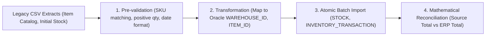

# Data Migration Plan & Reconciliation Specification
**Project:** MiniERP Manufacturing & Warehouse  
**Document Code:** GOL-MIG-002  

---

## 1. Migration Overview & Scope

The data migration phase transitions legacy master data and initial stock inventory from Excel/CSV extracts into the normalized Oracle schema of MiniERP.

---

## 2. Source Data Extraction & Validation Rules

- **Legacy Source:** `data/legacy_inventory.csv`
- **Validation Gates:**
  1. **Item Code Existence:** Every row's `ITEM_CODE` must exist in `ITEM` table.
  2. **Warehouse Code Existence:** `WAREHOUSE_CODE` must exist in `WAREHOUSE` table.
  3. **Non-Negative Balance:** Physical quantities must be $Q \ge 0$.
  4. **UOM Match:** The unit of measure must match canonical catalog (`PAIR`, `METER`, `SPOOL`, `KG`, `PCS`).
  5. **No Duplicate SKU/Warehouse Pairs:** Records with identical warehouse and item must be merged prior to import.

---

## 3. Reconciliation Algorithm & Acceptance Rule

Migration is declared successful **only when the mathematical difference between legacy source quantities and ERP imported quantities equals exactly zero**:

$$\Delta = \left| \sum Q_{\text{Legacy Source}} - \sum Q_{\text{ERP Imported}} \right| = 0$$

- **Audit Requirement:**
  - An opening balance transaction (`TXN_TYPE = 'STOCK_IN'` or `'OPENING_BALANCE'`) must be generated for every imported row.
  - The reconciliation report must log total row count, total units, and hash checksums.
