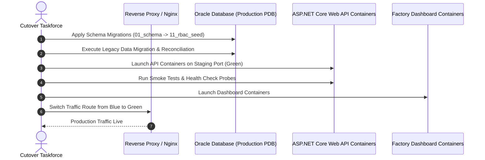

# Production Deployment Plan & Strategy
**Project:** MiniERP Manufacturing & Warehouse  
**Document Code:** GOL-DEP-001  
**Target Cutover Date:** 2026-09-28 (Sunday Weekend Maintenance Window)  
**Maintenance Window:** 01:00 AM – 06:00 AM (5 Hours)  

---

## 1. Deployment Strategy Overview

The production deployment follows a **Blue/Green with Canary Verification** model to ensure zero impact on Monday morning factory shifts.

---

## 2. Pre-Deployment Prerequisites

1. **Hardware & VM Sizing:** Minimum 4 vCPU, 16 GB RAM, 100 GB NVMe SSD for Oracle Database.
2. **Container Engine:** Docker Engine $\ge 24.0$ with Docker Compose v2.
3. **Backup Baseline:** Full physical snapshot of host VM taken at 00:30 AM before cutover commencement.
4. **Network Access:** Firewall ports opened for 1521 (Oracle DB internal), 5000 (API internal/reverse proxy), 8080/443 (Web Dashboard).

---

## 3. Deployment Phases & Timeline

| Phase / Hour | Activity Description | Responsible Role | Verification Method |
|:---:|---|---|---|
| **01:00 – 01:30** | Stop legacy Excel sync services; take final legacy database/CSV snapshot. | Lead DBA | Checksum verification |
| **01:30 – 02:30** | Spin up Oracle container; execute DDL and PL/SQL package compilations. | Lead DBA | `scripts/run-sql.sh` log review |
| **02:30 – 03:30** | Execute legacy CSV data migration and total stock reconciliation ($Delta = 0$). | Migration Lead | `scripts/migrate-legacy-data.sh` |
| **03:30 – 04:30** | Deploy ASP.NET Core API and Nginx Dashboard; execute automated smoke test. | DevOps Lead | `scripts/test-api.sh` |
| **04:30 – 05:30** | End-to-end operational sanity check by Warehouse & Production Supervisors. | Business Leads | Recruiter Demo Scenario |
| **05:30 – 06:00** | Final Go/No-Go Decision with Project Sponsor; open traffic to plant floor. | Project Sponsor | Formal Sign-off Certificate |
