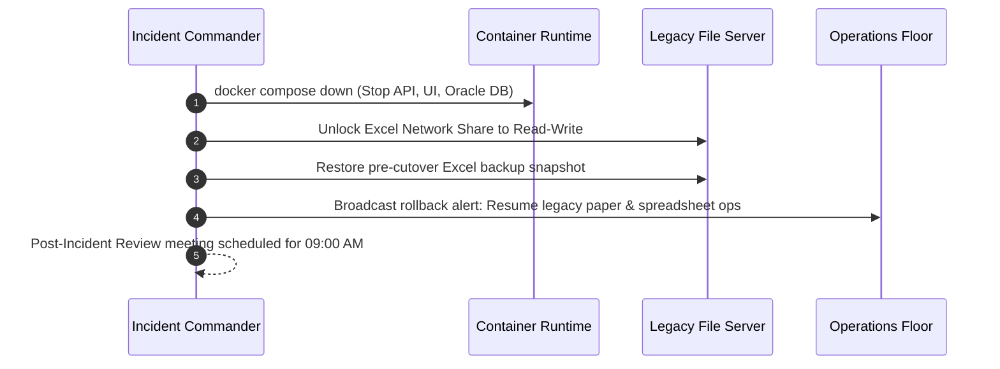

# Production Rollback & Contingency Plan
**Project:** MiniERP Manufacturing & Warehouse  
**Document Code:** GOL-ROL-004  
**Trigger Deadline:** 05:00 AM on Cutover Day (1 Hour prior to Morning Shift)  

---

## 1. Rollback Triggers & Decision Authority

A rollback is formally declared by the **Project Sponsor** upon consultation with the **IT Director** and **Lead DBA** if any of the following conditions occur prior to 05:00 AM:
1. Migration reconciliation difference $\Delta \ne 0$ and cannot be reconciled within 45 minutes.
2. Oracle Database fails to compile packages `ERP_OPERATIONS`, `ERP_AUTOMATION`, or `ERP_TRACEABILITY` with `VALID` status.
3. Critical API smoke test failures preventing production order creation or goods receipt.
4. Unrecoverable hardware, networking, or container storage subsystem failure.

---

## 2. Step-by-Step Rollback Execution



### Step 1: Terminate New Services (05:00 – 05:10)
```bash
# Stop and unbind newly deployed containers immediately:
docker compose down
```

### Step 2: Revert Network & DNS Routing (05:10 – 05:20)
- Revert router port forwards and internal DNS mappings back to the legacy management terminal.

### Step 3: Re-enable Legacy System Access (05:20 – 05:35)
- Remove read-only lock on the legacy network file share (`\\fs01\Plant_Ops\Inventory_2026.xlsx`).
- Verify spreadsheet integrity against the 00:30 AM pre-cutover snapshot.

### Step 4: Floor Communication & Stand-Down (05:35 – 05:50)
- Dispatch floor alert to Warehouse and Production supervisors: *"MiniERP cutover deferred. Morning shift will operate using standard legacy procedures."*
- Schedule emergency triage meeting at 09:00 AM to determine root cause.
