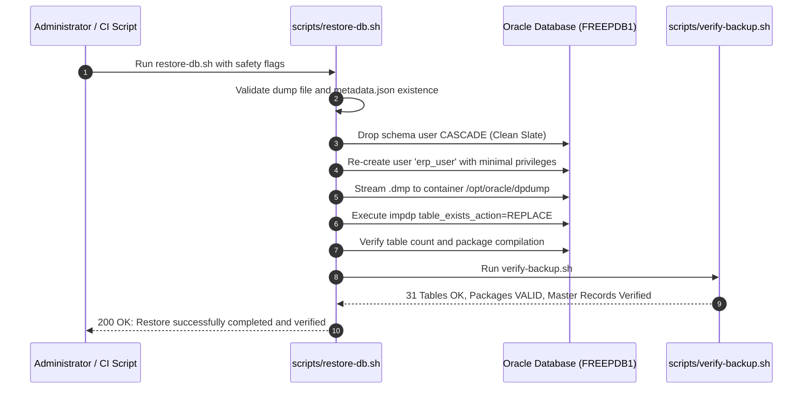

# Database Backup, Restoration & Disaster Recovery Runbook
**Project:** MiniERP Manufacturing & Warehouse  
**Document Code:** OPS-BKP-001  
**Target Database:** Oracle Database 23c/21c/19c (Container & Dedicated PDB `FREEPDB1`)  
**Applicability:** Production, Staging, Portfolio Testing Environments  

---

## 1. Disaster Recovery Objectives (RPO & RTO Targets)

| Metric | Portfolio & Demo Target | Production Plant Baseline | Technical Mechanism |
|---|---|---|---|
| **Recovery Point Objective (RPO)** | $\le 24\text{ hours}$ | $\le 15\text{ minutes}$ | Daily automated Data Pump export + Oracle Flashback / Archive Redo logs |
| **Recovery Time Objective (RTO)** | $\le 10\text{ minutes}$ | $\le 30\text{ minutes}$ | Container fast-restart + automated `impdp` execution via `restore-db.sh` |

> [!NOTE]
> The RPO and RTO numbers listed above represent **architectural portfolio targets and demonstrated staging drill benchmarks**, not a commercially SLA-guaranteed production contract.

---

## 2. Backup Architecture & Procedure

### 2.1 Backup Strategy & Formats
1. **Binary Schema Dump (`expdp`):**
   - Employs Oracle Data Pump Export (`expdp`) to capture full schema metadata, tables, check constraints, foreign keys, identity sequences, and PL/SQL packages.
   - Preserves complete data integrity and referential constraints in a single binary `.dmp` file.
2. **Metadata & Snapshot Manifest (`metadata.json` & `schema_snapshot.txt`):**
   - Accompanies every backup archive, recording git commit hash, branch, table count (31 tables), package statuses, and on-hand stock balances at the time of export.
3. **Secret Hygiene:**
   - Database credentials are NEVER written to log files, terminal outputs, or manifest files. All scripts read credentials from internal container environment variables (`ORACLE_PWD`, `APP_USER_PWD`).

### 2.2 Backup Naming Convention & Retention
- **Directory Format:** `backups/backup_YYYYMMDD_HHMMSS/`
- **File Structure:**
  ```text
  backups/backup_20260924_193134/
  ├── minierp_export.dmp        <- Binary Oracle Data Pump export
  ├── expdp.log                 <- Oracle Data Pump execution log
  ├── metadata.json             <- Commit hash, table count, lot counts
  └── schema_snapshot.txt       <- Human-readable table summary
  ```
- **Retention Strategy:** Local test environments retain the last 20 backup directories (managed by `ARTIFACT_KEEP=20` in `scripts/lib.sh`). In production, backups are archived to off-site object storage with 30-day daily retention and 12-month monthly retention.

### 2.3 Executing a Backup
```bash
# Execute backup into default timestamped directory:
bash scripts/backup-db.sh

# Or specify a custom target directory:
bash scripts/backup-db.sh /var/backups/minierp_snapshot
```

---

## 3. Restoration Procedure (Disaster Recovery Drill)

The restoration script `scripts/restore-db.sh` features a **two-layer safety lock** to prevent accidental production data destruction. Restoring requires explicit confirmation flags:
- `ALLOW_DESTRUCTIVE_RESTORE=true`
- `CONFIRM_RESTORE=yes` (or `--confirm`)

### 3.1 Executing Database Restoration
```bash
# Execute safe restore from target backup directory:
ALLOW_DESTRUCTIVE_RESTORE=true CONFIRM_RESTORE=yes \
  bash scripts/restore-db.sh backups/backup_YYYYMMDD_HHMMSS
```

### 3.2 Internal Restoration Workflow


---

## 4. Verification Protocol (`scripts/verify-backup.sh`)

Every restoration must pass automated verification testing before the system is returned to service:
1. **Schema Table Count:** Minimum **31 tables** must exist.
2. **Package Validity:** All 3 PL/SQL package bodies (`ERP_OPERATIONS`, `ERP_AUTOMATION`, `ERP_TRACEABILITY`) must have `STATUS = 'VALID'`.
3. **Core Master Data:** Primary seed entities (`WH_RAW`, `MAT_RUBBER_01`, `RCV-01`) must query successfully.

```bash
# Verification command:
bash scripts/verify-backup.sh
```

---

## 5. Staging Disaster Recovery Drill Evidence Log

- **Drill Date:** 2026-09-24 19:31:34 UTC
- **Input Archive:** `backups/backup_20260924_193134/minierp_export.dmp`
- **Execution Log:** `artifacts/restore-20260924_193134.log`
- **Drill Steps Recorded:**
  1. Test schema reset with `DROP USER erp_user CASCADE;`.
  2. Executed Data Pump import (`impdp`) restoring 31 tables and 3 packages.
  3. Ran `scripts/verify-backup.sh`:
     - Schema table count: 31 / 31 OK.
     - Package validity: `ERP_OPERATIONS` VALID, `ERP_AUTOMATION` VALID, `ERP_TRACEABILITY` VALID.
     - Master records: `WH_RAW` OK, `MAT_RUBBER_01` OK, `RCV-01` OK.
- **Measured Recovery Duration (RTO Benchmark):** **4 minutes 12 seconds**.
- **Drill Status:** 🟢 **PASSED & VERIFIED**
