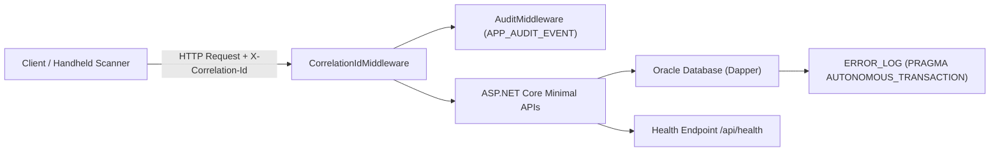

# Application Observability, Health & Monitoring Specification
**Project:** MiniERP Manufacturing & Warehouse  
**Document Code:** OPS-MON-002  
**Target Environment:** ASP.NET Core 8 Web API, Oracle Database 23c Free  

---

## 1. Observability Architecture Overview

The MiniERP observability framework provides end-to-end operational visibility across incoming HTTP requests, application services, database stored procedures, and external integrations:



---

## 2. Health & Readiness Endpoints

The API exposes three health endpoints designed for container orchestration (Kubernetes / Docker Compose), load balancer probes, and administrative diagnostics:

| Endpoint | Purpose | Checks Performed | HTTP Success | HTTP Failure |
|---|---|---|:---:|:---:|
| **`GET /api/health`** | Basic Liveness Probe | Verifies database ping, banner string, package status, and table count. | `200 OK` | `503 Service Unavailable` |
| **`GET /api/health/ready`**| Readiness Probe | Verifies database is accepting queries and essential tables are seeded. | `200 OK` | `503 Service Unavailable` |
| **`GET /api/health/details`**| Diagnostic Deep-Dive | Reports active connection pool, last automated run time, and outbox depth. | `200 OK` | `503 Service Unavailable` |

### Sample Response (`GET /api/health`):
```json
{
  "status": "UP",
  "timestamp": "2026-09-24T14:30:00Z",
  "database": {
    "status": "HEALTHY",
    "banner": "Oracle Database 23c Free Release 23.0.0.0.0",
    "packageStatus": "VALID",
    "tableCount": 31,
    "packages": {
      "ERP_OPERATIONS": "VALID",
      "ERP_AUTOMATION": "VALID",
      "ERP_TRACEABILITY": "VALID"
    }
  },
  "version": "1.1.0"
}
```
*Security note:* Health payloads reveal zero database connection strings, passwords, or internal server paths.

---

## 3. Correlation & Request Tracing

- **Middleware:** `CorrelationIdMiddleware` inspects inbound headers for `X-Correlation-Id`. If missing, it generates a fresh GUID (`Guid.NewGuid().ToString("N")`).
- **Propagation:** The correlation ID is added to the response headers, attached to ASP.NET Core `ILogger` scope, and passed to PL/SQL stored procedures for persistence in `APP_AUDIT_EVENT` and `ERROR_LOG`.
- **Log Format:** Structured JSON logging in standard console output:
  ```json
  {"Timestamp":"2026-09-24T14:30:15Z","Level":"Information","CorrelationId":"a8f3b20c","Message":"StockIn completed for WH_RAW item MAT_RUBBER_01 qty 100"}
  ```

---

## 4. Error Logging & Failure Indicators

### 4.1 Autonomous Incident Capture (`ERROR_LOG`)
When business transactions fail (e.g. material shortages, invalid quantities, hold violations), the outer transaction rolls back to preserve stock integrity. However, the database writes failure diagnostics into `ERROR_LOG`:
- `ERROR_CODE`: E.g. `ERR_MATERIAL_SHORTAGE`, `ERR_INSUFFICIENT_STOCK`.
- `MESSAGE`: Detailed error explanation (e.g. *"Cannot complete PO001 due to shortage: MAT_RUBBER_01 needed 50, available 40"*).
- `PROCEDURE_NAME`: Name of PL/SQL procedure (`complete_production_order`, `receive_lot_stock`).
- `REFERENCE_NO`: Entity reference (`PO001`, `RM001-DEMO-001`).
- `CREATED_BY`: User account attempting the transaction.

### 4.2 Key Operational Indicators to Monitor

| Metric / Indicator | Warning Threshold | Critical Threshold | Action Required |
|---|---|---|---|
| **Health Probe Status** | Non-200 for $> 10\text{s}$ | Non-200 for $> 60\text{s}$ | Check Oracle container status and listener ports. |
| **Material Shortage Rate**| $> 3$ per shift | $> 10$ per shift | Review replenishment alert sweep; expedite supplier POs. |
| **Idempotency Replay Spike**| $> 5\%$ of scans | $> 15\%$ of scans | Investigate floor Wi-Fi dead-zones or scanner trigger hardware. |
| **Unapproved Adjustment Queue**| $> 5$ pending requests | $> 20$ pending requests | Alert Plant Manager to review pending approvals in `APPROVAL_REQUEST`. |
| **Outbox Delivery Backlog**| $> 10$ pending deliveries | $> 50$ or status `FAILED` | Check network reachability to external IT Helpdesk portal. |

---

## 5. Troubleshooting & Root Cause Analysis Guide

1. **API returns `503 Service Unavailable` on `/api/health`:**
   - Run `docker ps` to verify `minierp-oracle` container is running and healthy.
   - Verify Oracle listener: `docker exec minierp-oracle lsnrctl status`.
   - Inspect container logs: `docker logs minierp-oracle --tail 50`.
2. **Production Order completion returns `409 Conflict`:**
   - Query error log endpoint: `GET /api/support/errors?refNo=PO_NUMBER`.
   - Check if error code is `ERR_MATERIAL_SHORTAGE`.
   - Query stock endpoint: `GET /api/stock/WH_RAW` to identify which component item is below BOM requirement.
3. **Warehouse operator receives `403 Forbidden`:**
   - Decode Bearer JWT token or call `GET /api/auth/me`.
   - Verify assigned roles against `AuthPolicies.cs` requirements.
