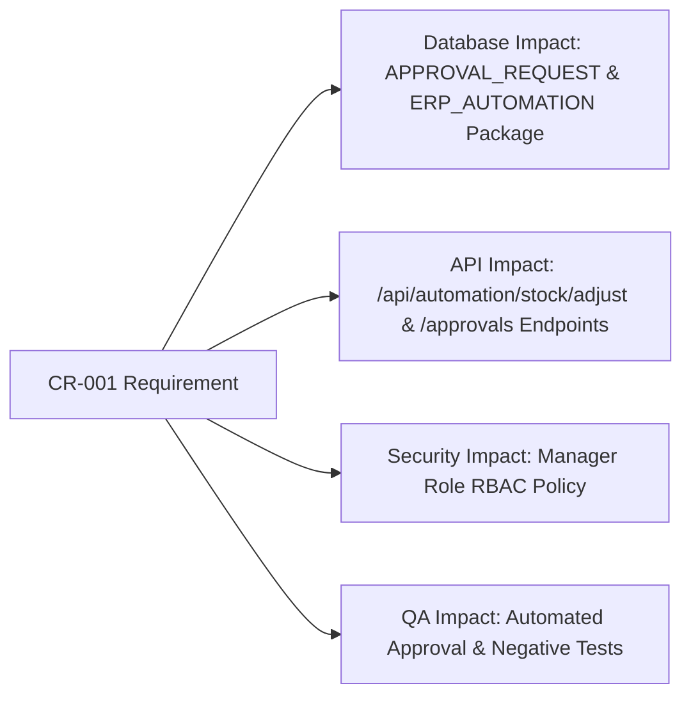

# Change Request Log & Impact Analysis
**Project:** MiniERP Manufacturing & Warehouse  
**Document Code:** PM-CRL-007  

---

## 1. Change Request Register Overview

| CR ID | Title | Requester | Priority | Impact | CCB Decision | Implementation Date | Status |
|:---:|---|---|:---:|:---:|:---:|:---:|:---:|
| **CR-001** | Add Manager Approval for Inventory Adjustments Above Configured Threshold | Internal Audit / Warehouse Mgr | High | Medium | Approved | 2026-09-24 | 🟢 Implemented & Released |

---

## 2. Detailed Change Request: CR-001

### 2.1 Requirement Description
- **Business Need:** During initial user acceptance testing, Internal Audit discovered that regular warehouse staff could perform unlimited negative or positive inventory adjustments directly on stock balances. To comply with factory accounting rules, any inventory adjustment exceeding **$\pm 50$ units** or flagged as critical material must require explicit two-person authorization from a user holding the `MANAGER` or `ADMIN` role.
- **Requested By:** Internal Audit Lead & Warehouse Operations Manager.

### 2.2 Impact Analysis

- **Database Layer:**
  - Leverage `APPROVAL_REQUEST` table to hold pending requests (`STATUS IN ('PENDING', 'APPROVED', 'REJECTED')`).
  - Update `ERP_AUTOMATION.adjust_stock_with_approval` procedure to validate approval status before updating `STOCK`.
- **Application API Layer:**
  - Route `/api/automation/stock/adjust` validates whether request has an approved reference.
  - Expose `/api/automation/approvals/{approvalNo}/decision` restricted to `MANAGER` / `ADMIN`.
- **Frontend Layer:**
  - Warehouse operators receive notification: *"Adjustment submitted for Manager Approval (Request #APP-xxxx)"*.
- **Risk Assessment:** Low technical risk; fully backward-compatible with automated audit trail logging.

### 2.3 Change Control Board (CCB) Decision
- **Date:** 2026-09-24
- **Decision:** **APPROVED**
- **Justification:** Essential enterprise control mandated by brand audit compliance. Prevents inventory shrinkage.

### 2.4 Implementation Details
1. **Database Logic (`sql/06_automation_plsql.sql`):**
   - Procedure `adjust_stock_with_approval` verifies that `APPROVAL_REQUEST` exists in `APPROVED` status before modifying physical `STOCK`.
   - Records immutable audit transaction in `INVENTORY_TRANSACTION` with `TXN_TYPE = 'ADJUSTMENT'`.
2. **API Endpoint (`src/Program.cs`):**
   - Implemented `app.MapPost("/api/automation/approvals/{approvalNo}/decision", ...)` requiring role `MANAGER` or `ADMIN`.
   - Implemented `app.MapPost("/api/automation/stock/adjust", ...)`.

### 2.5 Testing & Verification
- **Automated Test:** `AutomationIntegrationTests.cs` $\rightarrow$ `AdjustStock_RequiresApprovalGate`.
- **Negative Test:** Direct unapproved adjustment without approval token returns `401/403` or rejection error.
- **Verification Result:** Passed.

### 2.6 Release & Rollout
- Included in Release Baseline 1.1.
- Documented in Support Runbook and UAT Test Suite.
