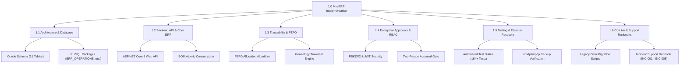

# Project Scope Management Plan & WBS
**Project:** MiniERP Manufacturing & Warehouse  
**Document Code:** PM-SCP-002  

---

## 1. Scope Baseline & Work Breakdown Structure (WBS)

---

## 2. In-Scope Deliverables

1. **Database Tier:**
   - 31 normalized Oracle tables across core ERP, business automation, lot traceability, and helpdesk outbox.
   - 3 production-grade PL/SQL packages (`ERP_OPERATIONS`, `ERP_AUTOMATION`, `ERP_TRACEABILITY`).
2. **Application Tier:**
   - ASP.NET Core 8 Web API supporting 57 route registrations.
   - Comprehensive error translation layer mapping Oracle `ORA-` errors into standardized problem details.
   - Idempotency middleware preventing duplicate scanner inputs.
3. **Frontend Tier:**
   - Single-page responsive web dashboard for warehouse and shop floor execution.
   - Visual KPI monitoring, lot movement tools, ZPL/HTML label generation, and genealogy visualizer.
4. **DevOps & DR Tier:**
   - Docker containerization for Oracle Database Free and application services.
   - Multi-stage GitHub Actions CI/CD pipeline.
   - Validated backup and disaster recovery runbooks with automated verification.

---

## 3. Scope Exclusions (Out of Scope)

- Advanced multi-plant inter-company transfer billing and multi-currency foreign exchange revaluations.
- Automated payroll, direct labor time-clock punch systems, and employee benefits administration.
- Custom IoT direct PLC hardware drivers (replaced by standardized REST API endpoints callable from floor barcode scanners and HMIs).
