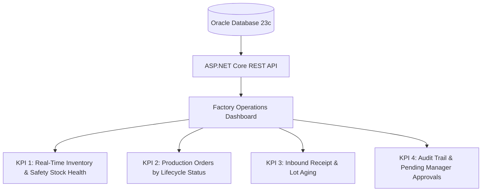

# Management Reporting & Operational KPI Specification
**Project:** MiniERP Manufacturing & Warehouse  
**Document Code:** REP-KPI-001  
**User Interface:** Factory Operations Dashboard (`dashboard/index.html`)  
**Data Sources:** Oracle Database 23c (`STOCK`, `PRODUCTION_ORDER`, `INVENTORY_TRANSACTION`, `APPROVAL_REQUEST`)  

---

## 1. Executive Reporting Philosophy

The MiniERP reporting architecture eliminates decorative, non-actionable charts in favor of **mission-critical operational indicators** derived directly from transactional database tables:

---

## 2. Key Operational Performance Indicators (KPIs)

### 2.1 Active Warehouse Inventory Balance
- **Business Purpose:** Real-time visibility into physical material availability across all 3 plant storage facilities (`WH_RAW`, `WH_WIP`, `WH_FG`).
- **Data Query:** `GET /api/stock/{warehouseCode}` mapped to Oracle `STOCK` joined with `ITEM`.
- **Display Component:** Real-time stock matrix showing on-hand quantity, unit of measure, minimum safety threshold, and shortage warning badges.

### 2.2 Safety Stock & Shortage Alert Ratio
- **Business Purpose:** Immediate alert when any raw material dips below safety threshold (`MIN_STOCK`), risking line starvation.
- **Metric Formula:**
  $$\text{Safety Compliance \%} = \frac{\sum \text{SKUs where } Q \ge \text{MIN\_STOCK}}{\text{Total Active SKUs}} \times 100$$
- **Display Component:** Summary health card on Dashboard Overview (e.g. `100% - 5/5 SKU đạt định mức`).

### 2.3 Production Order Status Breakdown
- **Business Purpose:** Tracks factory floor throughput across production order lifecycle stages:
  - `CREATED`: Scheduled but pending material check.
  - `WAITING_MATERIAL`: Blocked due to component shortage (Action required by Procurement).
  - `READY` / `RELEASED`: Staged for line execution with soft-reserved materials.
  - `COMPLETED`: Finished goods received into `WH_FG`.
- **Data Query:** `GET /api/manufacturing/production-order/{poNo}` and `PO_STATE_HISTORY`.

### 2.4 Pending Managerial Approvals Queue
- **Business Purpose:** Prevents inventory adjustments and high-impact movements from stalling without supervisory sign-off.
- **Data Query:** `GET /api/automation/approvals` querying `APPROVAL_REQUEST` where `STATUS = 'PENDING'`.

### 2.5 Autonomous Error Incident Frequency
- **Business Purpose:** Real-time indicator of operational failures (e.g. barcode scan failures, shortage events).
- **Data Query:** `GET /api/support/errors` querying `ERROR_LOG`.
