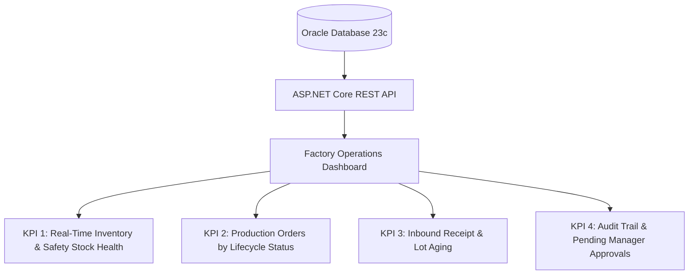

# Management Reporting & Operational KPI Specification
**Project:** MiniERP Manufacturing & Warehouse  
**Document Code:** REP-KPI-001  
**User Interface:** Factory Operations Dashboard (`dashboard/index.html`)  
**Data Sources:** Oracle Database 23c (`STOCK`, `PRODUCTION_ORDER`, `INVENTORY_TRANSACTION`, `APPROVAL_REQUEST`)  

---

## 1. Executive Reporting Philosophy

The MiniERP reporting architecture eliminates decorative, non-actionable charts in favor of **mission-critical operational indicators** derived directly from transactional database tables:

```mermaid
flowchart TD
    DB[(Oracle Database 23c)] --> API["ASP.NET Core REST API"]
    API --> DASH["Factory Operations Dashboard"]
    DASH --> K1["KPI 1: Real-Time Inventory & Safety Stock Health"]
    DASH --> K2["KPI 2: Production Orders by Lifecycle Status"]
    DASH --> K3["KPI 3: Inbound Receipt & Lot Aging"]
    DASH --> K4["KPI 4: Audit Trail & Pending Manager Approvals"]
```

> **Note on this diagram:** it deliberately renders only the four **executive
> overview** cards (K1–K4). The operational KPI list in §2 has **5** entries, not 4.
> KPI 2.5 (error incident frequency) is an **operational** list, not an overview card —
> it appears in the Manufacturing & BOM tab, not on the overview. See §3 for the full
> backend-to-UI coverage statement, which is the authoritative surface map for this
> document.

---

## 2. Key Operational Performance Indicators (KPIs)

### 2.1 Active Warehouse Inventory Balance
- **Business Purpose:** Real-time visibility into physical material availability across all 3 plant storage facilities (`WH_RAW`, `WH_WIP`, `WH_FG`).
- **Data Query:** `GET /api/stock/{warehouseCode}` mapped to Oracle `STOCK` joined with `ITEM`.
- **Display Component:** Real-time stock matrix showing on-hand quantity, unit of measure, minimum safety threshold, and shortage warning badges.

### 2.2 Safety Stock & Shortage Alert Ratio
- **Business Purpose:** Immediate alert when any raw material dips below safety threshold (`MIN_STOCK`), risking line starvation.
- **Metric Formula:**
  $$\text{Safety Compliance \%} = \frac{\sum \text{SKUs where } Q \ge \text{MIN\_STOCK}}{\text{Total Active SKUs}} \times 100$$
- **Display Component:** Summary health card on Dashboard Overview (e.g. `100% - 5/5 SKU đạt định mức`).

### 2.3 Production Order Status Breakdown
- **Business Purpose:** Tracks factory floor throughput across production order lifecycle stages:
  - `CREATED`: Scheduled but pending material check.
  - `WAITING_MATERIAL`: Blocked due to component shortage (Action required by Procurement).
  - `READY` / `RELEASED`: Staged for line execution with soft-reserved materials.
  - `COMPLETED`: Finished goods received into `WH_FG`.
- **Data Query:** `GET /api/manufacturing/production-order/{poNo}` and `PO_STATE_HISTORY`.
- **Display Component:** Production order status board in `tab-mfg` (Sản xuất & BOM).

### 2.4 Pending Managerial Approvals Queue
- **Business Purpose:** Prevents inventory adjustments and high-impact movements from stalling without supervisory sign-off.
- **Data Query:** `GET /api/automation/approvals` querying `APPROVAL_REQUEST` where `STATUS = 'PENDING'`.
- **Display Component:** `tab-incident` (Giám sát & Sự cố) → `#approval-list`
  (`index.html:355`), fed by `app.js:299` with `status=PENDING&take=20` and rendered
  at `app.js:455`.
- **⚠️ UI coverage — read-only, and the verdict matters:** this KPI **is** surfaced in
  the dashboard, but **read-only**. The dashboard exposes no control to *create* an
  approval request or to *decide* one, so the `POST /api/automation/approvals` and
  `POST /api/automation/approvals/{approvalNo}/decision` endpoints are reachable only
  through the API. Requirement **FR-009** in
  [`../business-analysis/07-requirement-traceability-matrix.md`](../business-analysis/07-requirement-traceability-matrix.md)
  is therefore graded **Partial** on UI coverage, not *Backend only*.

### 2.5 Autonomous Error Incident Frequency
- **Business Purpose:** Real-time indicator of operational failures (e.g. barcode scan failures, shortage events).
- **Data Query:** `GET /api/support/errors` querying `ERROR_LOG`.
- **Display Component:** `tab-mfg` (Sản xuất & BOM) → `#error-list`
  (`index.html:204`), fed by `app.js:261` with `take=20` and rendered at `app.js:410`.

---

## 3. Backend-to-UI Coverage Statement

Required so a reader is not left guessing which backend capability has no screen.

| KPI | Backend data source | Dashboard surface | Reachability |
|---|---|---|---|
| 2.1 Inventory balance | `STOCK` | `tab-stock` / `tab-lots` cards | Full |
| 2.2 Safety-stock ratio | `STOCK` | Overview health card | Full |
| 2.3 Production order status | `PRODUCTION_ORDER`, `PO_STATE_HISTORY` | `tab-mfg` | Full |
| 2.4 Pending approvals | `APPROVAL_REQUEST` | `tab-incident` → `#approval-list` | **Partial — read-only** |
| 2.5 Error incident frequency | `ERROR_LOG` | `tab-mfg` → `#error-list` | Full (read-only list) |

**Every KPI in §2 has a dashboard surface.** None is backend-only, so this document
previously **understated** UI coverage by omitting the `Display Component` line for
2.3, 2.4 and 2.5 — the omission was a documentation gap, not a missing feature.

**What the dashboard still cannot do, and where the RTM grades it:** the approval
*write* path (create / decide) and the audit-trail read (`APP_AUDIT_EVENT`) have no
UI control. Those correspond to FR-009 (Partial) and FR-012 (*Backend only*) in the
requirement traceability matrix.

**Evidence basis and its limit:** the surface names above were read from the shipped
`dashboard/index.html` and `dashboard/app.js`. That is **static** evidence — there is
no browser-level E2E run proving each of these is reachable *and renders*; the
dashboard E2E evidence covers the login/ticket journey, not KPI rendering.
