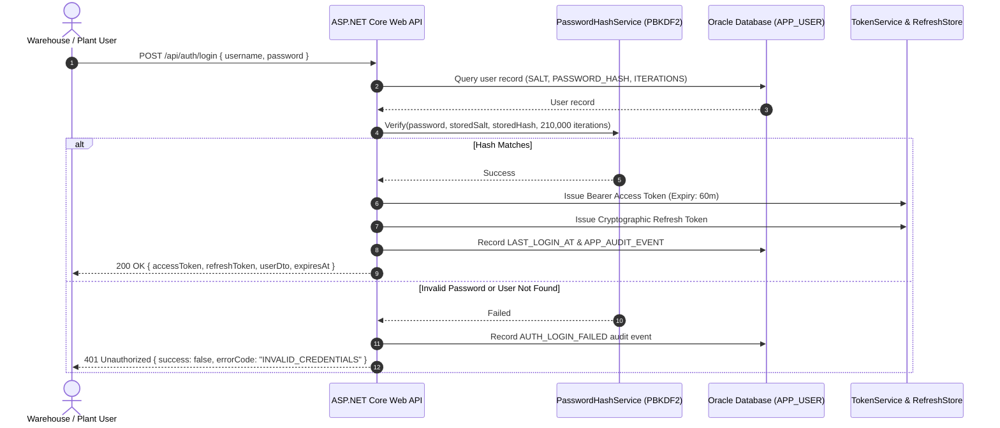

# Enterprise Security Architecture & Governance Specification
**Project:** MiniERP Manufacturing & Warehouse  
**Document Code:** SEC-DES-001  
**Target Environment:** ASP.NET Core 8 Web API, Oracle Database 23c/21c, JWT RBAC  
**Classification:** Internal ERP Architecture Specification

---

## 1. Overview & Security Objectives

In an industrial manufacturing plant (e.g. footwear and apparel fabrication), the ERP system governs raw material consumption, physical inventory balances, bill of materials (BOM), production orders, and outbound deliveries. Compromising these systems can lead to unauthorized stock exfiltration, ghost production orders, or operational downtime.

The MiniERP security architecture enforces **Defense-in-Depth** across 6 layers:
1. **Network & Perimeter:** Reverse proxy isolation, CORS domain whitelist.
2. **Identity & Authentication:** PBKDF2 password derivation, tamper-evident Bearer JWT tokens, stateful refresh rotation.
3. **Authorization & RBAC:** Principle of least privilege enforced at the Web API middleware level and database schema boundaries.
4. **Auditability & Traceability:** Immutable audit logging (`APP_AUDIT_EVENT`), correlation tracking (`X-Correlation-Id`), autonomous rollback-resistant incident logging (`ERROR_LOG`).
5. **Data Protection & Secret Hygiene:** Zero hardcoded credentials in version control, 12-factor environment variable injection.
6. **Input Validation & Exception Sanitization:** Strict RFC 7807 problem details, masking internal database error details (`ORA-` text).

---

## 2. Authentication Architecture



### 2.1 Password Hashing Specification
- **Algorithm:** RFC 2898 PBKDF2 (Password-Based Key Derivation Function 2) with HMAC-SHA256.
- **Work Factor:** 210,000 iterations (exceeding OWASP minimum guidelines for SHA-256).
- **Salt Generation:** 16-byte cryptographically secure pseudo-random number generator (`RandomNumberGenerator.GetBytes(16)`).
- **Key Length:** 32 bytes (256 bits).
- **Storage Format:** Standardized token string:
  ```text
  pbkdf2$210000$<Base64-16Byte-Salt>$<Base64-32Byte-DerivedKey>
  ```
- **Constant-Time Comparison:** Cryptographic equality comparison prevents timing attacks.

### 2.2 Token Lifecycle & Refresh Mechanism
- **Access Token:** Bearer token containing user ID, username, department, and role claims. Short-lived (default 60 minutes) to minimize exposure windows.
- **Refresh Token:** Cryptographic high-entropy random string stored in `RefreshTokenStore` tied to user ID and client device identifier, enabling zero-relogin token rotation.
- **Revocation (`/api/auth/revoke` & `/api/auth/logout`):** Invalidation of refresh tokens upon user logout or security alerts.

---

## 3. Role-Based Access Control (RBAC)

### 3.1 Role Hierarchy & Permissions

| Role Name | Scope & Authority | Allowed API Endpoints | Prohibited Actions |
|---|---|---|---|
| **ADMIN** | System administration, user provisioning, global auditing | All endpoints (`/api/admin/*`, `/api/warehouse/*`, `/api/manufacturing/*`, `/api/support/*`) | Cannot bypass immutable audit log constraints. |
| **WAREHOUSE** | Inbound receiving, putaway, internal transfer, inventory counting | `/api/warehouse/*`, `/api/stock/in`, `/api/stock/out`, `/api/stock/*` | Cannot create production orders or approve adjustments above threshold. |
| **PLANNER** | Master scheduling, BOM maintenance, production release | `/api/manufacturing/bom/*`, `/api/manufacturing/production-order` | Cannot modify warehouse stock directly without production orders. |
| **PRODUCTION** | Floor operations, lot consumption, finished goods completion | `/api/manufacturing/production-order/*/issue-lots`, `/api/manufacturing/production-order/*/complete*` | Cannot alter user roles or system configuration. |
| **MANAGER** | Transaction approval gate, operational review, managerial KPI | `/api/automation/approvals/*`, `/api/automation/reports/*` | Limited to approval actions and reporting oversight. |
| **AUDITOR** | Read-only compliance, regulatory audit, genealogy investigation | `GET /api/*`, `/api/trace/*`, `/api/support/errors` | Strictly blocked (403) from all `POST`, `PUT`, `DELETE` endpoints. |

### 3.2 Backend Permission Enforcement
Authorization is strictly validated on the backend. The system never relies on frontend UI button hiding:
- **`MutationAuthorizationMiddleware`:** Validates incoming state-modifying requests (`POST`, `PUT`, `DELETE`). If an anonymous or read-only token calls a mutation endpoint, the API immediately returns `401 Unauthorized` or `403 Forbidden`.
- **Policy Declarations (`AuthPolicies.cs`):** Registered in ASP.NET Core DI:
  - `AuthPolicies.WarehouseMutation`: Requires `ADMIN` or `WAREHOUSE`.
  - `AuthPolicies.ProductionMutation`: Requires `ADMIN` or `PLANNER`.
  - `AuthPolicies.AdminOnly`: Requires `ADMIN`.
  - `AuthPolicies.LotHold`: Requires `ADMIN`, `WAREHOUSE`, or `SUPPORT`.

---

## 4. Audit Logging & Non-Repudiation

### 4.1 Immutable Audit Log (`APP_AUDIT_EVENT`)
Every mutating business transaction and critical authentication event creates an append-only audit record in `APP_AUDIT_EVENT`:

```sql
CREATE TABLE APP_AUDIT_EVENT (
  ID             NUMBER GENERATED BY DEFAULT AS IDENTITY PRIMARY KEY,
  EVENT_TYPE     VARCHAR2(50)  NOT NULL,
  ENTITY_NAME    VARCHAR2(50)  NOT NULL,
  ENTITY_KEY     VARCHAR2(100),
  ACTOR          VARCHAR2(50)  NOT NULL,
  DETAILS_JSON   VARCHAR2(4000),
  CORRELATION_ID VARCHAR2(64),
  CREATED_AT     DATE DEFAULT SYSDATE NOT NULL
);
```

- **Logged Fields:**
  - `EVENT_TYPE`: E.g. `AUTH_LOGIN`, `AUTH_LOGIN_FAILED`, `STOCK_IN`, `PO_COMPLETE`, `APPROVAL_DECISION`, `LOT_HOLD`.
  - `ENTITY_NAME`: Target entity (`PRODUCTION_ORDER`, `INVENTORY_LOT`, `STOCK`, `APP_USER`).
  - `ENTITY_KEY`: Primary business identifier (`PO001`, `RM001-DEMO-001`, `WH_RAW/MAT_RUBBER_01`).
  - `ACTOR`: Authenticated username initiating the action.
  - `DETAILS_JSON`: Old/new values, quantity delta, approval comments, or failure reasons.
  - `CORRELATION_ID`: `X-Correlation-Id` linking the client HTTP request to API logs and database rows.
  - `CREATED_AT`: Authoritative database timestamp (`SYSDATE`).

### 4.2 Autonomous Error Capture (`ERROR_LOG`)
When a business operation fails (e.g. `ORA-20007 Material Shortage`), the outer database transaction rolls back to preserve stock consistency. However, using Oracle `PRAGMA AUTONOMOUS_TRANSACTION`, the system records the failure, actor, procedure name, and reference number into `ERROR_LOG`, guaranteeing post-incident visibility.

---

## 5. Secret Management & Environmental Configuration

1. **No Credentials Committed to Source Control:**
   - Database connection strings, JWT signing keys, and third-party service tokens are extracted to environment variables (`ORACLE_PWD`, `APP_USER_PWD`, `JWT_SIGNING_KEY`, `SONAR_TOKEN`).
   - `.gitignore` explicitly excludes `.env`, `*.key`, `*.pfx`, and credential dumps.
2. **Production-Safe Fallbacks:**
   - Development defaults (`ErpPassword2026#`) only activate when `ASPNETCORE_ENVIRONMENT=Development`. In production mode, the API terminates on startup if required secrets are absent.
3. **CORS Security:**
   - Strict origin validation (`Cors:AllowedOrigins` or `CORS_ALLOWED_ORIGINS`). Local developer origins (`http://localhost:5000`, `http://localhost:8080`) are restricted in production deployments.

---

## 6. Input Validation & Error Handling

- **Boundary Validation:** Quantity inputs must satisfy $Q > 0$. String lengths are bounded (Username $\le 50$, Password $\le 256$, Notes $\le 500$) to prevent buffer/memory exhaustion.
- **Parameterized SQL & Stored Procedures:** All database communication occurs via compiled Oracle Stored Procedures and Dapper parameterized queries, completely eliminating SQL injection vectors.
- **Idempotency Guard (`REQUEST_IDEMPOTENCY`):** Warehouse floor operators using rugged handheld barcode scanners may re-trigger network requests due to barcode bounce. The API records SHA-256 payload hashes against `idempotencyKey`, discarding duplicate executions and preventing duplicate stock decrement.
