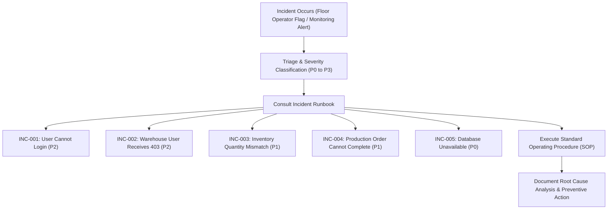

# IT ERP Support Runbook & Incident Management Framework
**Project:** MiniERP Manufacturing & Warehouse  
**Document Code:** SUP-OVR-001  

---

## 1. ERP Incident Management Overview

In an industrial manufacturing plant, ERP system disruptions immediately jeopardize factory production lines, container shipment deadlines, and inventory integrity. The MiniERP Support Framework defines structured escalation pathways, diagnostic protocols, and Root Cause Analysis (RCA) runbooks.

---

## 2. Standard Incident Runbooks Index

| Runbook ID | Title | Severity | Impacted Area | Runbook Link |
|---|---|:---:|---|---|
| **INC-001** | User Cannot Login | P2 | Authentication / PBKDF2 / Token | [`INC-001-user-cannot-login.md`](file:///Users/mainguyenbinhtan/Downloads/PORTFOLIO/04-MiniERP-Manufacturing-Warehouse/docs/support/INC-001-user-cannot-login.md) |
| **INC-002** | Warehouse User Receives 403 Forbidden | P2 | RBAC Authorization / Approval Gate | [`INC-002-warehouse-user-receives-403.md`](file:///Users/mainguyenbinhtan/Downloads/PORTFOLIO/04-MiniERP-Manufacturing-Warehouse/docs/support/INC-002-warehouse-user-receives-403.md) |
| **INC-003** | Inventory Quantity Mismatch | P1 | Inventory Reconciliation / Ledger | [`INC-003-inventory-quantity-mismatch.md`](file:///Users/mainguyenbinhtan/Downloads/PORTFOLIO/04-MiniERP-Manufacturing-Warehouse/docs/support/INC-003-inventory-quantity-mismatch.md) |
| **INC-004** | Production Order Cannot Complete | P1 | BOM Explosion / Material Shortage | [`INC-004-production-order-cannot-complete.md`](file:///Users/mainguyenbinhtan/Downloads/PORTFOLIO/04-MiniERP-Manufacturing-Warehouse/docs/support/INC-004-production-order-cannot-complete.md) |
| **INC-005** | Database Unavailable | P0 | Oracle DB Container / Listener Outage | [`INC-005-database-unavailable.md`](file:///Users/mainguyenbinhtan/Downloads/PORTFOLIO/04-MiniERP-Manufacturing-Warehouse/docs/support/INC-005-database-unavailable.md) |

---

## 3. Incident Severity Levels & SLAs

| Severity | Description | Target Response Time | Target Resolution Time (SLA) |
|:---:|---|:---:|:---:|
| **P0 (Disaster)** | Total plant outage; database down; all lines halted | $\le 15\text{ minutes}$ | $\le 2\text{ hours}$ |
| **P1 (Critical)** | Core assembly line blocked; material shortage preventing PO complete | $\le 30\text{ minutes}$ | $\le 4\text{ hours}$ |
| **P2 (High)** | Single user login failure; permission denial on non-blocking workflow | $\le 1\text{ hour}$ | $\le 8\text{ hours}$ |
| **P3 (Normal)** | Minor cosmetic UI defect; non-urgent reporting question | $\le 4\text{ hours}$ | $\le 24\text{ hours}$ |
