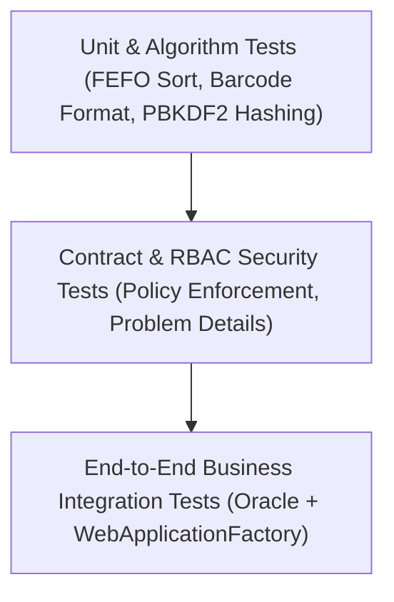

# Quality Assurance & Test Strategy Specification
**Project:** MiniERP Manufacturing & Warehouse  
**Document Code:** QA-STRAT-001  
**Target Environment:** xUnit, .NET 8 WebApplicationFactory, Oracle Database 23c/21c  
**Coverage Level:** Unit, Contract, Negative, Concurrency/Idempotency, End-to-End Integration

---

## 1. Quality Strategy Overview

The testing strategy for MiniERP follows a strict pyramid model designed for mission-critical manufacturing and warehouse operations. In an ERP system, a software bug directly impacts physical inventory balances, factory line availability, and financial accounting. Therefore, automated verification must prove both functional correctness and database transaction atomicity.



---

## 2. Test Classification & Frameworks

| Test Level | Scope | Framework | Execution Frequency | Database Dependency |
|---|---|---|---|:---:|
| **Unit Tests** | Domain calculation, PBKDF2 hash verification, FEFO sorting logic, barcode parsing, error mapping | xUnit 2.5, .NET 8 SDK | Every local build & PR | None (Mock / In-Memory) |
| **Contract Tests** | OpenAPI schema adherence, RFC 7807 problem details, HTTP status code contracts (400, 401, 403, 404, 409) | xUnit, System.Net.Http | Every build | None |
| **RBAC Security Tests**| Authentication scheme, JWT token expiration, refresh rotation, role permission gates | xUnit, ASP.NET Core TestHost | Every build | Oracle Container |
| **Integration Tests** | Multi-step ERP business workflows (Receive $\rightarrow$ Allocate $\rightarrow$ Issue $\rightarrow$ Complete $\rightarrow$ Verify) | xUnit, WebApplicationFactory | Pre-merge & CI Pipeline | Oracle Container (`FREEPDB1`) |
| **Disaster Recovery Drill**| Binary backup export (`expdp`), drop schema, restore (`impdp`), data integrity verifier | Bash, Oracle Data Pump | Scheduled & Pre-release | Oracle Container |

---

## 3. Core Business Workflow Integration Test Matrix

### 3.1 The Golden Path: Production Order Execution
1. **Authentication:** Authenticate as Warehouse Staff (`warehouse01`) and obtain Bearer JWT.
2. **Raw Material Inbound:** Post goods receipt of 100 units `MAT_RUBBER_01` with lot code and bin location.
3. **Inventory Verification:** Confirm `STOCK` and `LOT_STOCK` increase by 100.
4. **Order Release:** Authenticate as Production Planner (`planner01`) and create/release Production Order `PO_GOLDEN_01` for 10 pairs of `FG_RUNNER_PRO_42`.
5. **FEFO Allocation & Material Issue:** System calculates material consumption according to BOM (10 pairs $\times$ 1.0 unit = 10 units of rubber).
6. **Execution & Completion:** Complete order; verify raw material decreases from 100 to 90, and finished good inventory increases from 0 to 10.
7. **Traceability Verification:** Query backward genealogy `/api/trace/FG-LOT-01?direction=backward` and confirm full linkage:
   $$\text{Finished Good Lot} \longrightarrow \text{Production Order} \longrightarrow \text{Consumed Raw Material Lot} \longrightarrow \text{Inbound Purchase Order}$$

---

## 4. Negative & Boundary Testing Matrix

| Test ID | Scenario Description | Input / Condition | Expected Result | Business Code |
|---|---|---|---|---|
| **NEG-001** | Unauthorized Access | Calling `/api/manufacturing/production-order` without Authorization header | `401 Unauthorized` | `AUTH_UNAUTHORIZED` |
| **NEG-002** | Insufficient Role Privilege | Warehouse operator calling `/api/admin/users` | `403 Forbidden` | `AUTH_FORBIDDEN` |
| **NEG-003** | Material Shortage | Completing production order when stock is insufficient for BOM | `409 Conflict` (Transaction rolled back, error logged in `ERROR_LOG`) | `ERR_MATERIAL_SHORTAGE` (`ORA-20007`) |
| **NEG-004** | Invalid Quantity | Submitting stock-in with quantity $\le 0$ | `400 Bad Request` | `ERR_INVALID_QTY` |
| **NEG-005** | Non-existent Entity | Looking up unknown Lot Code or Production Order | `404 Not Found` | `ERR_NOT_FOUND` |
| **NEG-006** | Invalid State Transition | Completing an order that is already `COMPLETED` or `CANCELLED` | `409 Conflict` | `ERR_INVALID_STATUS` |
| **NEG-007** | Duplicate Barcode Scan (Idempotency) | Submitting identical `idempotencyKey` with same payload twice | Second request returns `200 OK` (Replay) without duplicate stock deduction | `IDEMPOTENT_REPLAY` |
| **NEG-008** | Idempotency Key Conflict | Submitting identical `idempotencyKey` with different payload | `409 Conflict` | `ERR_IDEMPOTENCY_MISMATCH` (`ORA-20013`) |

---

## 5. Test Automation Execution & CI/CD Integration

### Running Tests Locally
```bash
# 1. Run Unit & Contract Tests (No Oracle dependency required)
export PATH="$HOME/.dotnet:$PATH"
dotnet test tests/MiniERP.Api.Tests --filter "Category!=Integration"

# 2. Run Full Test Suite (Requires active Oracle container)
bash scripts/start-db.sh && bash scripts/run-sql.sh
dotnet test tests/MiniERP.Api.Tests

# 3. Run Full 7-Stage Acceptance Pipeline
bash scripts/run-all-tests.sh
```

### Continuous Integration Quality Gate
The GitHub Actions workflow (`.github/workflows/ci.yml`) runs on every push and pull request to `main`:
1. Build API with warnings treated as errors (`-p:TreatWarningsAsErrors=true`).
2. Run unit and contract tests in under 15 seconds.
3. Spin up Oracle Database 23c Free service container.
4. Execute SQL migrations and package compilation verifications.
5. Execute end-to-end integration tests.
6. Verify binary Data Pump backup and restoration drill (`verify-backup.sh`).
7. Archive test logs (`.trx`) and SQL verification logs as pipeline artifacts.
