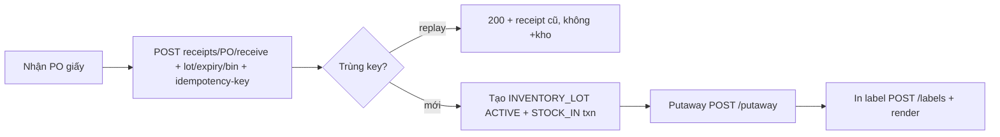
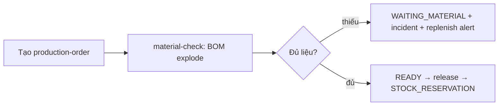

# User Journey — MiniERP (PHS evidence)

## J1. Thủ kho nhập hàng (FR-001)

## J2. Planner release lệnh (FR-002)

## J3. QA truy xuất sự cố (FR-004)
Quét barcode → `GET /barcodes/resolve` → `GET /trace/{lot}` → cây 3 tầng (FG→WIP→raw) + hold lot lỗi (`POST lots/{lot}/hold`).
Pain solved: trước đây truy giấy 2 ngày, nay 85ms (UAT-REP-001).

## J4. Điều chỉnh kho 2-người-duyệt (FR-005)
Nhân viên tạo approval → quản lý decision → mới được `POST stock/adjust`; thiếu approval → `403 ERR_APPROVAL_REQUIRED`.
